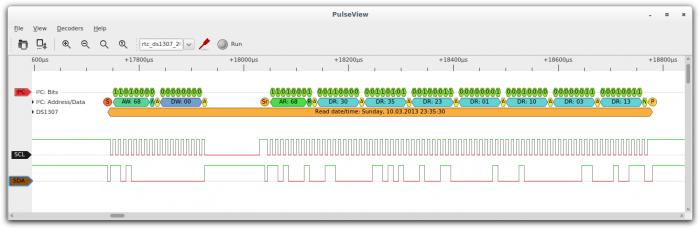

# Capture Your First Trace
This guide will walk you through capturing and analyzing your first digital signal with OpenTraceLab.
## Hardware Requirements
You'll need a logic analyzer to capture digital signals. OpenTraceLab supports many devices, but the most common and affordable option is:
- **FX2-based logic analyzers** - Available for ~$10 by searching for "24MHz Logic Analyzer"
- **Quality probe hooks** - [E-Z-Hook XKM series](http://catalog.e-z-hook.com/item/test-hooks/e-z-micro-hooks-single-hook-style/xkm-1) recommended
## Step 1: Connect Your Hardware
1. Connect your logic analyzer to your computer via USB
2. Attach probe hooks to the signals you want to analyze
3. For this example, we'll analyze I²C signals (SCL and SDA lines)
## Step 2: Capture Signals
Launch **OpenTraceView** and:
1. Select your logic analyzer device
2. Configure the sample rate (e.g., 1MHz for I²C)
3. Set up channel labels (SCL, SDA)
4. Click "Run" to start capturing

## Step 3: Add Protocol Decoders
Once you have captured data:
1. Go to **Decoders** menu
2. Select **I²C** decoder
3. OpenTraceView will automatically map SCL/SDA channels
4. View the decoded I²C messages

## Step 4: Stack Decoders (Advanced)
For chip-specific analysis:
1. Go to **Stack Decoder** menu
2. Select a device-specific decoder (e.g., DS1307 RTC)
3. View human-readable command interpretations

## Command Line Analysis
Use **OpenTraceCLI** for automated analysis:
```bash
# Basic capture
OpenTraceCLI --driver=fx2lafw --config samplerate=1M
# Live I²C decoding
OpenTraceCLI --driver=fx2lafw --config samplerate=1M --continuous -P i2c:scl=0:sda=1
# UART decoding with custom settings
OpenTraceCLI -d fx2lafw -c samplerate=250000 -P uart:rx=D0:baudrate=9600 -A uart=rx_data
```
## Next Steps
- Explore [protocol decoders](../opentracedecode/overview.md) for your specific protocols
- Learn about [OpenTraceView features](../opentraceview/overview.md)
- Check [supported hardware](../opentracecapture/overview.md) for more devices
