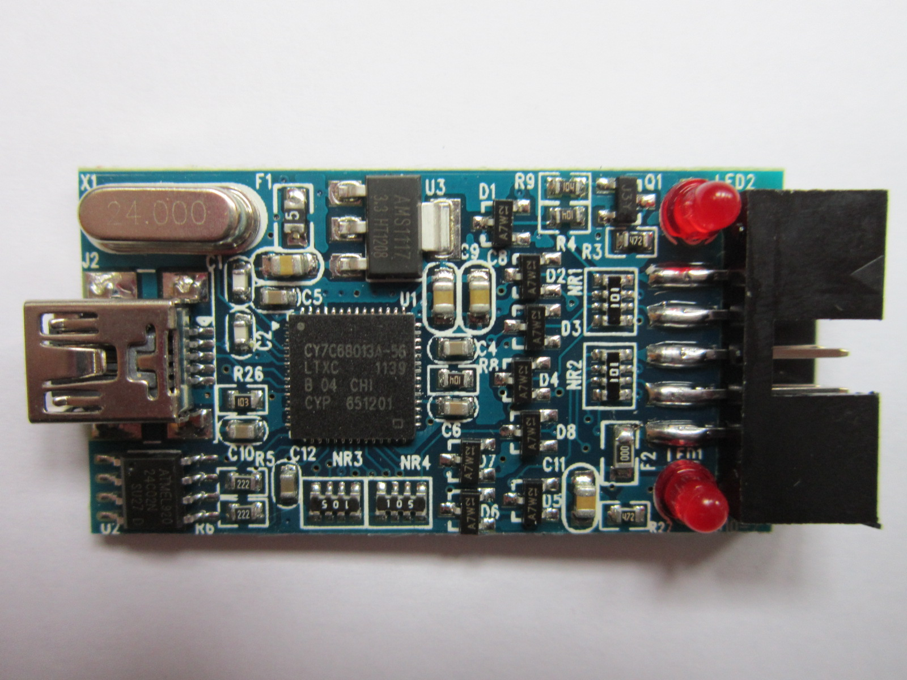
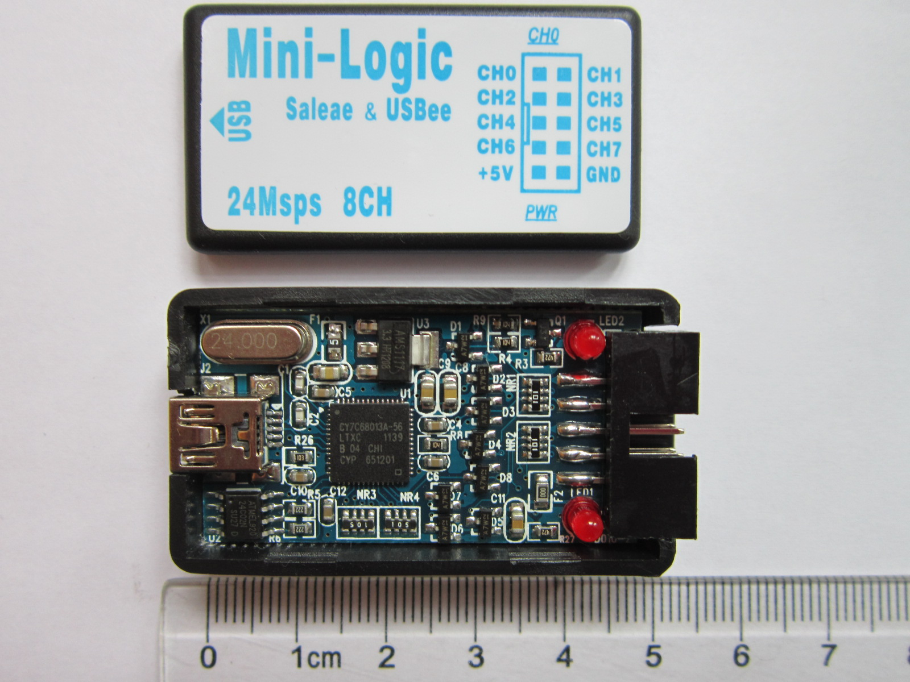
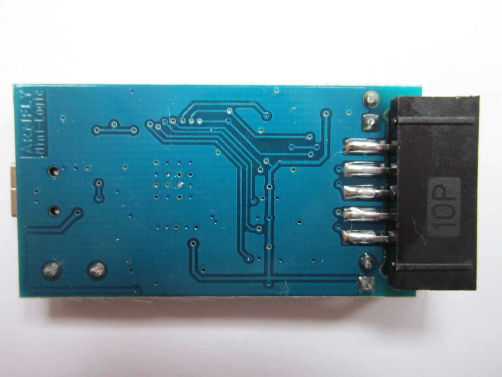
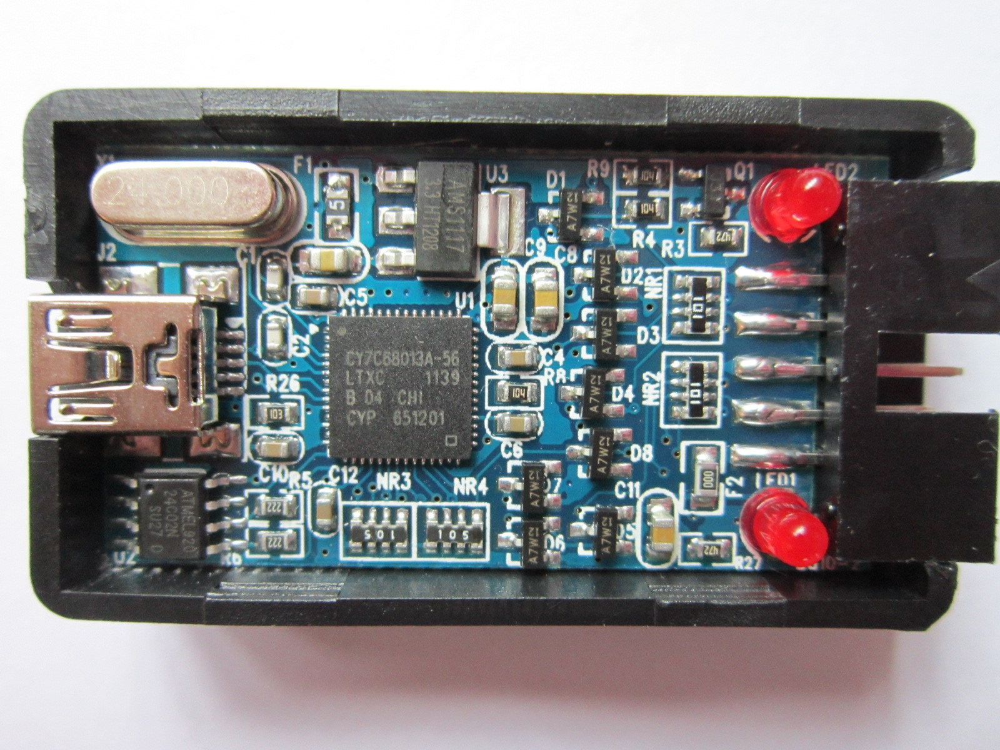

# ARMFLY Mini-Logic

{ .infobox-image }

### ARMFLY Mini-Logic

| | |
|---|---|
| **Status** | supported |
| **Source code** | [fx2lafw](https://github.com/OpenTraceLab/OpenTraceCapture/tree/main/src/hardware/fx2lafw) |
| **Channels** | 8 |
| **Samplerate** | 24MHz |
| **Samplerate (state)** | — |
| **Triggers** | none (SW-only) |
| **Min/max voltage** | -0.5V — 5.25V |
| **Threshold voltage** | Fixed: VIH=2.0V—5.25V, VIL=-0.5V—0.8V |
| **Memory** | none |
| **Compression** | none |
| **Price range** | $5 - $10 |
| **Website** | [armfly.com](http://www.armfly.com/product/Mini-Logic/mini-logic.htm) |

The **ARMFLY Mini-Logic** is a USB-based, 8-channel logic analyzer with up to 24MHz sampling rate.

It is a clone of the [CWAV USBee AX-Pro](/w/index.php?title=CWAV_USBee_AX-Pro&action=edit&redlink=1), but it doesn't have analog (only 8-channel digital) sampling capabilities. There is an "[RS232 RS485 RS422 CAN converter](http://item.taobao.com/item.htm?id=16943624739)" add-on board for more functionality (not supported in sigrok, though).

In sigrok, we use the open-source [fx2lafw](https://sigrok.org/wiki/Fx2lafw) firmware for this logic analyzer.

See [ARMFLY Mini-Logic/Info](https://sigrok.org/wiki/ARMFLY_Mini-Logic/Info) for more detailed information on the device.

## Hardware
- **Main chip**: Cypress CY7C68013A-56LTXC (FX2LP)
- **I2C EEPROM**: Atmel ATML920 24C02N SU27 D
- **Low-dropout voltage regulator**: Advanced Monolithic Systems AMS1117-3.3
- **24MHz crystal**: 24.000

## Photos

{ .glightbox data-gallery="armfly-mini-logic" }
Armfly Mini Logic Pcb 1

{ .glightbox data-gallery="armfly-mini-logic" }
Armfly Mini Logic

{ .glightbox data-gallery="armfly-mini-logic" }
Armfly Mini Logic Pcb Back

{ .glightbox data-gallery="armfly-mini-logic" }
Armfly Mini Logic

{ .glightbox data-gallery="armfly-mini-logic" }
Armfly Mini Logic Pcb

## Protocol

Since we use the open-source [fx2lafw](https://sigrok.org/wiki/Fx2lafw) firmware for this device, we don't need to know the protocol.

## Resources
- [ARMFLY Taobao shop](http://item.taobao.com/item.htm?id=14408505465) ([English translation](http://translate.google.com/translate?hl=en&sl=zh-CN&tl=en&u=http%3A%2F%2Fitem.taobao.com%2Fitem.htm%3Fid%3D14408505465))
- [ARMFLY Mini-Logic RS232 RS485 RS422 CAN converter](http://item.taobao.com/item.htm?id=16943624739) ([English translation](http://translate.google.com/translate?sl=zh-CN&tl=en&js=n&prev=_t&hl=en&ie=UTF-8&layout=2&eotf=1&u=http%3A%2F%2Fitem.taobao.com%2Fitem.htm%3Fid%3D16943624739&act=url))

