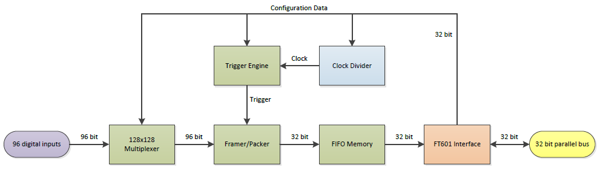
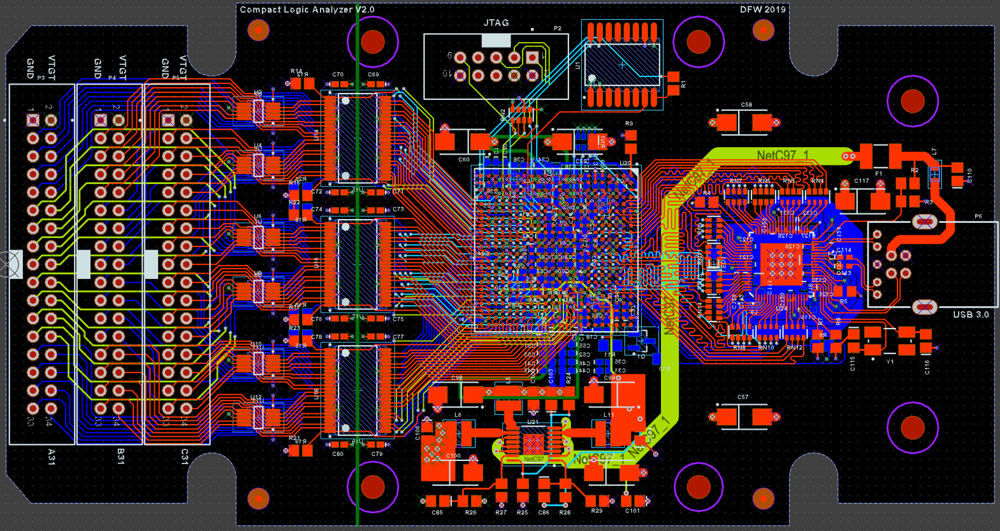

# CoLA

{ .infobox-image }

### CoLA

| | |
|---|---|
| **Status** | planned |
| **Source code** | [-](https://github.com/OpenTraceLab/OpenTraceCapture/tree/main/src/hardware/-) |
| **Channels** | 96/48/24 |
| **Samplerate** | 25MHz/50MHz/100MHz |
| **Samplerate (state)** | ? |
| **Triggers** | 32 hardware, 96 bit masked pattern |
| **Min/max voltage** | 1.65V - 5.5V continuously |
| **Threshold voltage** | ? |
| **Memory** | 262144 bytes |
| **Compression** | RLE, frame omission |
| **Website** | - |

## Introduction

CoLA - Compact Logic Analyzer is an USB3.0 based 96ch/25MHz, 48ch/50MHz or 24ch/100MHz logic analyzer/pattern generator, with built-in hardware pattern triggers, supporting all logic levels from 1.65V to 5.5V. It uses an Intel/Altera Cyclone V FPGA for digital aquisition and FTDI FT601B for 5Gbps USB3.0 support. To limit data transfers, it uses Run Length Encoding (RLE) as well as frame omission. Its compact design and versatility, as well as future upgradability and a DIY approach makes CoLA an interesting project.

## Theory

The aquisition of digital levels are done by an FPGA. The Intel/Altera Cyclone V series have sufficient speed and resources. Although versions with High Speed Serial Interfaces (HSSI's) and an embedded ARM Host Processor System (HPS) exist, a part without these is selected. The 5CEBA5F23C8 has 29.000 ALM / 77.000 LE's and 446 M10K memory blocks of resources. For now, the 150 DSP hardware multiplier modules are not used, but that can change in the future. The FPGA is also equipped with 6 PLL blocks, but only one is used.

To transfer all data to a computer, a part from FTDI is used to communicate over the USB bus. The FT601 has a 5Gbps transceiver, of which 3200Mbps can be used by the chip. The USB chip interfaces to the FPGA by means of a parallel data bus, 32 bits at 100MHz. It uses an external 30MHz crystal to generate all frequencies, and the FPGA inputs the 100MHz clock as its main clock frequency. Apart from the 32 data bits, some other arbitration signals are used.

The 96 inputs/outputs of the CoLA are equipped with logic level translators and diode clamps, to translate and protect from 1.65V to 5.5V, into the 3.3V logic levels that is used inside. The inputs are not isolated and a common ground is used. Data direction can be changed on a per-byte basis.

Inside the FPGA, the logic analyzer parts is divided into three major parts. First, the 96 inputs are routed through a connection matrix-like multiplexer, so every physical input can be routed freely onto every one of the 96 possible input channels. Secondly, the input channels are fed though a framer/packetizer, which outputs frames with a proper preamble and data compression. These frames are stored in a data buffer, ready to transmit. The third and final part is the communication interface with the FT601B chip, that sends data from the buffer and receives configuration information.

## Data transmission

Data transmission coming from the CoLA are formatted in 4 byte (32 bit) frames, each of which consists of a 1 byte preamble and a 3 byte data portion:

| Preamble | Data |
|---|---|
| 0x82 | bits 95 - 72 |
| 0x81 | bits 71 - 48 |
| 0x80 | bits 47 - 24 |
| 0x00 - 0x7F | bits 23 - 0 |

Data compression is accomplished in two ways: If nothing changes in input channel bits 95 - 72, the 0x82 frame is omitted completely. Likewise, if channel inputs 71 - 48 or 47 - 24 are unchanged, frame 0x81 and 0x80 respectively are omitted. If nothing changes in inputs 23 - 0, the preamble is increased by 1. This is called the RLE counter. If it finally reaches 0x7F, the frame is sent, and the preamble is reset to 0x00. Using this scheme, data compression can be done in realtime, and with an empty input, a 252:1 ratio can be accomplished. Of course, if the input channel data does change, the frame sent. The hardware WILL send lower preamble frames if a higher one MUST be transmitted. Also, when a USB transmission is started, it triggers a complete preamble set of 0x82, 0x81, 0x80 and 0x00-0x7F, depending on the RLE counter. This is done to provide regular reference points, similar to keyframes in a compressed video stream.

## Design

The overall design of the CoLA has two parts: A populated PCB, and an enclosure. The reference design uses a Hammond Manufacturing 1553DTBUBKBAT semi-transparent plastic enclosure. It has minimal exposed metal parts to minimize unwanted short circuits, as the unit is meant to be used near exposed PCB's. The enclosure has a seperate part with a lid, originally meant to house a 9V style battery. This part is used in the CoLA to expose three 34-pin headers to input all signals. Minimal modification is needed to the enclosure to accomodate the PCB.

The single PCB holds all the electronic components that make the design work. A USB3 B-type connector is used to ruggedize the design, as it is not as fragile compared to a Micro-B or C style connector. The FTDI FT601B-Q ensures steady communication over the USB bus. The parallel bus towards the FPGA is lenght-equalized, to minimize the risk of transmission errors.

Apart from communication, the USB connector also provides supply power to the logic analyzer. The 5V input voltage is converted to a 1.1V core, 2.5V auxilary and 3.3V I/O voltage with a Linear Technology LTC3569. This is a triple buck converter, capable of outputting 1 x 1.2A and 2 x 600mA at a high efficiency of over 90%. The 1.1V core voltage is connected to the 1.2A channel, as it is expected to draw the most current.

The 5CEBA5F23C8N is a 484 ball BGA style chip, with a 1mm pitch. As far as BGA's are DIY friendly at all, this is the most DIY friendly version of any of the packages that the Cyclone V FPGA comes in. As the fanout of this part is not that easy, a 6 layer PCB must be used to route all of the signals from and to the FPGA. Decoupling capacitors are best placed close to ther power pins, so many of them are placed at the opposite PCB side of the FPGA. To store the FPGA configuration image, a EPCQ64A flash is used in Active Serial mode.

For level conversion, a large number of signals needs to be supported. Because the CoLA can also act as a digital pattern generator, data direction signals are also used to drive the six 74LVC16T245DGGR level translators. These are directly connected to the input channels. Input protection is only done by diode clamping, by using twelve SP3003-08ATG 8 channel TVS protection devices. All of the digital channels are present on three 34-pin header connectors, each of which is also equipped with a supply and ground.

## Schematics

The schematics of this design can be divided into 5 major blocks. The Input Connector with its Diode Protection devices, the Voltage level Translators, the FPGA as the heart of the device, the USB interface and the Power Supply. All IC's are sufficiently provided with decoupling capacitors, with 2 different values to cover a wider frequency range. The analog PLL voltages of the FPGA are additionally decoupled by means of a ferrite bead. The power supplies have a high switching frequency, but large bulk capacitors of 100uF are provided to handle any kind of current spikes.

[File:CoLA Schematics.zip](./img/CoLA_Schematics.zip) Password: sigrok

## Bill of Materials
| Amount | Designators | Description | Package |
|---|---|---|---|
| 57 | C1 C3 C5 C7 C9 C11 C13 C15 C17 C19 C21 C23 C25 C27 C29 C31 C33 C35 C37 C39 C41 C43 C45 C47 C49 C51 C53 C55 C61 C63 C65 C67 C69 C70 C71 C72 C73 C74 C75 C76 C77 C78 C79 C80 C81 C83 C112 C113 C114 C118 C120 C122 C124 C126 C128 C130 C132 | Chip Capacitor 100nF | 0402 |
| 42 | C2 C4 C6 C8 C10 C12 C14 C16 C18 C20 C22 C24 C26 C28 C30 C32 C34 C36 C38 C40 C42 C44 C46 C48 C50 C52 C54 C56 C62 C64 C66 C68 C82 C84 C119 C121 C123 C125 C127 C129 C131 C133 | Chip Capacitor 6.8nF | 0402 |
| 9 | C57 C58 C59 C60 C97 C98 C99 C100 C117 | Tantalum Capacitor 100uF 10V | 2312 |
| 3 | C85 C86 C87 | Chip Capacitor 22pF | 0805 |
| 5 | C101 C103 C104 C106 C110 | Chip Capacitor 100nF | 0805 |
| 1 | C111 | Chip Capacitor 470nF | 0805 |
| 2 | C115 C116 | Chip Capacitor 18pF | 0805 |
| 1 | C134 | Chip Capacitor 10uF | 0805 |
| 1 | F1 | Polyfuse 500mA | 1812 |
| 7 | L1 L2 L3 L4 L8 L9 L10 | Würth Ferrite Bead 100 Ohms 742792620 | 0603 |
| 3 | L5 L6 L11 | Würth 2.2uH 74438335022 | 3x3x2mm |
| 1 | L7 | Würth Ferrite Bead 11 Ohms 7427920 | 0805 |
| 1 | LED1 | Led Blue | 1206 |
| 1 | P2 | Boxheader 2x5 pin |  |
| 1 | P3 | Boxheader 2x17 pin | Black |
| 1 | P4 | Boxheader 2x17 pin | Grey |
| 1 | P5 | Boxheader 2x17 pin | Blue |
| 1 | P6 | Würth 692221030100 USB3.0 B Connector |  |
| 1 | Q1 | BC847B NPN Transistor | SOT23 |
| 3 | R1 R7 R8 | Chip Resistor 25 Ohms | 0805 |
| 1 | R2 | Chip Resistor 4K7 Ohms | 0805 |
| 2 | R3 R6 | Chip Resistor 10K Ohms | 0805 |
| 1 | R4 | Chip Resistor 33 Ohms | 0805 |
| 1 | R5 | Chip Resistor 1K6 Ohms | 0805 |
| 1 | R9 | Chip Resistor 2K Ohms | 0805 |
| 1 | R10 | Chip Resistor 220 Ohms | 0805 |
| 13 | R11 R12 R13 R14 R15 R16 R17 R18 R19 R20 R21 R22 R23 | Chip Resistor 1K Ohms | 0805 |
| 1 | R24 | Chip Resistor 75K Ohms | 0805 |
| 1 | R25 | Chip Resistor 200K Ohms | 0805 |
| 1 | R26 | Chip Resistor 47K Ohms | 0805 |
| 1 | R27 | Chip Resistor 15K Ohms | 0805 |
| 1 | R28 | Chip Resistor 51K Ohms | 0805 |
| 1 | R29 | Chip Resistor 24K Ohms | 0805 |
| 1 | RN1 | Resistor Network 4x10K Ohms | 0612 |
| 1 | RN2 | Resistor Network 4x1K Ohms | 0612 |
| 11 | RN4 RN5 RN6 RN7 RN8 RN9 RN10 RN11 RN12 RN13 RN14 | Resistor Network 4x33 Ohms | 0612 |
| 1 | U1 | Altera EPCQ64A | SOICW16 |
| 12 | U2 U3 U4 U5 U6 U7 U8 U9 U10 U11 U12 U13 | SP3003-08ATG | MSOP10 |
| 6 | U14 U15 U16 U17 U18 U19 | 74LVC16T245DGGR | TSSOP48 |
| 1 | U20 | Intel/Altera 5CEBA5F23C8N | FBGA484 |
| 1 | U21 | Linear Technology LTC3569EFE | TSSOP16 EP |
| 1 | U24 | FTDI FT601Q-B-T | QFN76 |
| 1 | Y1 | 30MHz Crystal 10ppm | 5x3.2mm 4 pad |
| 1 | Enclosure | Hammond 1553DTBUBKBAT |  |
| 1 | PCB | CoLA PCB |  |

## PCB layout

This is the used PCB stackup for the 6 layer board. If you order PCB's, ask for this stackup:

| Description | Thickness | Material |
|---|---|---|
| Solder mask | 10um | Solder resist |
| Top Layer | 35um | Copper layer |
| Prepreg | 177um | Insulation layer |
| Ground Plane | 18um | Copper layer |
| FR4 base material | 410um | Insulation layer |
| Inner layer 1 | 18um | Copper layer |
| Prepreg | 188um | Insulation layer |
| Inner layer 2 | 18um | Copper layer |
| FR4 base material | 410um | Insulation layer |
| Split power plane | 18um | Copper layer |
| Prepreg | 173um | Insulation layer |
| Bottom Layer | 35um | Copper layer |
| Solder mask | 10um | Solder resist |

The PCB is 1.6mm thickness, 139.224mm x 73.666mm. It has a 6mil/6mil track spacing/clearance, with 0.25mm minimum drilled holes. Be sure to select silkscreen on both sides of the PCB. You will need to upload the ZIP file with the Gerber plot files to the PCB manufacturer. On these kinds of boards, electrical testing is the standard, but if you can choose: opt for an E-test.

[File:CoLA Gerber.zip](./img/CoLA_Gerber.zip)

## FPGA firmware

All the signal processing is done inside a FPGA, which stands for Field Programmable Gate Array. It basically is a chip in which you can configure every digital function you desire (within the constraints and complexity limits of the device). While this describes how a Logic Element inside the FPGA is set up, these FPGA's nowadays also have dedicated hardware for specific functions. For example, you can build a function to store digital information (those are called flipflops), but the FPGA also has on-board memory blocks where you can store loads of data. Since we expect to generate a lot of data with our logic analyzer function, we will need to apply these memory storage blocks. The Cyclone V we chose have them in 10kbit chunks, called M10K, of which we will use 8kbit of. The FPGA has a generous 446 of these. Other dedicated hardware inside the FPGA, such as hardware multipliers called DSP blocks, we will not be needing in this design.

The 96 inputs coming from the outside of the FPGA are first fed into a multiplexer. This block can route any of its 128 inputs to any of its 128 outputs. The benefit of this is that we can route any signals the way we want to. For example, a D0 signal on input 38 can be routed to D1 that can be all the way on input 71. This way, the data represented to the software can be interpreted more easily. An additional effect is that we can place our signals of interest onto a less wide window, and can use a higher sampling frequency to probe these signals.

Next, after the multiplexer, the data are packetized for the 32 bit data transfers to out USB interface. The 32 bit data consists, as said, of an 8 bit preamble, and a 24 bit data portion. Four of these data frames make for the full 96 bits, and therefore we can sample the data as fast as 25% of the USB clock. Since our USB clock is 100MHz, it means 25MHz is the maximum for 96 bits. If we use only half of the 96 signals, we can sample 48 bits at 50MHz. For 24 input channels, we can even use the full 100MHz sampling frequency. These 24 channels, thanks to our input multiplexer, can still be chosen out of the full 96 possible inputs.

Now that we formed the 32 bit USB transfer frames, we have to store them until the computer want to receive them. We have made room with the M10K memory blocks for 262144 frames, waiting for the computer to fetch them. These are passed onto the FT601 interface, this is the part that talks to the USB chip. It communicates sample data to, and configuration data from the USB bus. On the USB bus, data is transferred in 4Kbyte packets, and 16 of those packets form a 64 kbyte frame. Of course, there may not be that much data available, and a non-full frame indicates that we have not maxed out the available USB throughput. In the case of this maxing out happening 4 times in a row, there might be a chance that there was loss in sampling data due to a buffer overflow inside of the FPGA memory. The computer needs to keep track of this!

The generate the sample clock, the 100MHz USB clock is divided into a lower frequency. This is a point where the CoLA firmware can (and hopefully will) be improved: The FPGA incorporates fractional PLL's, blocks which can output a new clock, based of a reference clock. As opposed to the limited options with the current clock divider circuit, the fractional PLL can output a much broader range of frequencies. So if you want 21.36MHz as sampling frequency, it's possible with the fractional PLL. The sampling clock is sent to the trigger engine, where various trigger options can not be chosen. For now, only a continuous sampling can be selected. In the future, more triggering options such as a pattern trigger or a range trigger will be selectable.

The firmware for the CoLA is written in a hardware description language: VHDL. A HDL is a way to describe the workings of a digital circuit. This is interpreted by the computer and it makes an actual configuration file to write to the FPGA's SRAM. The SRAM is volatile, so if you want a more permanent functionality, you will need a configuration flash EEPROM. The EEPROM will program the FPGA every time it powers up. The SRAM image in Quartus is called a Serial Object File (SOF). Because we have no programming pins brought out for the flash EEPROM, we'll need to flash the FPGA with the design of an EEPROM programmer. The FPGA will in turn program the flash with data coming from the JTAG port. This kind of sequence is done with a JTAG Indirect Configuration, or JIC file.

[File:CoLA VHDL.zip](./img/CoLA_VHDL.zip)

[File:CoLA SOF.zip](./img/CoLA_SOF.zip)

[File:CoLA JIC.zip](./img/CoLA_JIC.zip)

## Software

The CoLA does not have integration into Sigrok and Pulseview. This is because the used FT601 driver is from FTDI and is closed source. This is the reason that prevents the software from being released under Sigrok compatible licence. However, this chapter describes a capture script that can be used outside of the Sigrok environment, yet produces files that can be read with Pulseview. The capture script can be adjusted to set the input multiplexer inside of the FPGA, as well as adjust the sample frequency, set double or quad speed mode (at cost of half or quarter the channel amount). At the moment of writing, Pulseview supports a maximum of 64 channels, so this scripts only exports a maximum of 64 of the 96 available channels. However, you can still select files over the 64 limit to be captures, by using the multiplexer function.

The capture script works in two steps: The first is to set the CoLA configuration, and write the captured data frames onto disk. Be sure to use a adequate performing storage solution, as the hardware can output in excess of 300 megabytes per second. An NVMe SSD is highly reccommended. The second step is to process the captured data, which is in compressed with RLE and omitted frames, and extract them to the full form. This is output to a Sigrok and Pulseview compatible (zipped) format. The files are automatically timestamped.

The capture script is written in Python 2.7, and is targeted at Windows computers for now. It requires the ftd3xx.dll file, which can be downloaded from hte FTDI website, in order to communicate with the FTDI chip. Be sure to connect the CoLA to an USB3.0 or higher port, and use the FT601 configuration tool to disable the USB suspend option, as this will feature disables the clock signal towards the FPGA. You will recognize this unwanted behaviour by the LED on the CoLA. If it stops blinking, you will need to disbale the suspend option. At idle, the LED will blink in a slow double flash pattern. If it is capturing, it will blink fast. If a communication congestion occurs, the blink pattern will change into a mostly-on pattern.

Please note that the software can be greatly improved upon, and is merely to provide a minimalistic means to use the hardware. The ultimate goal would be to have Sigrok integration, but unless an open source solution is written for the FT601, this Python script will have to do for now.

[File:CoLA cap.zip](./img/CoLA_cap.zip)

## Photos

{ .glightbox data-gallery="cola" }
Cola Pcb Bot

{ .glightbox data-gallery="cola" }
Cola Fpga Block

{ .glightbox data-gallery="cola" }
Cola Block Schematic

{ .glightbox data-gallery="cola" }
Cola Pcb Top

{ .glightbox data-gallery="cola" }
Img 20191206 105430

{ .glightbox data-gallery="cola" }
Cola2

{ .glightbox data-gallery="cola" }
1553dtbubkbat

