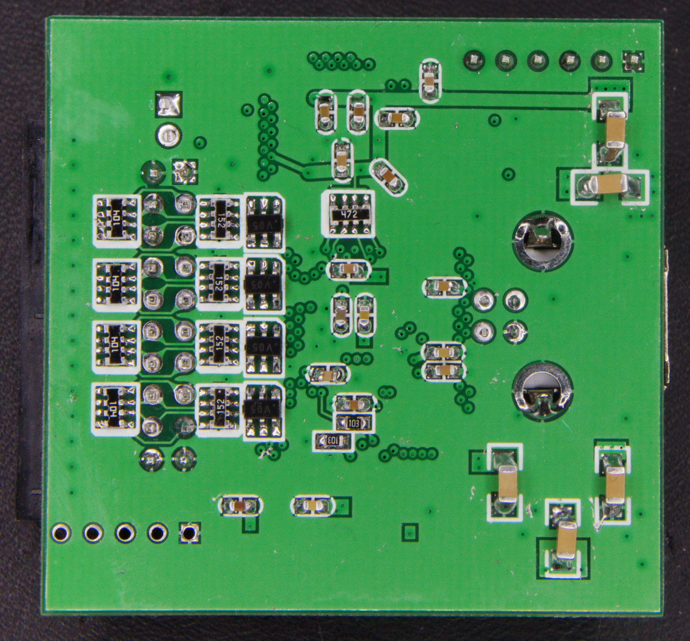

# mcupro Logic16 clone

{ .infobox-image }

### mcupro Logic16 clone

| | |
|---|---|
| **Status** | supported |
| **Source code** | [saleae-logic16](https://github.com/OpenTraceLab/OpenTraceCapture/tree/main/src/hardware/saleae-logic16) |
| **Channels** | 3/6/9/16 |
| **Samplerate** | 100/50/32/16MHz |
| **Samplerate (state)** | — |
| **Triggers** | none (SW-only) |
| **Min/max voltage** | -0.9V — 6V |
| **Threshold voltage** | 1.5V (operates with 3.3V logic) |
| **Memory** | none |
| **Compression** | yes |
| **Price range** | $30 - $35 |
| **Website** | [aliexpress.com](https://www.aliexpress.com/item/new-USB-Logic-100MHz-16Ch-Logic-Analyzer-for-ARM-FPGA-E4-004/32931358747.html) |

The **mcupro Logic16 clone** is a USB-based, 16-channel logic analyzer with 100/50/32/16MHz sampling rate (at 3/6/9/16 enabled channels).

This is a clone of the [Saleae Logic16](https://sigrok.org/wiki/Saleae_Logic16).

See [mcupro Logic16 clone/Info](https://sigrok.org/wiki/Mcupro_Logic16_clone/Info) for more details (such as **lsusb -v** output) about the device.

## Hardware (Actel variant)

The PCB is marked "Saleae16 v4.6 By mcupro".

- **FPGA**: [Actel A3P125](https://www.actel.com/documents/PA3_DS.pdf)
- **USB interface chip**: [Cypress CY7C68013A](http://www.cypress.com/?docID=45142)
- **I²C EEPROM**: [Atmel 24C02N](http://www.atmel.com/Images/doc3256.pdf)
- **3.3V voltage regulator**: [Advanced Monolithic Systems AMS1117-3.3](http://ams-semitech.com/attachments/File/AMS1117_20120314.pdf)
- **1.5V voltage regulator**: [Advanced Monolithic Systems AMS1117-1.5](http://ams-semitech.com/attachments/File/AMS1117_20120314.pdf)
- **Crystal**: 24MHz
## Hardware (Cyclone variant)

The PCB doesn't have any identifying markings.

- **FPGA**: [Altera Cyclone EP1C3T100](https://www.altera.com/products/fpga/cyclone-series/cyclone/support.html#Cyclone-Device-Handbook--All-Sections-)
- **USB interface chip**: [Cypress CY7C68013A](http://www.cypress.com/?docID=45142)
- **I²C EEPROM**: [Atmel 24C02N](http://www.atmel.com/Images/doc3256.pdf)
- **3.3V voltage regulator**: [Advanced Monolithic Systems AMS1117-3.3](http://ams-semitech.com/attachments/File/AMS1117_20120314.pdf)
- **1.5V voltage regulator**: [Advanced Monolithic Systems AMS1117-1.5](http://ams-semitech.com/attachments/File/AMS1117_20120314.pdf)
- **Crystal (FX2)**: 24MHz
- **Crystal (FPGA)**: 100MHz
- **FPGA bitstream**: ST M25P10VP, 1Mbit SPI NOR flash ([datasheet](https://cdn.datasheetspdf.com/pdf-down/2/5/P/25P10VP-STMicroelectronics.pdf))
- **Bootstrap controller**: [STCMCU 15F10](http://www.stcmcu.com/datasheet/stc/STC-AD-PDF/STC15.pdf), 8051 compatible
## Hardware (2018 variant)

The PCB is marked "Logic 16 Saleae". This variant also comes in a case identical to the [Noname_XL-LOGIC16-100M](https://sigrok.org/wiki/Noname_XL-LOGIC16-100M).

- **FPGA**: Markings ground off, but pinout indicates an Altera Cyclone EP1C3T144.
- **USB interface chip**: [Cypress CY7C68013A](http://www.cypress.com/?docID=45142)
- **I²C EEPROM**: Markings ground off
- **3.3V voltage regulator**: [TD 6810](http://www.techcodesemi.com/cn/products_info.asp?pid=26) adjustable version + 150k/680k resistors pair
- **1.5V voltage regulator**: [TD 6810](http://www.techcodesemi.com/cn/products_info.asp?pid=26) adjustable version + 160k/240k resistors pair
- **Crystal (FX2)**: 24MHz
- **Crystal (FPGA)**: 32MHz
- **FPGA bitstream**: ST M25P10VP, 1Mbit SPI NOR flash ([datasheet](https://cdn.datasheetspdf.com/pdf-down/2/5/P/25P10VP-STMicroelectronics.pdf))
- **Bootstrap controller**: Not required?
## Hardware (2015-01-08 variant)

The PCB is marked "Saleae Logic 16 By MCUPro 2015-1-8". Readily identifiable by the irregular PCB traces, and switching power supplies. This comes in a different case, identical to the [Noname_XL-LOGIC16-100M](https://sigrok.org/wiki/Noname_XL-LOGIC16-100M).

- **FPGA**: Markings ground off
- **USB interface chip**: [Cypress CY7C68013A](http://www.cypress.com/?docID=45142)
- **I²C EEPROM**: Markings ground off
- **3.3V voltage regulator**: [TD 6810](http://www.techcodesemi.com/cn/products_info.asp?pid=26) adjustable version + 150k/680k resistors pair
- **1.5V voltage regulator**: [TD 6810](http://www.techcodesemi.com/cn/products_info.asp?pid=26) adjustable version + 160k/240k resistors pair
- **Crystal (FX2)**: 24MHz
- **Crystal (FPGA)**: Looks like 32MHz?
- **FPGA bitstream**: ST M25P10VP, 1Mbit SPI NOR flash ([datasheet](https://cdn.datasheetspdf.com/pdf-down/2/5/P/25P10VP-STMicroelectronics.pdf))
- **Bootstrap controller**: Not required?
## Hardware (2014-01-25 variant)

The PCB is marked "Saleae Logic 16 mcupro 2014.1.25".

The bottom two channels are not GND, but SCK (sample clock out) and HCK (half of SCK out).

- **FPGA**: Markings ground off, but pinout and JTAG (IDCODE 0x020810dd) indicate an Altera Cyclone EP1C3T100.
- **USB interface chip**: Markings sometimes ground off? Cypress CY7C68013A
- **Crystal (FX2)**: marked "DKF 24.000"
- **Crystal (FPGA)**: marked "RAK32.00"
- **FPGA bitstream**: ST M25P10VP, 1Mbit SPI NOR flash ([datasheet](https://cdn.datasheetspdf.com/pdf-down/2/5/P/25P10VP-STMicroelectronics.pdf))
- **I²C EEPROM**: None? (CY7C68013A I2C port wired to FPGA pins)
- **Bootstrap controller**: Markings ground off, pinout could indicate a [STCMCU 15F10x](http://www.stcmcu.com/datasheet/stc/STC-AD-PDF/STC15.pdf) 8051-based MCU?
- **3.3V voltage regulator**: unknown switching regulator (marked "IC5CJ"&#160;?) + 150k/680k resistors pair
- **1.5V voltage regulator**: unknown switching regulator (marked "IC5CJ"&#160;?) + 160k/240k resistors pair
- **Channel input buffering**: none, only simple resistor (510R) + TVS diode array protection (possibly [Semtech SRV05](http://www.semtech.com/images/datasheet/srv05-4.pdf))

## Photos

{ .glightbox data-gallery="mcupro-logic16-clone" }
Img 0207 V1

{ .glightbox data-gallery="mcupro-logic16-clone" }
Mcupro 2014 1 25 Top Overview

{ .glightbox data-gallery="mcupro-logic16-clone" }
Mcupro 2015 1 8 Voltage Regulators

{ .glightbox data-gallery="mcupro-logic16-clone" }
Mcupro 2018 Back

{ .glightbox data-gallery="mcupro-logic16-clone" }
Seleae Logic16 Aliexpress Clone

{ .glightbox data-gallery="mcupro-logic16-clone" }
Mcupro 2015 1 8 Top Overview

{ .glightbox data-gallery="mcupro-logic16-clone" }
Mcupro 2015 1 8 Bottom Overview

{ .glightbox data-gallery="mcupro-logic16-clone" }
Mcupro 2018 Case

{ .glightbox data-gallery="mcupro-logic16-clone" }
Mcupro 2015 1 8 Bottom Markings Intact

{ .glightbox data-gallery="mcupro-logic16-clone" }
Xl Logic16 100m External

{ .glightbox data-gallery="mcupro-logic16-clone" }
Mcupro Logic16 Variant2 Top Flash 2buc

{ .glightbox data-gallery="mcupro-logic16-clone" }
Mcupro Logic16 Overview

{ .glightbox data-gallery="mcupro-logic16-clone" }
Mcupro 2014 1 25 Bottom Overview

{ .glightbox data-gallery="mcupro-logic16-clone" }
Mcupro 2014 1 25 Bottom Ortho

{ .glightbox data-gallery="mcupro-logic16-clone" }
Mcupro 2014 1 25 Top Ortho

{ .glightbox data-gallery="mcupro-logic16-clone" }
Mcupro Logic16 Variant2 Top

{ .glightbox data-gallery="mcupro-logic16-clone" }
Mcupro 2018 Front

## Photos

{ .glightbox data-gallery="mcupro-logic16-clone" }
Img 0207 V1

{ .glightbox data-gallery="mcupro-logic16-clone" }
Mcupro 2014 1 25 Top Overview

{ .glightbox data-gallery="mcupro-logic16-clone" }
Mcupro 2015 1 8 Voltage Regulators

{ .glightbox data-gallery="mcupro-logic16-clone" }
Mcupro 2018 Back

{ .glightbox data-gallery="mcupro-logic16-clone" }
Seleae Logic16 Aliexpress Clone

{ .glightbox data-gallery="mcupro-logic16-clone" }
Mcupro 2015 1 8 Top Overview

{ .glightbox data-gallery="mcupro-logic16-clone" }
Mcupro 2015 1 8 Bottom Overview

{ .glightbox data-gallery="mcupro-logic16-clone" }
Mcupro 2018 Case

{ .glightbox data-gallery="mcupro-logic16-clone" }
Mcupro 2015 1 8 Bottom Markings Intact

{ .glightbox data-gallery="mcupro-logic16-clone" }
Xl Logic16 100m External

{ .glightbox data-gallery="mcupro-logic16-clone" }
Mcupro Logic16 Variant2 Top Flash 2buc

{ .glightbox data-gallery="mcupro-logic16-clone" }
Mcupro Logic16 Overview

{ .glightbox data-gallery="mcupro-logic16-clone" }
Mcupro 2014 1 25 Bottom Overview

{ .glightbox data-gallery="mcupro-logic16-clone" }
Mcupro 2014 1 25 Bottom Ortho

{ .glightbox data-gallery="mcupro-logic16-clone" }
Mcupro 2014 1 25 Top Ortho

{ .glightbox data-gallery="mcupro-logic16-clone" }
Mcupro Logic16 Variant2 Top

{ .glightbox data-gallery="mcupro-logic16-clone" }
Mcupro 2018 Front

## Photos

{ .glightbox data-gallery="mcupro-logic16-clone" }
Img 0207 V1

{ .glightbox data-gallery="mcupro-logic16-clone" }
Mcupro 2014 1 25 Top Overview

{ .glightbox data-gallery="mcupro-logic16-clone" }
Mcupro 2015 1 8 Voltage Regulators

{ .glightbox data-gallery="mcupro-logic16-clone" }
Mcupro 2018 Back

{ .glightbox data-gallery="mcupro-logic16-clone" }
Seleae Logic16 Aliexpress Clone

{ .glightbox data-gallery="mcupro-logic16-clone" }
Mcupro 2015 1 8 Top Overview

{ .glightbox data-gallery="mcupro-logic16-clone" }
Mcupro 2015 1 8 Bottom Overview

{ .glightbox data-gallery="mcupro-logic16-clone" }
Mcupro 2018 Case

{ .glightbox data-gallery="mcupro-logic16-clone" }
Mcupro 2015 1 8 Bottom Markings Intact

{ .glightbox data-gallery="mcupro-logic16-clone" }
Xl Logic16 100m External

{ .glightbox data-gallery="mcupro-logic16-clone" }
Mcupro Logic16 Variant2 Top Flash 2buc

{ .glightbox data-gallery="mcupro-logic16-clone" }
Mcupro Logic16 Overview

{ .glightbox data-gallery="mcupro-logic16-clone" }
Mcupro 2014 1 25 Bottom Overview

{ .glightbox data-gallery="mcupro-logic16-clone" }
Mcupro 2014 1 25 Bottom Ortho

{ .glightbox data-gallery="mcupro-logic16-clone" }
Mcupro 2014 1 25 Top Ortho

{ .glightbox data-gallery="mcupro-logic16-clone" }
Mcupro Logic16 Variant2 Top

{ .glightbox data-gallery="mcupro-logic16-clone" }
Mcupro 2018 Front

## Photos

{ .glightbox data-gallery="mcupro-logic16-clone" }
Img 0207 V1

{ .glightbox data-gallery="mcupro-logic16-clone" }
Mcupro 2014 1 25 Top Overview

{ .glightbox data-gallery="mcupro-logic16-clone" }
Mcupro 2015 1 8 Voltage Regulators

{ .glightbox data-gallery="mcupro-logic16-clone" }
Mcupro 2018 Back

{ .glightbox data-gallery="mcupro-logic16-clone" }
Seleae Logic16 Aliexpress Clone

{ .glightbox data-gallery="mcupro-logic16-clone" }
Mcupro 2015 1 8 Top Overview

{ .glightbox data-gallery="mcupro-logic16-clone" }
Mcupro 2015 1 8 Bottom Overview

{ .glightbox data-gallery="mcupro-logic16-clone" }
Mcupro 2018 Case

{ .glightbox data-gallery="mcupro-logic16-clone" }
Mcupro 2015 1 8 Bottom Markings Intact

{ .glightbox data-gallery="mcupro-logic16-clone" }
Xl Logic16 100m External

{ .glightbox data-gallery="mcupro-logic16-clone" }
Mcupro Logic16 Variant2 Top Flash 2buc

{ .glightbox data-gallery="mcupro-logic16-clone" }
Mcupro Logic16 Overview

{ .glightbox data-gallery="mcupro-logic16-clone" }
Mcupro 2014 1 25 Bottom Overview

{ .glightbox data-gallery="mcupro-logic16-clone" }
Mcupro 2014 1 25 Bottom Ortho

{ .glightbox data-gallery="mcupro-logic16-clone" }
Mcupro 2014 1 25 Top Ortho

{ .glightbox data-gallery="mcupro-logic16-clone" }
Mcupro Logic16 Variant2 Top

{ .glightbox data-gallery="mcupro-logic16-clone" }
Mcupro 2018 Front

## Photos

{ .glightbox data-gallery="mcupro-logic16-clone" }
Img 0207 V1

{ .glightbox data-gallery="mcupro-logic16-clone" }
Mcupro 2014 1 25 Top Overview

{ .glightbox data-gallery="mcupro-logic16-clone" }
Mcupro 2015 1 8 Voltage Regulators

{ .glightbox data-gallery="mcupro-logic16-clone" }
Mcupro 2018 Back

{ .glightbox data-gallery="mcupro-logic16-clone" }
Seleae Logic16 Aliexpress Clone

{ .glightbox data-gallery="mcupro-logic16-clone" }
Mcupro 2015 1 8 Top Overview

{ .glightbox data-gallery="mcupro-logic16-clone" }
Mcupro 2015 1 8 Bottom Overview

{ .glightbox data-gallery="mcupro-logic16-clone" }
Mcupro 2018 Case

{ .glightbox data-gallery="mcupro-logic16-clone" }
Mcupro 2015 1 8 Bottom Markings Intact

{ .glightbox data-gallery="mcupro-logic16-clone" }
Xl Logic16 100m External

{ .glightbox data-gallery="mcupro-logic16-clone" }
Mcupro Logic16 Variant2 Top Flash 2buc

{ .glightbox data-gallery="mcupro-logic16-clone" }
Mcupro Logic16 Overview

{ .glightbox data-gallery="mcupro-logic16-clone" }
Mcupro 2014 1 25 Bottom Overview

{ .glightbox data-gallery="mcupro-logic16-clone" }
Mcupro 2014 1 25 Bottom Ortho

{ .glightbox data-gallery="mcupro-logic16-clone" }
Mcupro 2014 1 25 Top Ortho

{ .glightbox data-gallery="mcupro-logic16-clone" }
Mcupro Logic16 Variant2 Top

{ .glightbox data-gallery="mcupro-logic16-clone" }
Mcupro 2018 Front

## Protocol

See [Saleae_Logic16#Protocol](https://sigrok.org/wiki/Saleae_Logic16#Protocol).

## Firmware
Actel variant
This logic analyzer works with unmodified Saleae software. The Actel FPGA has on-chip flash storage, so it only requires an upload of Cypress FX2LP firmware in order to operate.
Cyclone variant
This logic analyzer works with unmodified Saleae software. The PCB contains an SPI flash chip, so it only requires an upload of Cypress FX2LP firmware in order to operate.
2015-01-08 and 2018 variants
Only requires an upload of Cypress FX2LP firmware to operate. Open-source binaries from [gregani](https://github.com/gregani/la16fw) work, but must be renamed to **saleae-logic16-fx2.fw**. It also requires a [libsigrok](https://sigrok.org/wiki/Libsigrok) more recent than 2014-08-22 to work (see bug [#680](http://sigrok.org/bugzilla/show_bug.cgi?id=680#c4)).
2014-01-25 variant
Seems to have the bitstream in internal flash, so it only requires an upload of Cypress FX2LP firmware in order to operate. This requires a [libsigrok](https://sigrok.org/wiki/Libsigrok) more recent than 2014-08-22 to work (see bug [#680](http://sigrok.org/bugzilla/show_bug.cgi?id=680#c4)).

The firmware extraction steps are identical to [steps for Saleae Logic16](https://sigrok.org/wiki/Saleae_Logic16#Firmware), however you only need to have **saleae-logic16-fx2.fw** installed.

