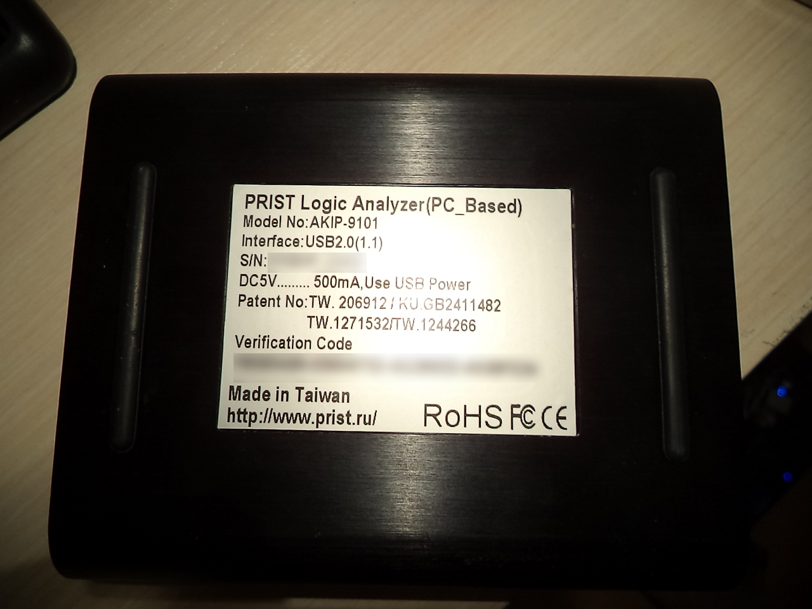
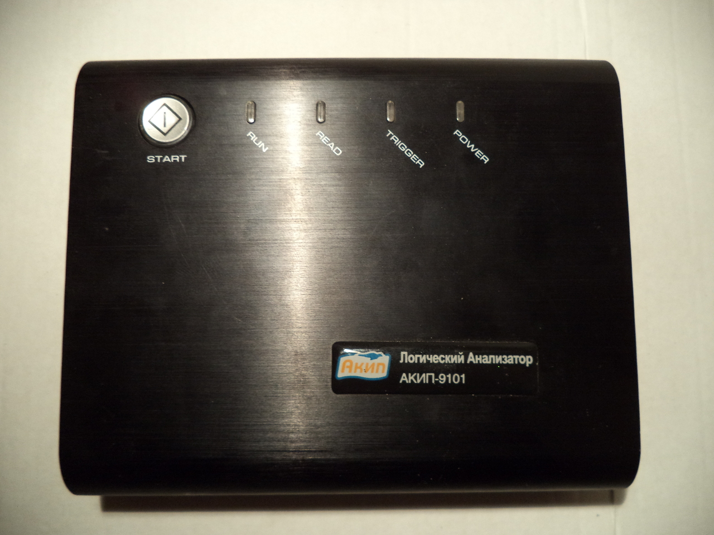
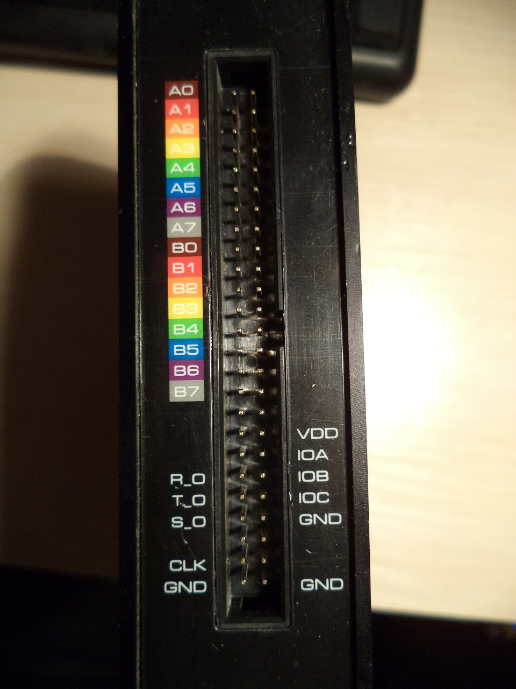

# Prist AKIP-9101

{ .infobox-image }

### Prist AKIP-9101

| | |
|---|---|
| **Status** | supported |
| **Source code** | [zeroplus-logic-cube](https://github.com/OpenTraceLab/OpenTraceCapture/tree/main/src/hardware/zeroplus-logic-cube) |
| **Channels** | 16 |
| **Samplerate** | 200MHz |
| **Samplerate (state)** | 100MHz |
| **Triggers** | pattern, edge |
| **Min/max voltage** | -6V — +6V |
| **Memory** | 256Kbits/channel |
| **Compression** | yes |
| **Website** | [prist.ru](http://www.prist.ru/produce.php/card/meas.htm?id=411489254#t=main) |

The **Prist AKIP-9101 (АКИП-9101)** is a USB-based, 16-channel logic analyzer with up to 200MHz sampling rate.

It is likely to be a rebranded ZEROPLUS LAP-C(16128+).

See [Prist AKIP-9101/Info](https://sigrok.org/wiki/Prist_AKIP-9101/Info) for more details (such as **lsusb -v** output) about the device.

See [ZEROPLUS Logic Cube LAP-C series](https://sigrok.org/wiki/ZEROPLUS_Logic_Cube_LAP-C_series) for information common to all devices in this series.

## Hardware

TODO

## Photos

{ .glightbox data-gallery="prist-akip-9101" }
Akip Rear

{ .glightbox data-gallery="prist-akip-9101" }
Akip Front

{ .glightbox data-gallery="prist-akip-9101" }
Prist Akip 9101 Mugshot

{ .glightbox data-gallery="prist-akip-9101" }
Akip Ports

## Protocol

TODO.

## Resources
- [Datasheet](http://www.prist.ru/produces/pdf/akip-910x.pdf)

