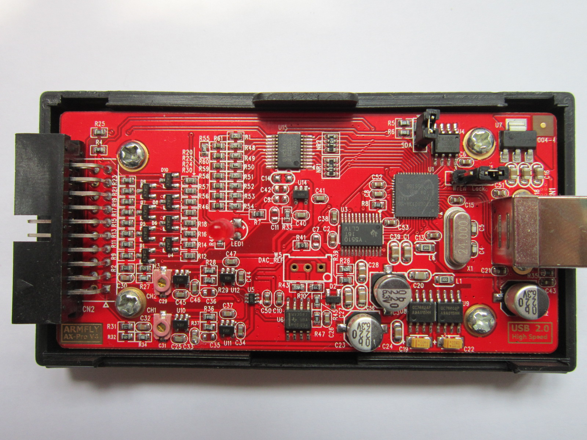
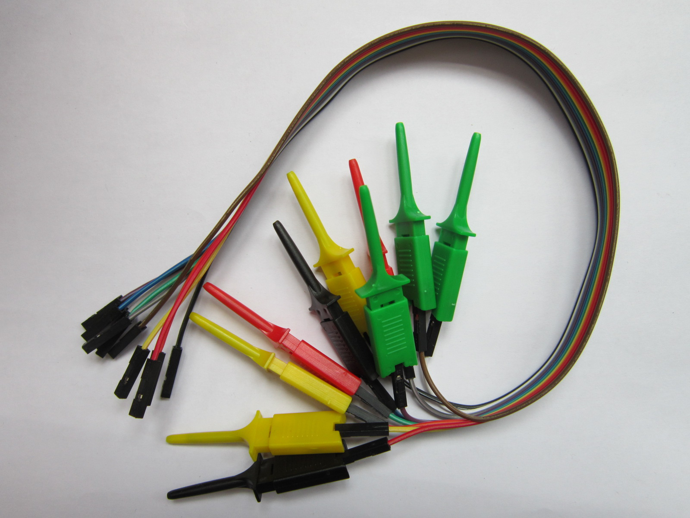
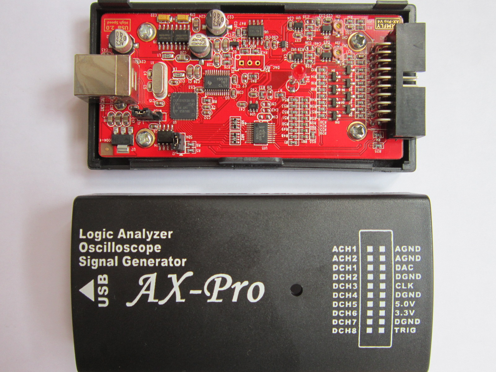

# ARMFLY AX-Pro

{ .infobox-image }

### ARMFLY AX-Pro

| | |
|---|---|
| **Status** | supported |
| **Source code** | [fx2lafw](https://github.com/OpenTraceLab/OpenTraceCapture/tree/main/src/hardware/fx2lafw) |
| **Channels** | 8 + 1 |
| **Samplerate** | 8ch @ 24MHz, 8+1ch @ 12MHz |
| **Samplerate (state)** | — |
| **Triggers** | none (SW-only) |
| **Min/max voltage** | Digital: 0V — +5VAnalog: ±10V (±20V max) |
| **Threshold voltage** | Fixed: VIH=1.4V, VIL=0.8V |
| **Memory** | none |
| **Compression** | none |
| **Price range** | $35-45 |
| **Website** | [armfly.com](http://www.armfly.com/product/AX-Pro/ax-pro.htm) |

The **ARMFLY AX-Pro** is a USB-based, 8-channel logic analyzer with up to 24MHz sampling rate, with 1 additional analog channel (theoretically 2, but only one of them can be used at a time; 3MHz analog bandwidth). Has been proven to be possible to work at 24MS/s also for the Analog channel even if the ADC max sample rate is 20MS/s (see resources).

It is a clone of the [CWAV USBee AX-Pro](/w/index.php?title=CWAV_USBee_AX-Pro&action=edit&redlink=1). There is an "[RS232 RS485 RS422 CAN converter](http://item.taobao.com/item.htm?id=12503749579)" add-on board which also has a BNC connector for analog support.

In sigrok, we use the open-source [fx2lafw](https://sigrok.org/wiki/Fx2lafw) firmware for this logic analyzer.

**Note**: [fx2lafw](https://sigrok.org/wiki/Fx2lafw) currently doesn't support switching between the two possible analog channels, ACH1 will be used unconditionally.

See [ARMFLY AX-Pro/Info](https://sigrok.org/wiki/ARMFLY_AX-Pro/Info) for some more details (such as **lsusb -v** output) on the device.

## Hardware
- **Main chip**: Cypress CY7C68013A-56LTXC (FX2LP)
- **I2C EEPROM**: Atmel ATML920 24C02N SU27 D
- **Low-dropout voltage regulator**: Advanced Monolithic Systems AMS1117-3.3
- **Crystal**: 24MHz
- **ADC**: Texas Instrument TLC5510IPW, 8-Bit, 20 MS/s ADC Single Channel
- **OpAmp**: Texas Instrument LMV358 Dual Low-Voltage Rail-to-Rail Output Operational Amplifier
- **OpAmp**: Analog Devices AD8065 (SMD marking "HRA")
- **Multiplexor**: (I do not see it. Is it U5?)
- **Edge-Triggered D-Type Flip-Flops"": HC574 (U15)**
- ...

## Photos

{ .glightbox data-gallery="armfly-ax-pro" }
Ax Pro Pcb

{ .glightbox data-gallery="armfly-ax-pro" }
Ax Pro Cables

{ .glightbox data-gallery="armfly-ax-pro" }
Ax Pro

{ .glightbox data-gallery="armfly-ax-pro" }
Armfly Ax Pro

## Protocol

Since we use the open-source [fx2lafw](https://sigrok.org/wiki/Fx2lafw) firmware for this device, we don't need to know the protocol.

## Hardware configuration (V.5)
- PA0 -> Select the Analog Source (Channel 1 or 2)
- PA1-7 are not connected
- CTL0 -> not connected
- CTL1 (connected with RDY1) -> CLK Pin (external)
- CTL2 -> provide the clock to the ADC
- PORTB -> Digital Data (8 pins, external)
- PORTD -> ADC Data
## Resources
- [ARMFLY Taobao shop](https://item.taobao.com/item.htm?spm=a230r.1.14.24.3c1ad073DBcRDL&id=19741672514&ns=1&abbucket=8#detail) ([English translation](http://translate.google.com/translate?hl=en&sl=zh-CN&tl=en&u=https%3A%2F%2Fitem.taobao.com%2Fitem.htm%3Fspm%3Da230r.1.14.24.3c1ad073DBcRDL%26id%3D19741672514%26ns%3D1%26abbucket%3D8%23detail&sandbox=1))
- [ARMFLY AX-Pro RS232 RS485 RS422 CAN converter](http://item.taobao.com/item.htm?id=12503749579) ([English translation](http://translate.google.com/translate?hl=en&sl=zh-CN&tl=en&u=http%3A%2F%2Fitem.taobao.com%2Fitem.htm%3Fid%3D12503749579))
- [ARMFLY AX-Pro Analog Channel up to 24MS/s](https://www.youtube.com/watch?v=hM8xnfO61Aw)

