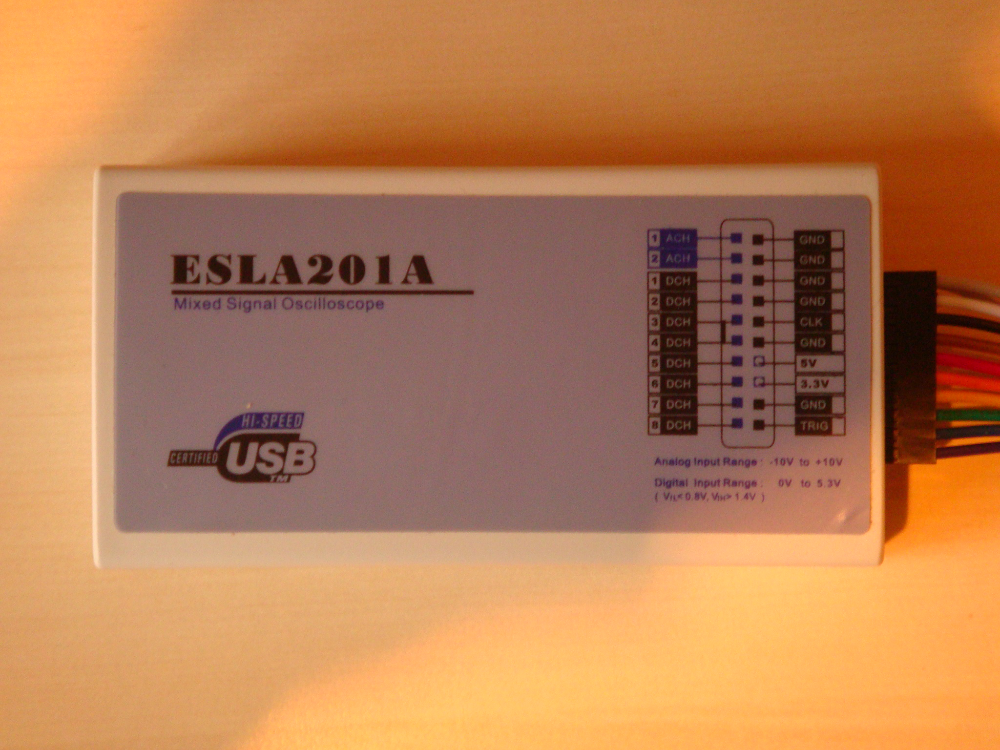

# EE Electronics ESLA201A

{ .infobox-image }

### EE Electronics ESLA201A

| | |
|---|---|
| **Status** | supported |
| **Source code** | [fx2lafw](https://github.com/OpenTraceLab/OpenTraceCapture/tree/main/src/hardware/fx2lafw) |
| **Channels** | 8 + 1 |
| **Samplerate** | 8ch @ 24MHz, 8+1ch @ 12MHz |
| **Samplerate (state)** | — |
| **Triggers** | none (SW-only) |
| **Min/max voltage** | max. 5.5V |
| **Threshold voltage** | Fixed: VIH=1.4V, VIL=0.8V |
| **Memory** | none |
| **Compression** | none |
| **Price range** | $35 - $45 |
| **Website** | [eeelec.com](https://web.archive.org/web/20110213013236/http://eeelec.com/xla/) |

The **EE Electronics ESLA201A** a USB-based, 8-channel logic analyzer with up to 24MHz sampling rate, with 1 additional analog channel (theoretically 2, but only one of them can be used at a time; 3MHz analog bandwidth).

It is a clone of the [CWAV USBee AX-Pro](/w/index.php?title=CWAV_USBee_AX-Pro&action=edit&redlink=1).

In sigrok, we use the open-source [fx2lafw](https://sigrok.org/wiki/Fx2lafw) firmware for this logic analyzer.

**Note**: [fx2lafw](https://sigrok.org/wiki/Fx2lafw) currently doesn't support switching between the two possible analog channels, 1ACH (TODO: not verified on hardware) will be used unconditionally.

See [EE Electronics ESLA201A/Info](https://sigrok.org/wiki/EE_Electronics_ESLA201A/Info) for some more details (such as **lsusb -vvv** output) on the device.

## Hardware
- Cypress CY7C68013A — [FX2 chip, 56 pins](http://www.cypress.com/?rID=38801)
- Atmel ATMLH113 — I2C EEPROM
- Texas Instruments TLC5510I — [8-bit ADC](http://www.ti.com/product/tlc5510)
- NXP 74HC4051D — [8-channel analog switch](http://www.nxp.com/documents/data_sheet/74HC_HCT4051.pdf)
- National LM358 — [Low Power Dual Op-Amp](http://www.national.com/mpf/LM/LM358.html)
- ON Semiconductor MC33078 — [Low Noise Dual Op-Amp](http://www.onsemi.com/PowerSolutions/product.do?id=MC33078)
- Maxim ICL7660 — [Switched Capacitor Voltage Converter](http://datasheets.maxim-ic.com/en/ds/ICL7660-MAX1044.pdf)

**Analog frontend:**

## Photos

{ .glightbox data-gallery="ee-electronics-esla201a" }
Esla201a

{ .glightbox data-gallery="ee-electronics-esla201a" }
Esla201a Pcb

{ .glightbox data-gallery="ee-electronics-esla201a" }
Esla201a

## Protocol

Since we use the open-source [fx2lafw](https://sigrok.org/wiki/Fx2lafw) firmware for this device, we don't need to know the protocol.

The USBee AX software controls the unit through a combination of command messages, and firmware patched for sample rates etc. downloaded before each capture. For this reason we have abandoned efforts to decode the protocol, and are working instead on [fx2lafw](https://sigrok.org/wiki/Fx2lafw) — a replacement open source firmware for the device.

## Resources
- [Eeelec eBay store](http://stores.ebay.com/eeelec) and [Eeelec webshop](http://store.eeelec.com/)
- [Eeelec: Software download location](https://web.archive.org/web/20110213013236/http://eeelec.com/xla/)

