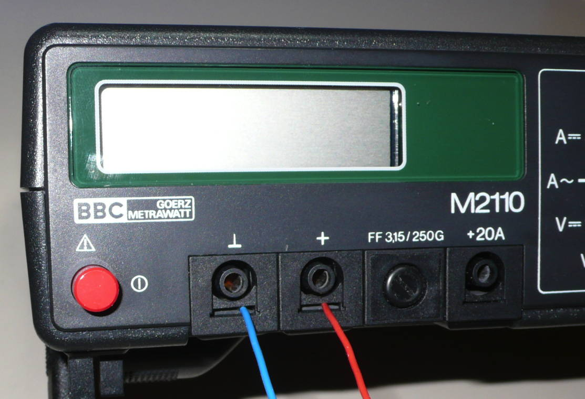
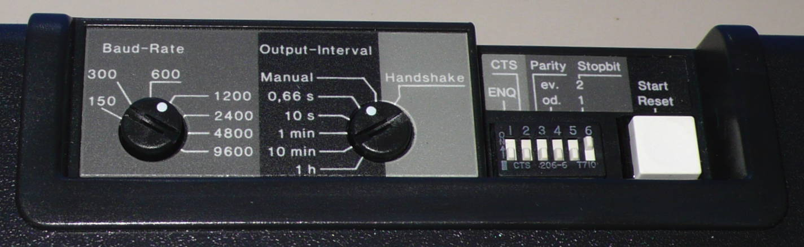
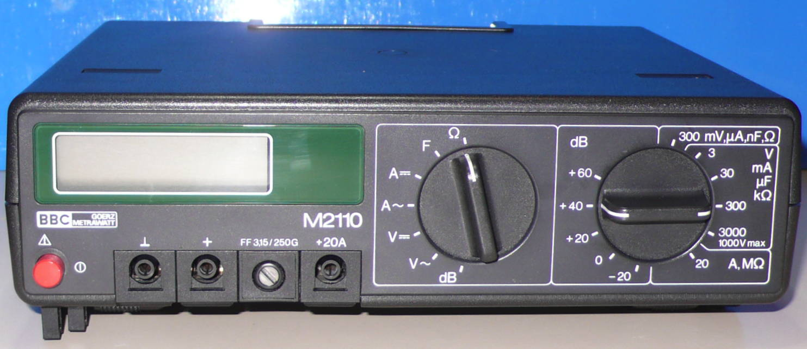
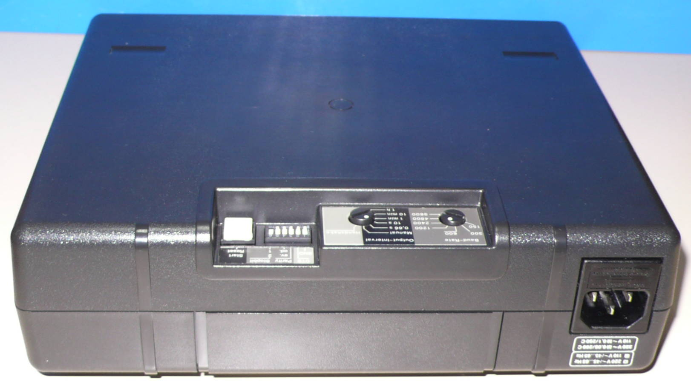
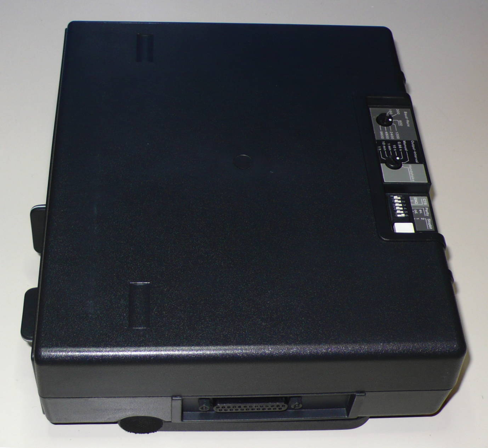
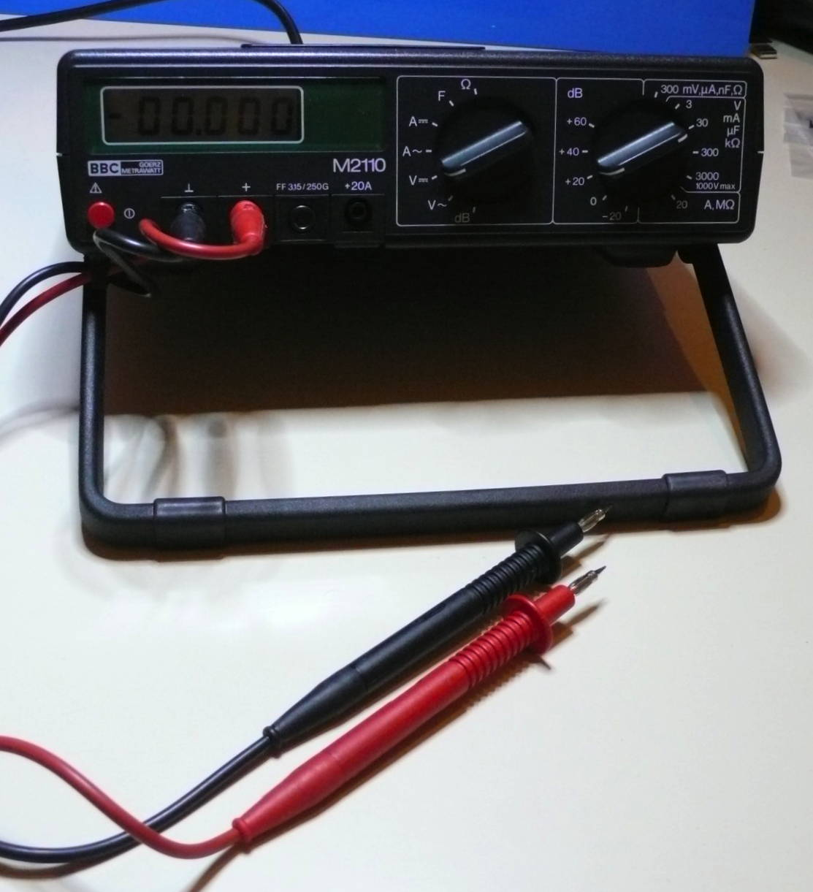
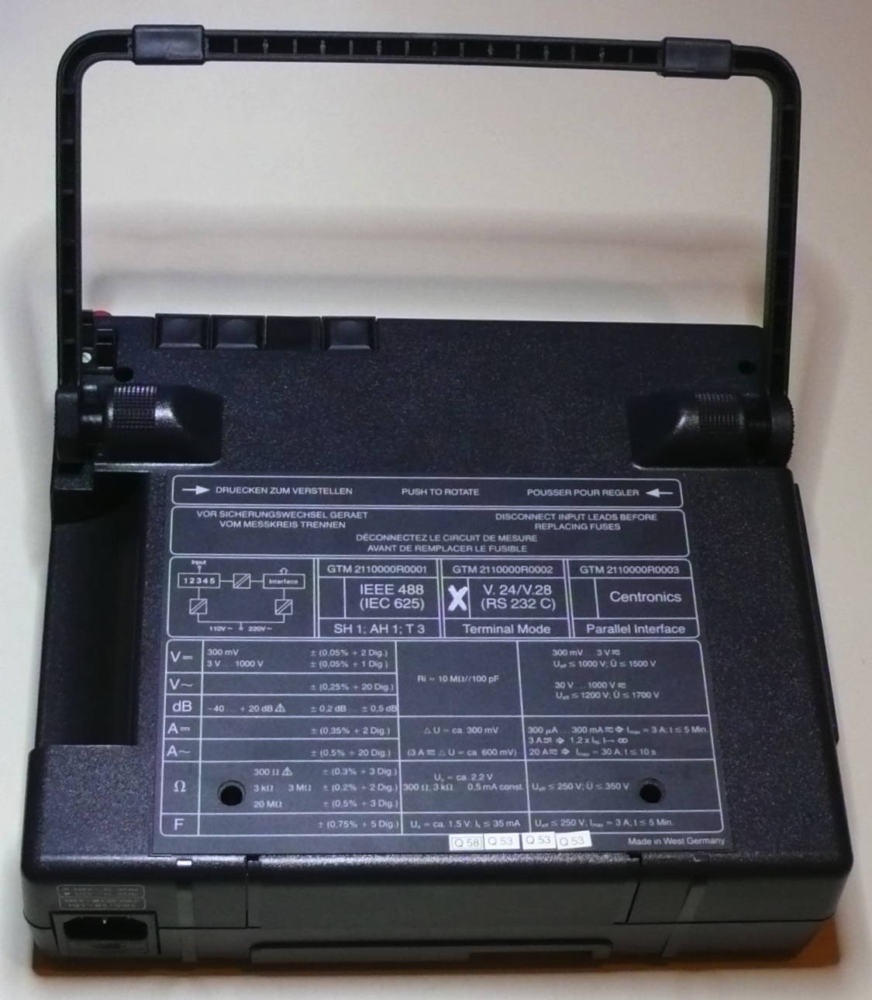

# BBC Goertz Metrawatt M2110

<div class="infobox" markdown>

{ .infobox-image }

### BBC Goertz Metrawatt M2110

| | |
|---|---|
| **Status** | supported |
| **Source code** | [serial-dmm](https://github.com/OpenTraceLab/OpenTraceCapture/tree/main/src/hardware/serial-dmm) |
| **Counts** | 30000 |
| **Connectivity** | RS232 |
| **Measurements** | voltage, current, resistance, capacitance |
| **Features** | manual range |

</div>

The **BBC Goertz Metrawatt M2110** is a historic (about 1984) 30000 count bench multimeter with RS232 connectivity.

It is possibly the oldest multimeter supported by [libsigrok](https://sigrok.org/wiki/Libsigrok).

A multimeter called **Metravo 5D** from the same manufacturer that seems to be the same model without RS232 port received the *iF design awards* in 1981. 

The manufacturer is called [Gossen Metrawatt](https://sigrok.org/wiki/Gossen_Metrawatt) today.

## Hardware

**RS232 interface:**

- Baud rates 150/300/600/1200/2400/4800/9600, configurable via rotary switch
- 7 data bits
- No/even/odd parity bit, configurable via DIP switches
- 1 or 2 stop bits, configurable via DIP switch
- Optional CTS handshake, configurable via DIP switch
- Output intervals 0.66 s/10 s/1 min/10 min/1 h/manual/remote controlled, configurable via rotary switch
- Manual output sends value on button *Start/Reset* pressed
- Remote controlled output sends data on CTS set or ENQ sent, configurable via DIP switches
- Max. 1.5 measurements/s

**RS232 cable:**

- 25 pin "female" connector
- Null modem cable required (DTE configuration)!

## Photos

<div class="photo-grid" markdown>

[](./img/Bbc_gm_m2110_mugshot.png "Bbc Gm M2110 Mugshot"){ .glightbox data-gallery="bbc-goertz-metrawatt-m2110" }
<span class="caption">Bbc Gm M2110 Mugshot</span>

[](./img/Bbcg_m2110_6.JPG "Bbcg M2110 6"){ .glightbox data-gallery="bbc-goertz-metrawatt-m2110" }
<span class="caption">Bbcg M2110 6</span>

[](./img/Bbcg_m2110_2.JPG "Bbcg M2110 2"){ .glightbox data-gallery="bbc-goertz-metrawatt-m2110" }
<span class="caption">Bbcg M2110 2</span>

[](./img/Bbcg_m2110_1.JPG "Bbcg M2110 1"){ .glightbox data-gallery="bbc-goertz-metrawatt-m2110" }
<span class="caption">Bbcg M2110 1</span>

[](./img/Bbcg_m2110_4.JPG "Bbcg M2110 4"){ .glightbox data-gallery="bbc-goertz-metrawatt-m2110" }
<span class="caption">Bbcg M2110 4</span>

[](./img/Bbcg_m2110_3.JPG "Bbcg M2110 3"){ .glightbox data-gallery="bbc-goertz-metrawatt-m2110" }
<span class="caption">Bbcg M2110 3</span>

[](./img/Bbcg_m2110_7.JPG "Bbcg M2110 7"){ .glightbox data-gallery="bbc-goertz-metrawatt-m2110" }
<span class="caption">Bbcg M2110 7</span>

[](./img/Bbcg_m2110_5.JPG "Bbcg M2110 5"){ .glightbox data-gallery="bbc-goertz-metrawatt-m2110" }
<span class="caption">Bbcg M2110 5</span>

</div>
## Protocol

```
msg&#160;:= SDDDDDD | 'OVERRNG'  CR LF
S&#160;:= '-' | ' '
D&#160;:= '0'..'9'|'.'

```

Unfortunately the device does not send the measured unit.

## Support in sigrok

The device is supported by the driver **bbcgm-m2110** in modes that send data automatically or manually. Polling is not implemented. The device does not send the measured quantity or unit via the serial interface, just the value.

The device detection requires a message to be sent by the device within 1s. The default serial port parameters are 1200/7n2.

After power on or configuration changes the button *Start/Reset* must be pressed at least once to initiate sending.

## Resources
- Manual (PDF) available from [Gossen Metrawatt](https://sigrok.org/wiki/Gossen_Metrawatt) customer support.
- [*Metravo 5D* in *iF online exibition*](http://exhibition.ifdesign.de/entrydetails_en.html?beitrag_id=11387)

