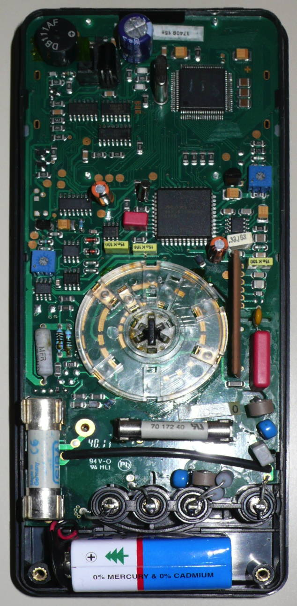

# HT Instruments HT410

{ .infobox-image }

### HT Instruments HT410

| | |
|---|---|
| **Status** | supported |
| **Source code** | [gmc-mh-1x-2x](https://github.com/OpenTraceLab/OpenTraceCapture/tree/main/src/hardware/gmc-mh-1x-2x) |
| **Counts** | 3100 |
| **IEC 61010-1** | CAT III 1000 V, CAT IV 600 V |
| **Connectivity** | Infrared (RS232) |
| **Measurements** | voltage, current, resistance, temperature, diode, continuity |
| **Features** | autorange, data hold, bargraph |
| **Website** | [ht-instruments.com](http://www.ht-instruments.com/en/products-ht/ht410) |

The **HT Instruments HT410** is a 3100 counts handheld digital multimeter with IR (RS232) connectivity.

It is probably a low-cost OEM version of the *Rishabh 15S* (see [Gossen Metrawatt](https://sigrok.org/wiki/Gossen_Metrawatt), *Metrahit 15S*) or a similar model with much worse specs, although the actual accuracy of [Matthias'](https://sigrok.org/wiki/User:Matthias_Heidbrink) device seems to be better than the specs, according to the calibration certificate (!) that came with it. At least the test cords that come with it are Rishabh brand and cheaper quality than orginal Gossen Metrawatt ones, although they look the same. The same seems to be true for case and sleeve.

The IR connectivity is undocumented, possibly because no IR interface or software is available from the manufacturer. To enable sending data, press the DATA button while powering it on. See [here](https://sigrok.org/wiki/Gossen_Metrawatt#Metrahit_1x.2F2x_series) for fitting interfaces.

## Hardware
- **Battery**:  9 V *NEDA1604*, *JIS006P, *IEC6F22**
- **Fuse**:
Current 300 mA: FF 1,6 A/1000V, 6,3x32 mm, 10 kA
- Current 3A, 10A: FF 16 A/1000V, 10x38mm, 30 kA
- TODO.

## Photos

{ .glightbox data-gallery="ht-instruments-ht410" }
Ht410 Logo

{ .glightbox data-gallery="ht-instruments-ht410" }
Ht410 3

{ .glightbox data-gallery="ht-instruments-ht410" }
Ht410 4

{ .glightbox data-gallery="ht-instruments-ht410" }
Ht410 5

{ .glightbox data-gallery="ht-instruments-ht410" }
Ht410 6

## Measurement functions and ranges
| Measurement function | Range | Resolution | Accuracy | sigrok result | Remarks |
|---|---|---|---|---|---|
| V= | 30.00 mV | 10 μV | ±(0,5% + 7) | mq V, unit V, mqflags DC | Manual range; accuracy with ZERO, otherwise +35 digits. |
| 300.0 mV | 100 μV | " | Manual range |
| 3.000 V | 1 mV | ±(0,25% + 5) | " |  |
| 30.00 V | 10 mV | " |  |
| 300.0 V | 100 mV | " |  |
| 1000 V | 1 V | ±(0,35% + 5) | " |  |
| V≈ | 3.000 V | 1 mV | ±(0,75% + 6) | mq V, unit V, mqflags AC |  |
| 30.00 V | 10 mV | " |  |
| 300.0 V | 100 mV | " |  |
| 1000 V | 1 V | " |  |
| A= | 300 µA | 0.1 µA | ±(1.0% + 9) | mq Curr., unit A, mqflags DC | Manual range |
| 3.000 mA | 1 µA | ±(1.0% + 6) | " |  |
| 30.00 mA | 10 µA | ±(1.0% + 9) | " | Manual range |
| 300.0 mA | 100 µA | ±(1,0% + 6) | " |  |
| 3.000 A | 1 mA | ±(1,0% + 9) | " | Manual range |
| 10.00 A | 10 mA | ±(1,0% + 6) | " |  |
| A≈ | 3.00 mA | 1 µA | ±(1,5% + 6) | mq Curr., unit A, mqflags AC |  |
| 300.0 mA | 100 µA | " |  |
| 10.00 A | 10 mA | " |  |
| Ω | 30.00 Ω | 10 mΩ | ±(0.5% + 7) | mq Res., unit Ω, mqflags - | Accuracy with ZERO, otherwise +30 digits. |
| 300.0 Ω | 100 mΩ | " |  |
| 3.000 kΩ | 1 Ω | ±(0.4% + 5) | " |  |
| 30.00 kΩ | 10 Ω | " |  |
| 300.0 kΩ | 100 Ω | " |  |
| 3.000 MΩ | 1 kΩ | ±(0.6% + 5) | " |  |
| 30.00 MΩ | 10 kΩ | ±(2.0% + 5) | " |  |
| Diode/Cont. | 3.000 V– | 1 mV |  | mq V, unit V, mqflags DC,DIODE | Diode and cont. are identical on this device, just without beeper for diode. Cont. beeps < 120 Ω. |
| Cap. F | 30.00 nF | 10 pF | ±(1.0% + 7) | mq Cap., unit F, mqflags - | Accuracy with ZERO, otherwise +50 digits. |
| 300.0 nF | 100 pF | " |  |
| 3.000 µF | 1 nF | " |  |
| 30.00 µF | 10 nF | ±(3.0% + 7) | " |  |
| Hz≃ | 300.0 Hz | 0.1 Hz | ±(0.5% + 5) | mq Freq., unit Hz, mqflags AC,DC |  |
| 3.000 kHz | 1 Hz | " |  |
| 30.00 kHz | 10 Hz | " |  |
| 100.00 kHz | 100 Hz | " |  |
| Duty cycle | 2% - 98% | 0.1&#160;% | ±5 | mq Duty cycle, unit&#160;%, mqflags - |  |
| °C | Pt100 –200.0 - +200.0 °C | 0.1 °C | ±(2 K + 9) | mq Temp., unit °C, mqflags - |  |
| Pt100 +200.0 - +850.0 °C | ±(1.0% + 9) | " |  |
| Pt1000 –100.0 - +200.0 °C | ±(2 K + 6) | " |  |
| Pt1000 +200.0 - +850.0 °C | ±(1.0% + 6) | " |  |
| Data Hold |  |  |  | mqflags += HOLD | Disabled while IR interface is active. |
| MIN |  |  |  | mqflags += MIN | Disabled while IR interface is active. |
| MAX |  |  |  | mqflags += MAX | Disabled while IR interface is active. |

The column "sigrok result" contains in short form what the driver generates for the resp. data type.

The accuracy specification is incomplete, see manual for exact specs.

