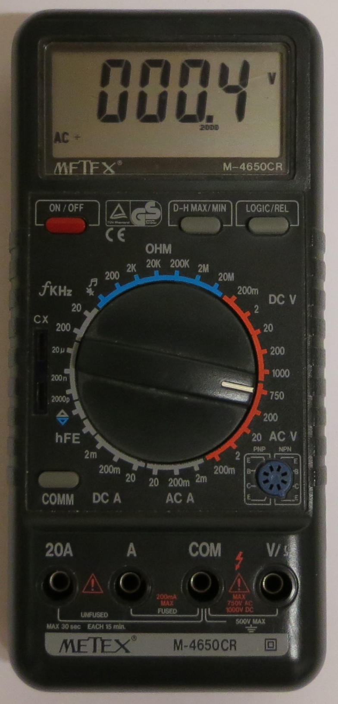
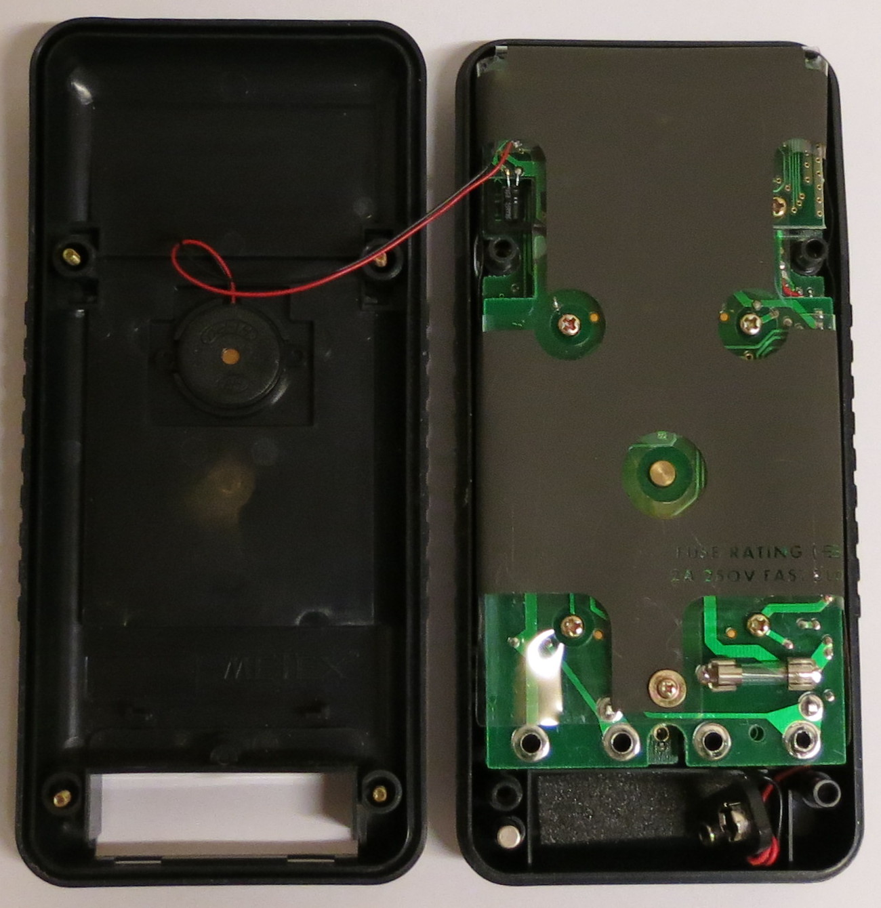
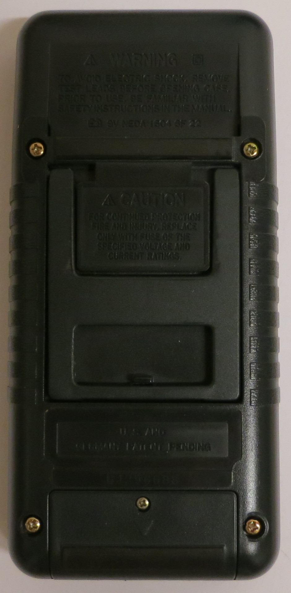
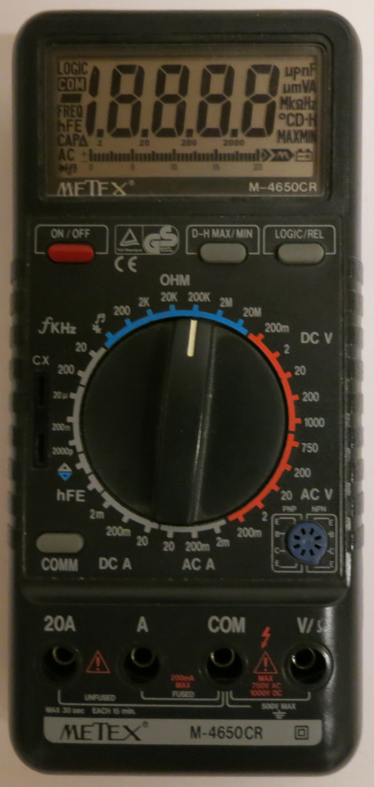
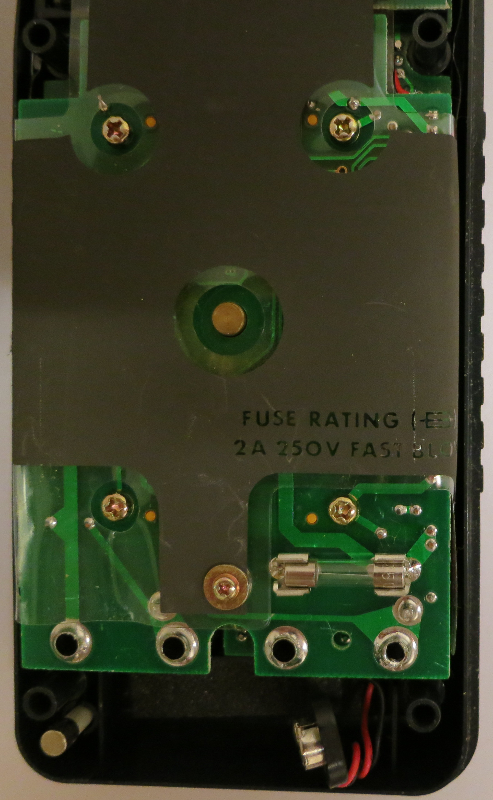
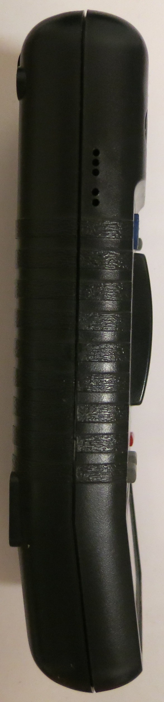

# Metex M-4650CR

{ .infobox-image }

### Metex M-4650CR

| | |
|---|---|
| **Status** | supported |
| **Source code** | [serial-dmm](https://github.com/OpenTraceLab/OpenTraceCapture/tree/main/src/hardware/serial-dmm) |
| **Counts** | 20000 |
| **IEC 61010-1** | — |
| **Connectivity** | RS232 |
| **Measurements** | voltage, current, hFE, logic, capacitance, frequency, resistance, continuity, diode |
| **Features** | hold, relative, min/max, bargraph |
| **Website** | [conrad.de](http://www.conrad.de) |

The **Metex M-4650CR** is a 20000 counts, handheld digital multimeter with RS232 connectivity.

It has also been sold under the name [Voltcraft M-4650CR](https://sigrok.org/wiki/Voltcraft_M-4650CR).

## Hardware

**Multimeter**:

- The hardware will likely be similar (or identical) to the [Voltcraft M-4650CR](https://sigrok.org/wiki/Voltcraft_M-4650CR#Hardware).
- **Fuse**: 2A/250V fast (5x20mm) (for the A jack; the 20A jack is unfused!)

**RS232 cable**:

- See [Device_cables#Metex_5-pin_RS232_cable](https://sigrok.org/wiki/Device_cables#Metex_5-pin_RS232_cable).

## Photos

{ .glightbox data-gallery="metex-m-4650cr" }
Metex M4650cr Front

{ .glightbox data-gallery="metex-m-4650cr" }
Metex M4650cr Open

{ .glightbox data-gallery="metex-m-4650cr" }
Metex M4650cr Back

{ .glightbox data-gallery="metex-m-4650cr" }
Metex M4650cr Poweron

{ .glightbox data-gallery="metex-m-4650cr" }
Metex M4650cr Fuse

{ .glightbox data-gallery="metex-m-4650cr" }
Metex M4650cr Mugshot

{ .glightbox data-gallery="metex-m-4650cr" }
Metex M4650cr Side

## Protocol

See [Multimeter ICs#Alternative_Protocol](https://sigrok.org/wiki/Multimeter_ICs#Alternative_Protocol).

## Resources
- [Calibration instructions](http://www.produktinfo.conrad.com/datenblaetter/125000-149999/126110-an-01-de-DMM4650CR_Kalibrieranleitung.pdf)
- [Manual](http://www.produktinfo.conrad.com/datenblaetter/125000-149999/126110-an-01-ru-DMM4650CR.pdf) (Russian)
- [reinhardweiss.de: DMM info](http://www.reinhardweiss.de/german/metex.htm)
- [gerald-gradl.de: DMM info](http://web.archive.org/web/20061018045026/http://www.gerald-gradl.de/eprojects/multi/body_multi.html)

