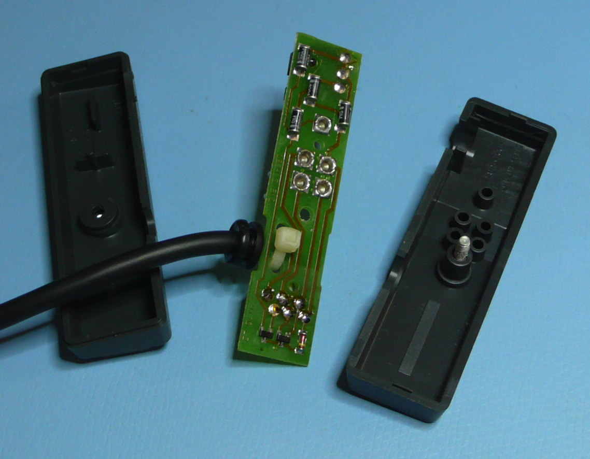
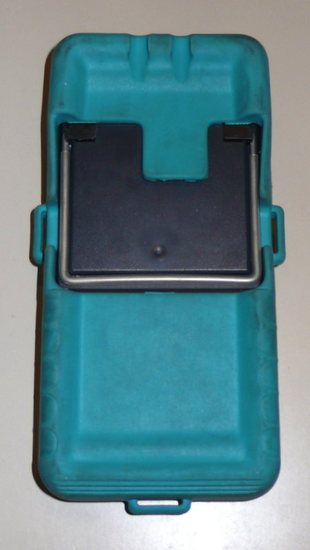
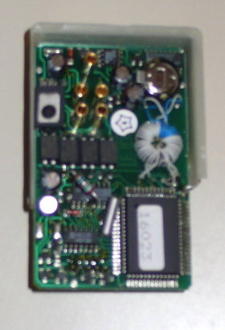
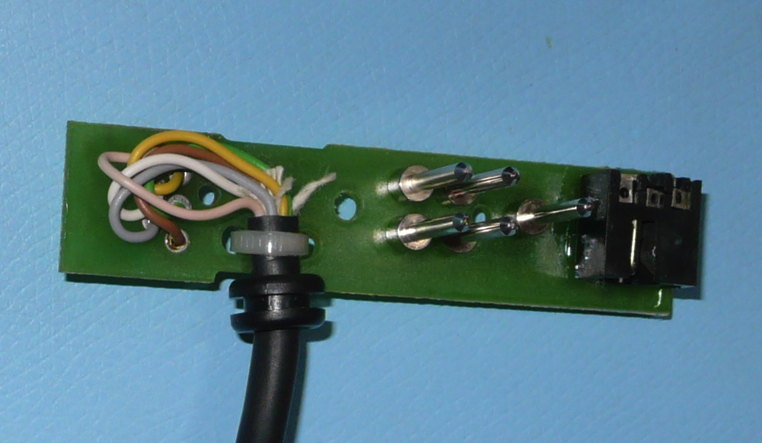
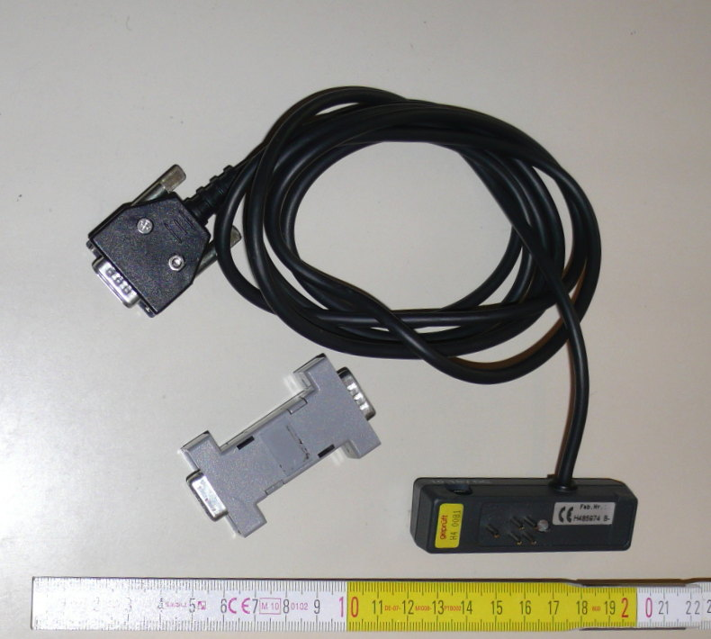
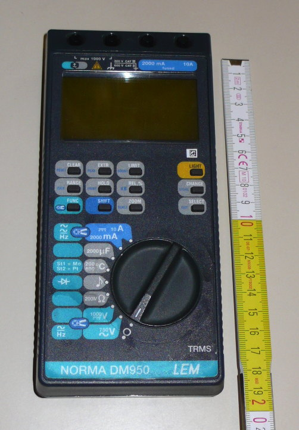
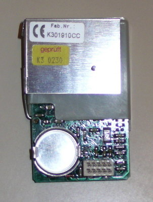
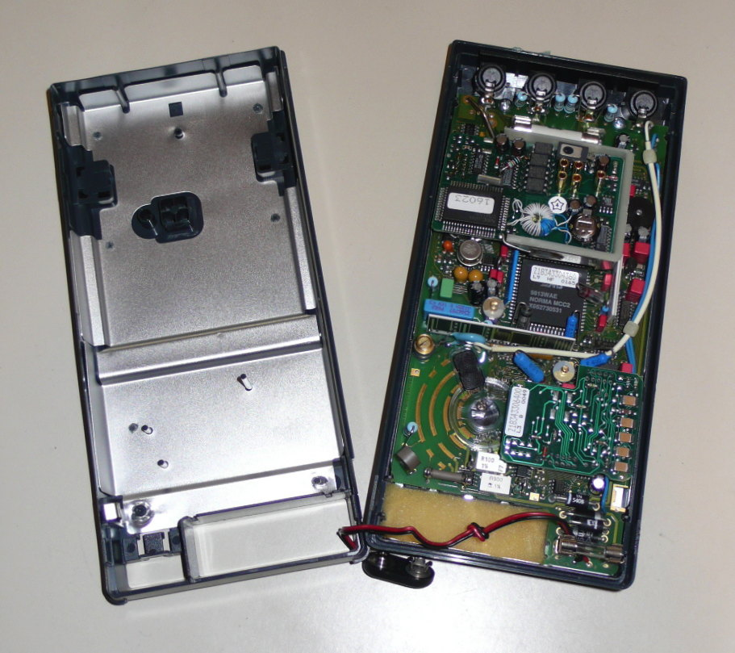

# Norma DM950

{ .infobox-image }

### Norma DM950

| | |
|---|---|
| **Status** | supported |
| **Source code** | [norma-dmm](https://github.com/OpenTraceLab/OpenTraceCapture/tree/main/src/hardware/norma-dmm) |
| **Counts** | 21000 |
| **IEC 61010-1** | CAT II 600 V, CAT III 300 V |
| **Connectivity** | RS232, proprietary cable |
| **Measurements** | voltage, current, resistance, capacitance, temperature, diode, continuity |
| **Features** | autorange, data hold, bargraph, backlight |
| **Website** | [set.nl](http://www.set.nl/LEM/dmm950.htm) |

The **Norma DM950** is a 21000 counts, handheld digital multimeter with RS232 connectivity.

## Models

The LEM Norma DM9x0 series of multimeters are 21000 count CAT II/CAT III hand multimeters with optional RS232 connectivity. The models differ by precision and feature set.

They were also sold as OEM devices by Siemens. The manufacturer was a company named Norma, later LEM Norma in Austria.

It seems that the same device series was sold with two different names and designs:

- Norma Normameter 910..950 (red company sign and bumper; earlier)
- LEM Norma DM910..950 (turquoise company sign and bumper, see pics; newer)
| Norma | LEM Norma | Siemens OEM | Precision (DC) | Backlight | RMS | TRMS | R 20 MΩ | R 200 MΩ | U AC 1 kΩ/V | I 10A | f | C |
|---|---|---|---|---|---|---|---|---|---|---|---|---|
| Normameter 910 | Norma DM910 | B1024 [[1]](http://www.messgeraete-einfach-mieten.de/html/siemens_b1024.html) | ±(0.5% +2d) |  |  |  | ● |  | ● |  |  |  |
| Normameter 920 | Norma DM920 | B1025 | ±(0.5% +2d) |  |  |  | ● |  | ● | ● |  |  |
| Normameter 930 | Norma DM930 | [B1026](https://sigrok.org/wiki/Siemens_B1026) | ±(0.3% +3d/+2d) | ● | ● |  | ● |  | ● | ● | ● | ● |
| Normameter 940 | Norma DM940 | B1027 | ±(0.1% +3d/+2d) | ● | ● |  | ● | ● |  | ● | ● | ● |
| Normameter 950 | Norma DM950 | B1028 [[2]](http://www.messgeraete-einfach-mieten.de/html/siemens_b1028.html) | ±(0.06% +3d/+2d) | ● | ● | ● | ● | ● |  | ● | ● | ● |

The RS232 interface is optional. All models were available with or without RS232 interface. The RS232 interface was also available separately as an accessory.

These Norma multimeters use the term *RMS* for correct measurement of possibly non-sinusoid AC and *TRMS* for correct measurement of mixed-mode (AC+DC) voltages and currents.

The driver has been tested with a *LEM Norma DM950* and a *Siemens B1026* DMM. If you have a different multimeter of this series, we would welcome information if it works and what the ID string looks like. You can contact [Matthias](https://sigrok.org/wiki/User:Matthias_Heidbrink) about it.

## Hardware
### Multimeter
- **Fuses**
2A: F 2A/250V DIN 41660-F2
- 10A: FF 12,5A/500 V, >20kA/AC
- TODO
### Interface

The RS232 interface consists of the following components:

- Interface board (installed inside of multimeter, based on a NEC 75P116 microcontroller)
- Printer cable 5-pin to DB9
- PC adaptor (null-modem plug with slightly unusal pinout)

The RS232 interface is designed to allow a direct connection to a serial printer or data recorder. Therefore an adaptor is required to connect it to a PC.

Comm parameters (PC): DTR on, RTS off, RTS/CTS flow control (!).

If the interface cannot be powered from RS232 (e.g. RS232-USB converter with too low voltage), switching on the multimeter with the FUNC button pressed powers the interface from multimeter.

The interface board contains a battery-buffered clock and NVRAM memory.

The *printer cable* has got a power connector (10-16 V DC, 50 mA; coaxial power connector 5,5/2,1 mm) to power the multimeter and the interface externally. Opening the plug on multimeter side should be avoided, if possible, because the nut on the opposite to the screw is loose beneath the rubber bumper and it can be a bit tricky to get it closed again without removing the glued bumper.

## Photos

{ .glightbox data-gallery="norma-dm950" }
Norma Dm9x0 Printer Cable Plug 3

{ .glightbox data-gallery="norma-dm950" }
Norma Dm950 6

{ .glightbox data-gallery="norma-dm950" }
Norma Dm9x0 Printer Cable Plug 1

{ .glightbox data-gallery="norma-dm950" }
Norma Dm950 7

{ .glightbox data-gallery="norma-dm950" }
Norma Dm950 3

{ .glightbox data-gallery="norma-dm950" }
Norma Dm9x0 Interface Board 1

{ .glightbox data-gallery="norma-dm950" }
Norma Dm9x0 Printer Cable Plug 2

{ .glightbox data-gallery="norma-dm950" }
Norma Dm9x0 Interface Cables

{ .glightbox data-gallery="norma-dm950" }
Norma Dm950 5

{ .glightbox data-gallery="norma-dm950" }
Norma Dm950 4

{ .glightbox data-gallery="norma-dm950" }
Norma Dm950 2

{ .glightbox data-gallery="norma-dm950" }
Norma Dm9x0 Interface Board 2

{ .glightbox data-gallery="norma-dm950" }
Norma Dm950 1

{ .glightbox data-gallery="norma-dm950" }
Norma Dm950 8

{ .glightbox data-gallery="norma-dm950" }
Norma Dm950

## Protocol
### Printer Mode

TODO.

### PC communication mode

The multimeter supports about 50 commands. Most functions that do not require changing the position of the rotary switch can be remote controlled.

| Command | Reply | Example | Remarks |
|---|---|---|---|
| IDN?\n | Device id and rev., interface rev. | 1834 065 V1.06,IF V1.02\r | ID string of a LEM Norma DM950, multimeter firmware version 1.06, interface firmware version 1.02 |
| " | " | 1834 063 V1.04,IF V1.02\r | ID string of a Siemens B1026, multimeter firmware version 1.04, interface firmware version 1.02 |
| DATA?\n | 27 chars ASCII + \r | R␣␣␣␣␣␣␣␣␣␣␣␣␣149.10E+3␣OHM\r | Similar to common 14 char protocol, but more verbose. ␣ means space. |
| STATUS?\n | 20 hex chars + \r | 03030024913100400040\r | Binary data, value + status flags. |
| ... | .. | .... | More to do. |

## Measurement functions and ranges
| Measurement function | Range | Resolution | Accuracy | sigrok result | Remarks |
|---|---|---|---|---|---|
| V= | 200 mV | 10 μV | ±(0.06% + 3) | mq V, unit V, mqflags DC |  |
| 2 V | 100 μV | ±(0.06% + 2) | " |  |
| 20 V | 100 μV | " |  |
| 200 V | 1 mV | " |  |
| 1000 V | 10 mV | " |  |
| V≈ | 200 mV | 10 µV | ±(0.4% + 25) | mq V, unit V, mqflags AC,DC,RMS |  |
| 2 V | 100 μV | ±(0.4% + 10) | " |  |
| 20 V | 1 mV | " |  |
| 200 V | 10 mV | " |  |
| 750 (1000) V | 100 mV | " |  |
| V≃ | 200 mV | 10 μV | ±(0.6% + 50) | mq V, unit V, mqflags AC,DC,RMS | There is no difference between RMS (AC) and TRMS (AC+DC) measurements except the accuracy. |
| 2 V | 100 μV | ±(0,6% + 25) | " |  |
| 20 V | 1 mV | " |  |
| 200 V | 10 mV | " |  |
| 1000 V | 100 mV | " |  |
| V db≈ | 62 - -42 dB | 0.01 dB | 0.5 dB | mq V, unit V, mqflags AC,DC,RMS | Actually 5 ranges. |
| V db≈ rel | -42 - 52 dB | 0.01 dB |  | mq V, unit V, mqflags AC,DC,RMS |  |
| A= | &#160;2.0000 mA | 100 nA |  | mq Curr., unit A, mqflags DC |  |
| 20.000 mA | 1 µA |  | " |  |
| 200.00 mA | 10 µA |  | " |  |
| 2.0000 A | 100 µA |  | " |  |
| 10.000 A | 10 mA |  | " |  |
| A≃ | &#160;2.0000 mA | 100 nA |  | mq Curr., unit A, mqflags AC,DC,RMS |  |
| 20.000 mA | 1 µA |  | " |  |
| 200.00 mA | 10 µA |  | " |  |
| 2.0000 A | 100 µA |  | " |  |
| 20.000 A | 10 mA |  | " |  |
| Ω | 200.00 Ω | 10 mΩ |  | mq Res., unit Ω, mqflags - |  |
| 2.0000 kΩ | 100 mΩ |  | " |  |
| 20.000 kΩ | 1 Ω |  | " |  |
| 200.00 kΩ | 10 Ω |  | " |  |
| 2.0000 MΩ | 100 Ω |  | " |  |
| 20.000 MΩ | 1 kΩ |  | " |  |
| 200.00 MΩ | 100 kΩ |  | " |  |
| Diode |  |  |  | mq V, unit V, mqflags DC,DIODE |  |
| Cont. |  |  |  | mq Cont., unit&#160;?, mqflags&#160;? |  |
| Cap. F | 2.000 nF | 1 pF | ±(1% + 3) | mq Cap., unit F, mqflags - |  |
| 20.00 nF | 10 pF | " |  |
| 200.0 nF | 100 pF | " |  |
| 2.000 µF | 1 nF | " |  |
| 20.00 µF | 10 nF | ±(2% + 3) | " |  |
| 200.0 µF | 100 nF | " |  |
| 2.000 mF | 1 µF | ±(4% + 3) | " |  |
| Hz≃ | 256 Hz | 0.01 Hz | ±(0.02% + 2) | mq Freq., unit Hz, mqflags AC,DC |  |
| 2.048 kHz | 0.1 Hz | " |  |
| 16 kHz | 1 Hz | " |  |
| 200.000 kHz | 10 Hz | " |  |
| °C | Mo100/1000 –50 - +200.0 °C | 0.1 °C | 0.2% + 0.3 °C | mq Temp., unit °C, mqflags - |  |
| Pt100/1000 -50 - +200 °C | 0.1 °C | ±(0.2% + 0.5 °C) | " | (min. temp. -273.1 °C?) |
| Pt100/1000 +200 – +600.0 °C | 1 °C | ±(0.2% + 1 °C) | " |  |
| Hold |  |  |  | mqflags += HOLD |  |
| Max |  |  |  | mqflags += MAX |  |
| Min |  |  |  | mqflags += MIN |  |
| Further functions? |  |  |  |  |  |

The column "sigrok result" contains in short form what the driver generates for the resp. data type.

## Resources
- [http://www.set.nl/LEM/dmm.htm](http://www.set.nl/LEM/dmm.htm)

