# UNI-T UT60E

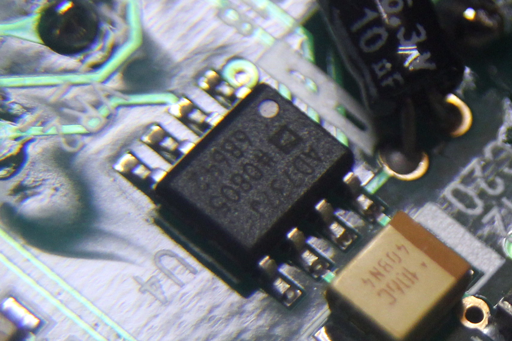{ .infobox-image }

### UNI-T UT60E

| | |
|---|---|
| **Status** | supported |
| **Source code** | [serial-dmm](https://github.com/OpenTraceLab/OpenTraceCapture/tree/main/src/hardware/serial-dmm) |
| **Counts** | 4000 |
| **IEC 61010-1** | CAT III (1000V) / CAT IV (600V) |
| **Connectivity** | [RS232](https://sigrok.org/wiki/Device_cables#UNI-T_UT-D02) / [USB](https://sigrok.org/wiki/Device_cables#UNI-T_UT-D04) |
| **Measurements** | voltage, current, resistance, capacitance, frequency, temperature, duty cycle, diode, continuity |
| **Features** | autorange, true-rms, data hold, relative, backlight |
| **Website** | [uni-trend.com](http://www.uni-trend.com/UT60e.html) |

The **UNI-T UT60E** is a 4000 count CAT III (1000V) / CAT IV (600V) handheld digital multimeter with RS232 or USB connectivity.

It is similar to the [Voltcraft VC-840](https://sigrok.org/wiki/Voltcraft_VC-840), but not the same device/PCB (and also not just a rebranded device).

## Hardware
- **Multimeter IC**: [Fortune Semiconductor FS9721_LP3](https://sigrok.org/wiki/Multimeter_ICs#Fortune_Semiconductor_FS9721_LP3) ([datasheet](http://www.ic-fortune.com/upload/Download/FS9721_LP3-DS-20_EN.pdf))
- **Low power, True RMS-to-DC converter**: [Analog Devices AD737J](http://www.analog.com/en/special-linear-functions/rms-to-dc-converters/ad737/products/product.html) ([datasheet](http://www.analog.com/static/imported-files/data_sheets/AD737.pdf))
- **JFET input single operational amplifier**: [ST TL062](http://www.st.com/web/catalog/sense_power/FM123/SC61/SS1378/PF65352) (markings: "ST 062C EZ749") ([datasheet‎](http://www.st.com/st-web-ui/static/active/en/resource/technical/document/datasheet/CD00000486.pdf))
- **Crystal**: 4MHz
- **Fuses**: 10A/250V and 500mA/250V (glass fuses)

**RS232 cable:**

- See [Device cables#UNI-T_UT-D02](https://sigrok.org/wiki/Device_cables#UNI-T_UT-D02).

**USB cable:**

- See [Device cables#UNI-T_UT-D04](https://sigrok.org/wiki/Device_cables#UNI-T_UT-D04).

## Photos

{ .glightbox data-gallery="uni-t-ut60e" }
Ut60e U4 Ad737j

[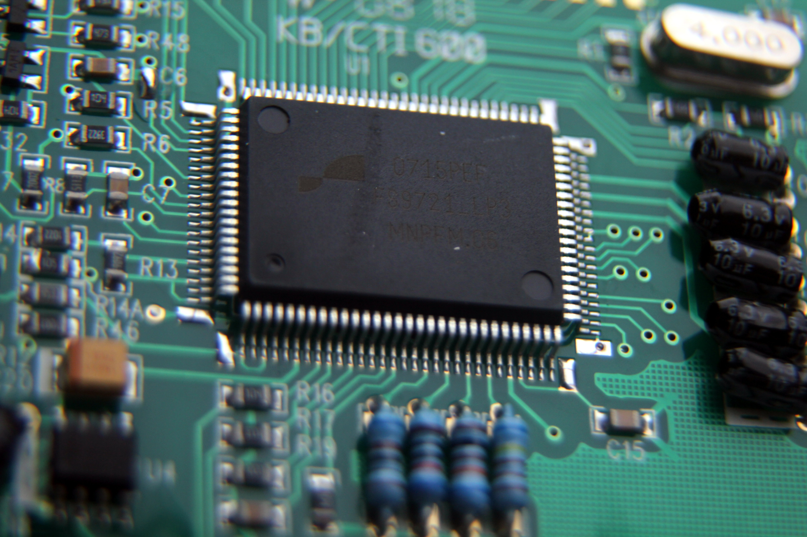](./img/Ut60e_-_u1_FS9721_LP3.JPG "Ut60e U1 Fs9721 Lp3"){ .glightbox data-gallery="uni-t-ut60e" }
Ut60e U1 Fs9721 Lp3

[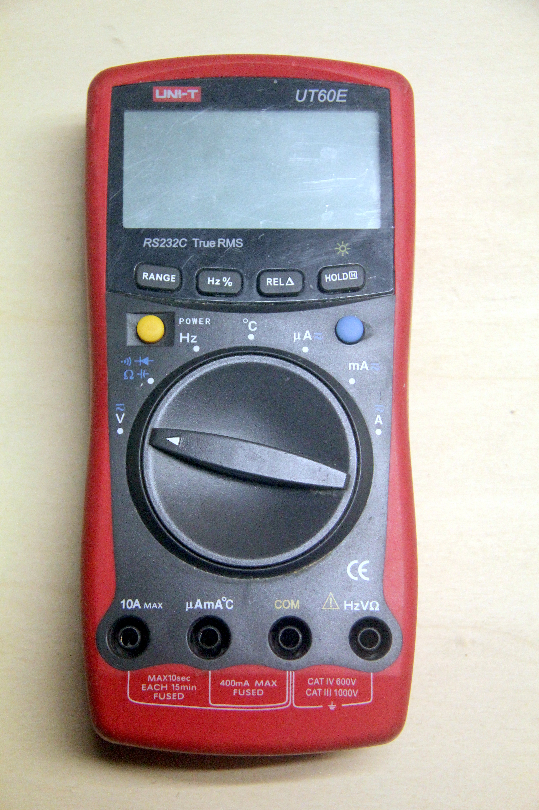](./img/Ut60e_-_front.JPG "Ut60e Front"){ .glightbox data-gallery="uni-t-ut60e" }
Ut60e Front

[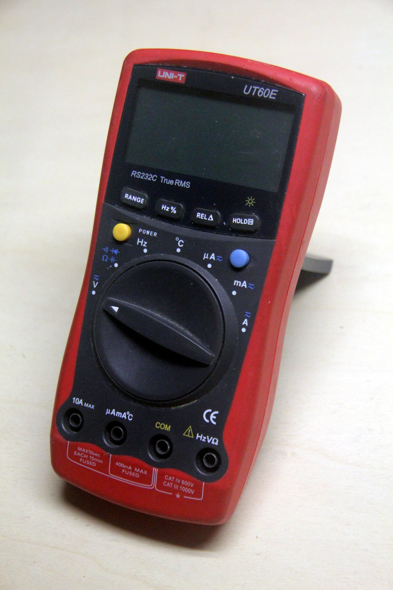](./img/Ut60e_-_perspect.JPG "Ut60e Perspect"){ .glightbox data-gallery="uni-t-ut60e" }
Ut60e Perspect

[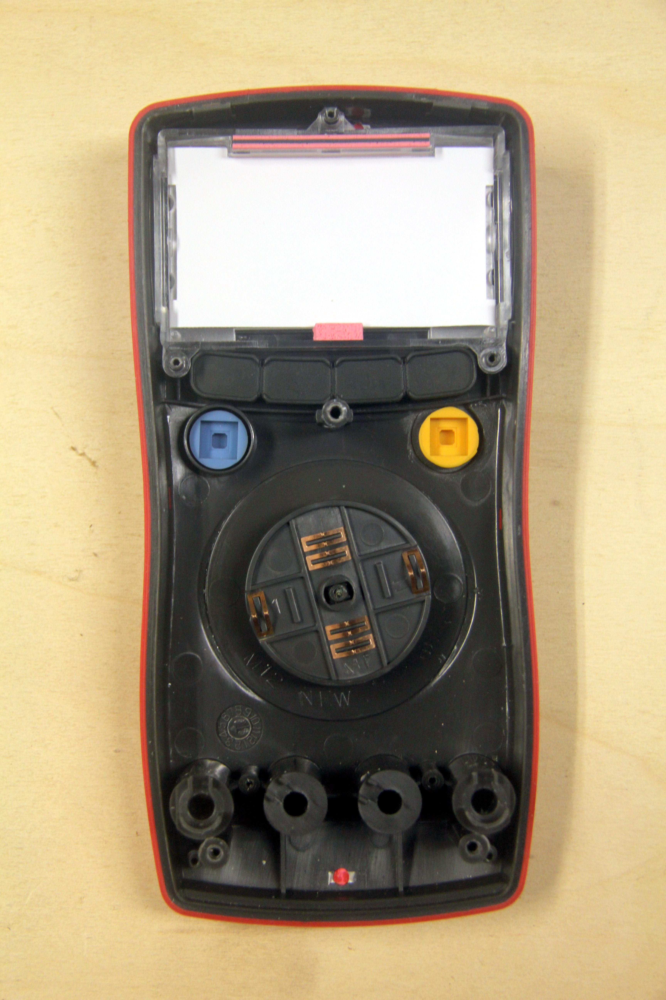](./img/Ut60e_-_front_in.JPG "Ut60e Front In"){ .glightbox data-gallery="uni-t-ut60e" }
Ut60e Front In

[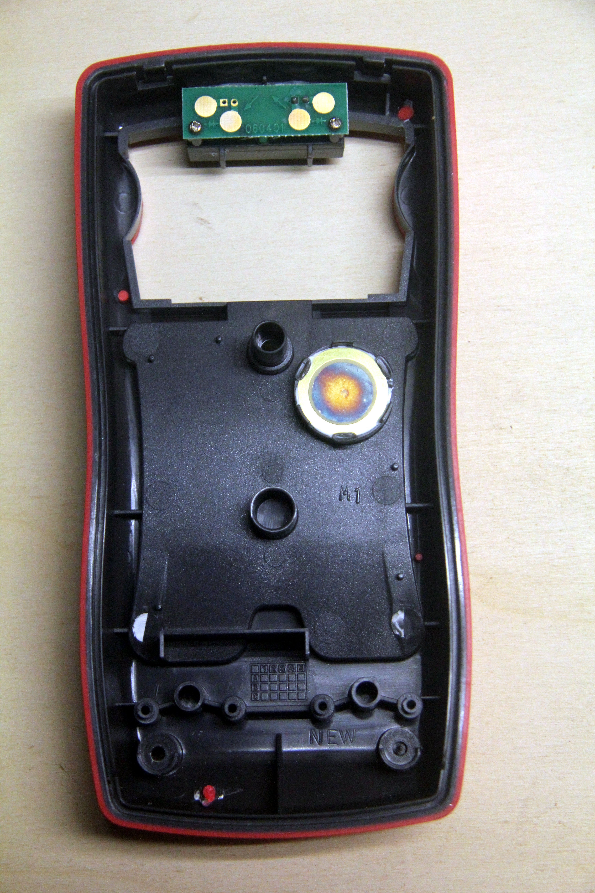](./img/Ut60e_-_back_in.JPG "Ut60e Back In"){ .glightbox data-gallery="uni-t-ut60e" }
Ut60e Back In

[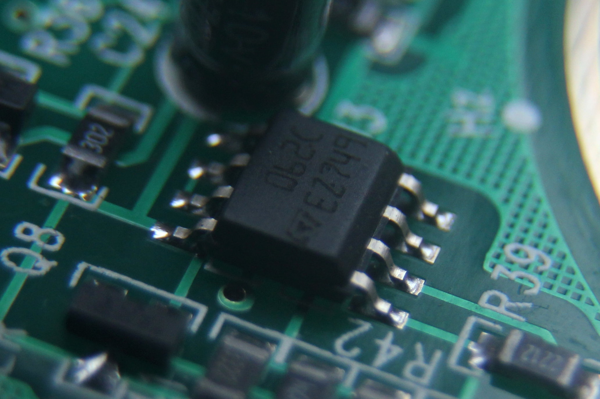](./img/Ut60e_-_u3_062c.JPG "Ut60e U3 062c"){ .glightbox data-gallery="uni-t-ut60e" }
Ut60e U3 062c

[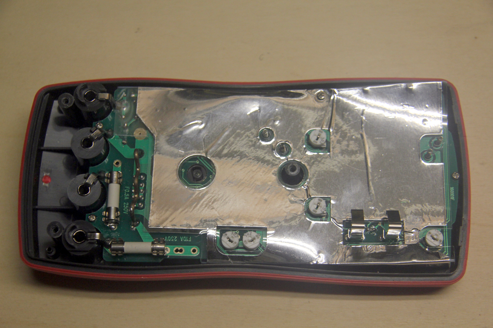](./img/Ut60e_-_pcb_back_shield.JPG "Ut60e Pcb Back Shield"){ .glightbox data-gallery="uni-t-ut60e" }
Ut60e Pcb Back Shield

[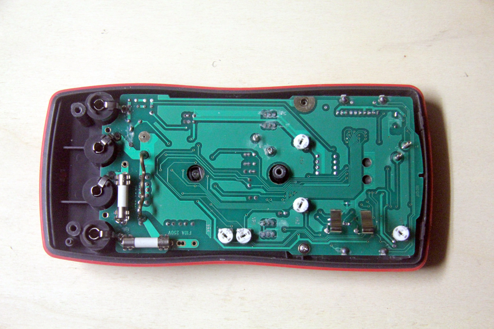](./img/Ut60e_-_pcb_back.JPG "Ut60e Pcb Back"){ .glightbox data-gallery="uni-t-ut60e" }
Ut60e Pcb Back

[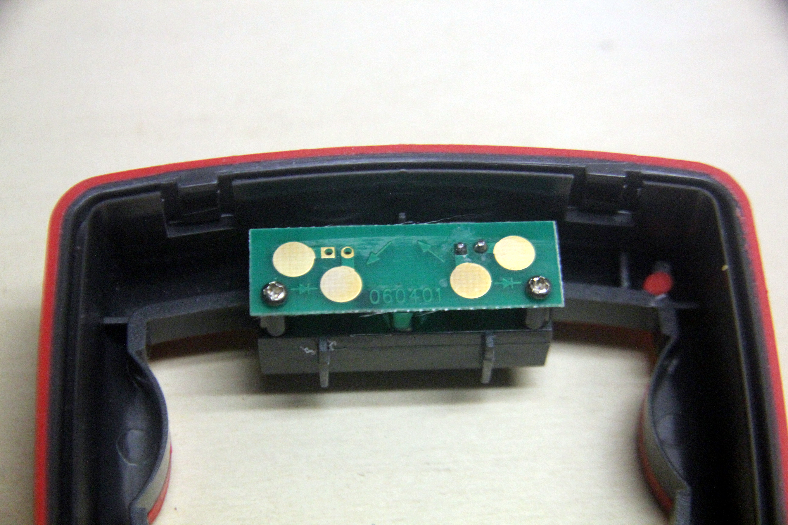](./img/Ut60e_-_ir.JPG "Ut60e Ir"){ .glightbox data-gallery="uni-t-ut60e" }
Ut60e Ir

{ .glightbox data-gallery="uni-t-ut60e" }
Ut60e Front Alpha

[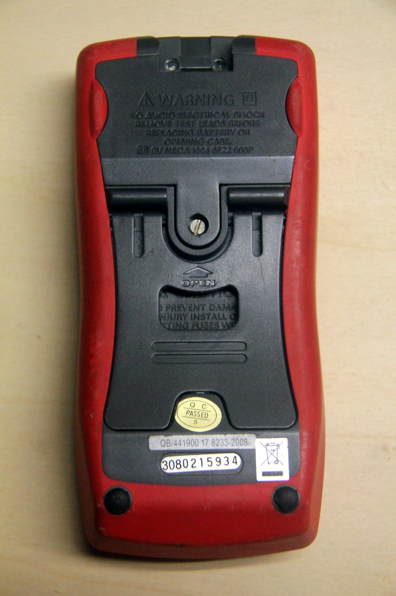](./img/Ut60e_-_back.JPG "Ut60e Back"){ .glightbox data-gallery="uni-t-ut60e" }
Ut60e Back

[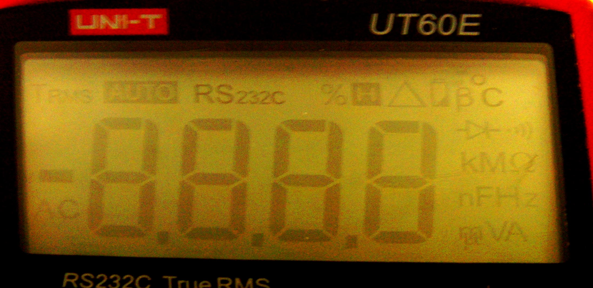](./img/Ut60e_-_lcd.JPG "Ut60e Lcd"){ .glightbox data-gallery="uni-t-ut60e" }
Ut60e Lcd

[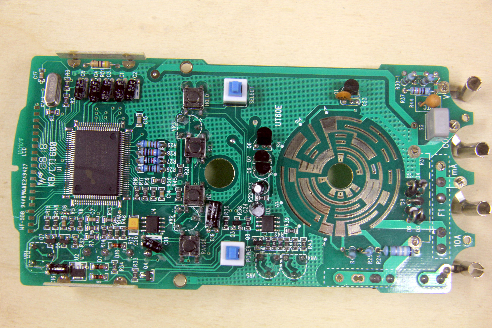](./img/Ut60e_-_pcb_front.JPG "Ut60e Pcb Front"){ .glightbox data-gallery="uni-t-ut60e" }
Ut60e Pcb Front

## Protocol

See [Multimeter_ICs#Fortune_Semiconductor_FS9721_LP3](https://sigrok.org/wiki/Multimeter_ICs#Fortune_Semiconductor_FS9721_LP3).

Serial data transmission is always enabled on this multimeter.

## Resources
- [Manual](http://www.uni-trend.com/manual2/UT60BCE%20Eng%20Manual.pdf)
- [Vendor software](http://www.uni-trend.com/manual2/UT60E%20_setup.exe)
- [Henrik Haftmann: DMM.exe etc.](http://www-user.tu-chemnitz.de/~heha/hs_freeware/UNI-T/) (Windows software for various UNI-T DMMs, and lots of device/protocol info)
- [Henrik Haftmann: UT60E log and protocol docs](http://www-user.tu-chemnitz.de/~heha/hs_freeware/UNI-T/UT60E.LOG)
- [postcogito.org: UT60E Decoder Program](http://www.postcogito.org/Kiko/UtSixtyEDecoder.html)
- [perfec.to: Uni-T UT60E RS-232 Data Logging](http://perfec.to/ut60e/)
- [forums.ni.com: Short protocol description](http://forums.ni.com/attachments/ni/170/102458/1/protocolo%20UT60E.pdf)
- [lionelsacks.com: Exercies: Reading out the Unit-Trend UT60E in Linux](http://blog.lionelsacks.com/2007/06/exercies-reading-out-unit-trend-ut60e.html)
- [forums.ni.com: Another UT60E forum thread](http://forums.ni.com/t5/LabVIEW/ut60e/m-p/173300)

