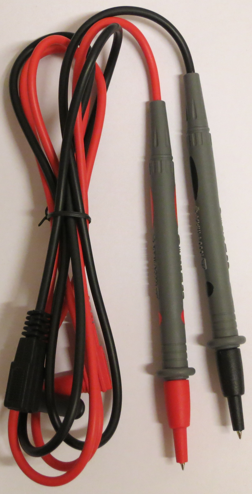

# V&amp;A VA40B

{ .infobox-image }

### V&amp;A VA40B

| | |
|---|---|
| **Status** | supported |
| **Source code** | [serial-dmm](https://github.com/OpenTraceLab/OpenTraceCapture/tree/main/src/hardware/serial-dmm) |
| **Counts** | 6000 |
| **IEC 61010-1** | CAT III (1000V) / CAT IV (600V) |
| **Connectivity** | [USB/serial](https://sigrok.org/wiki/Device_cables#V.26A_VA4000) |
| **Measurements** | voltage, current, resistance, capacitance, frequency, temperature, duty cycle, diode, continuity |
| **Features** | autorange, data hold, relative, min/max, backlight |
| **Website** | [mastech.com.cn](http://www.mastech.com.cn/html/en/products-va40.htm) |

The **V&A VA40B** is a 6000 count CAT III (1000V) / CAT IV (600V) handheld digital multimeter with USB connectivity.

See [V&A VA40B/Info](https://sigrok.org/wiki/V%26A_VA40B/Info) for more details (such as **lsusb -v** output) about the device.

Note: The company V&A ("[SHANGHAI YIHUA V&A INSTRUMENT CO., LTD, known as Mastech Shanghai](http://www.mastech.com.cn/html/en/about-us.htm)") has apparently been part of (or related to) [MASTECH](http://www.p-mastech.com) in the past, and also sells some multimeter models that have been sold by MASTECH in the past.[1](http://www.eevblog.com/forum/product-reviews-photos-and-discussion/product-review-dmm-latest-va-mastech-va18b/msg128081/#msg128081)

The manufacturer name isn't stated anywhere on the device, package or manual. The [Velleman DVM4100](https://sigrok.org/wiki/Velleman_DVM4100) model looks identical to the VA40B, except for its labels and blue case color, but their protocols differs. The VA40B also has some similarities with the [V&A VA18B](https://sigrok.org/wiki/V%26A_VA18B) and the [PeakTech 3415](https://sigrok.org/wiki/PeakTech_3415).

## Hardware

**Multimeter:**

- **Fuses**: F 0.63A/1000V D10,3*38, F 10A/1000V D10,3*38 (values from the manual)
- TODO

**USB cable:**

- See [Device cables#V.26A_VA4000](https://sigrok.org/wiki/Device_cables#V.26A_VA4000).

## Photos

{ .glightbox data-gallery="vamp;a-va40b" }
Va40b Probes

{ .glightbox data-gallery="vamp;a-va40b" }
Va40b Device Front Wo Bumper

{ .glightbox data-gallery="vamp;a-va40b" }
Va40b Display Poweron

{ .glightbox data-gallery="vamp;a-va40b" }
Va40b Top

{ .glightbox data-gallery="vamp;a-va40b" }
Va40b Package Contents

{ .glightbox data-gallery="vamp;a-va40b" }
Va40b Thermo

{ .glightbox data-gallery="vamp;a-va40b" }
Va40b Device Back Wo Bumper

{ .glightbox data-gallery="vamp;a-va40b" }
Va40b Front

{ .glightbox data-gallery="vamp;a-va40b" }
Va40b Bag Open

{ .glightbox data-gallery="vamp;a-va40b" }
Va Va40b Mugshot

{ .glightbox data-gallery="vamp;a-va40b" }
Va40b Bag

{ .glightbox data-gallery="vamp;a-va40b" }
Va40b Device Back

## Protocol

14-byte LCD segments over USB-to-serial (Prolific chip, 2400 baud, 8n1). The DMM IC used in this multimeter is probably a [Fortune Semiconductor FS9721_LP3](https://sigrok.org/wiki/Multimeter_ICs#Fortune_Semiconductor_FS9721_LP3) or a [Dream Tech International DTM0660](https://sigrok.org/wiki/Multimeter_ICs#Dream_Tech_International_DTM0660) with protocol options set accordingly.

The manufacturer specific last byte of the 14-byte packet (numbered 0xe) is as follows:

| Byte | Bits 7-4 | Bit 3 | Bit 2 | Bit 1 | Bit 0 |
|---|---|---|---|---|---|
| 13 | 0xe | MIN | (unused?) | °C | MAX |

To enable output to the PC on the multimeter you have to keep the **Hz/DUTY** key pressed while powering on the device. However, it will auto-poweroff (after roughly 1 hour?), even in this mode. To avoid that, press both the **Hz/DUTY** and the **SELECT** key during power-up (see manual page 19).

## Resources
- [Mastech (V&A) VA40B product page](http://www.mastech.com.cn/html/en/products-va40.htm)
- [V&A VA40B video review (German)](http://www.youtube.com/watch?v=ONv2PlOt3F0)

