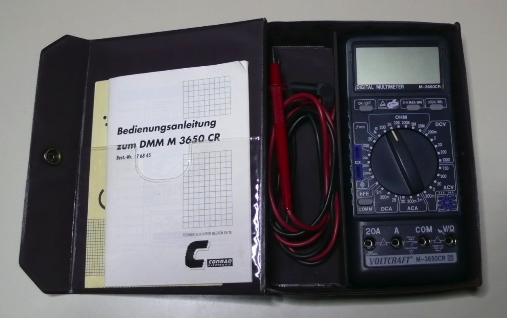
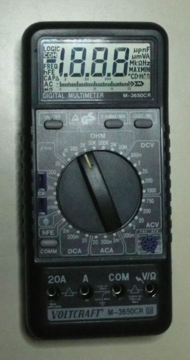
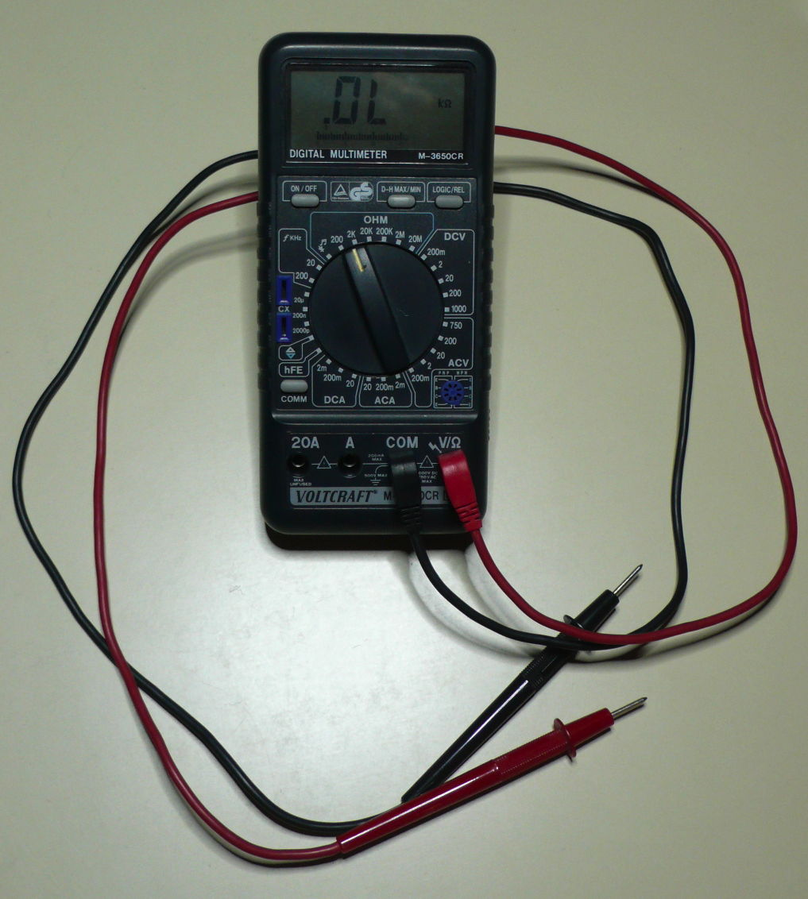
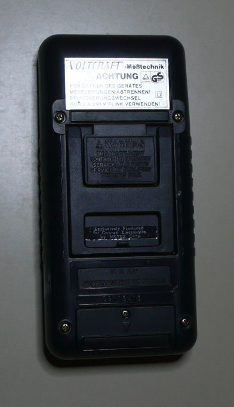
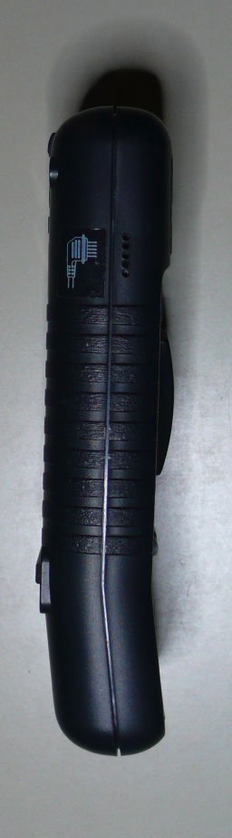
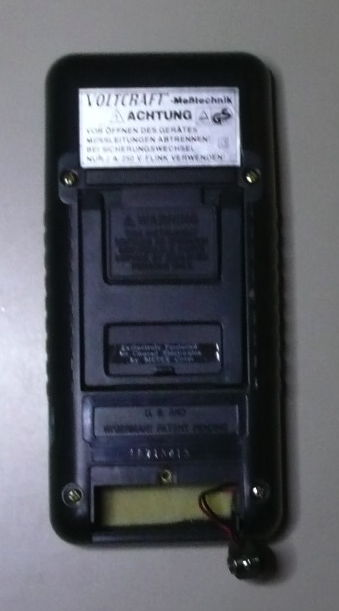
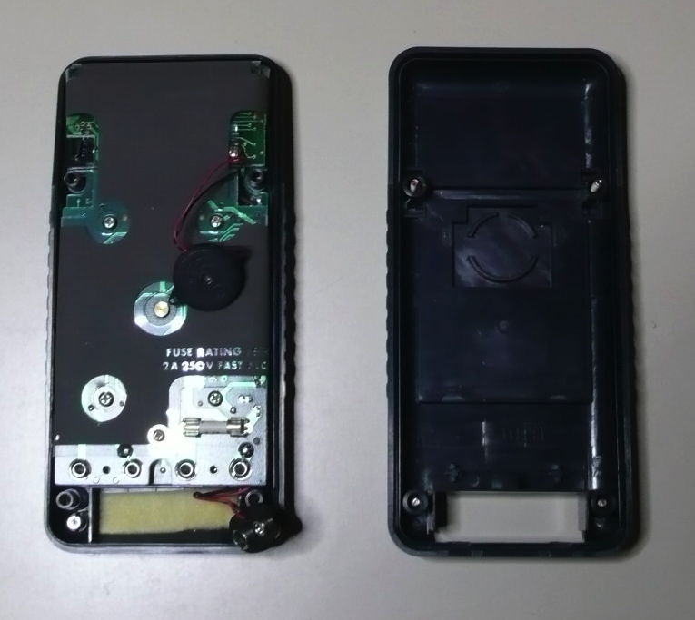
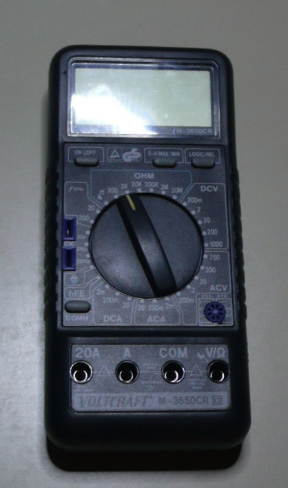
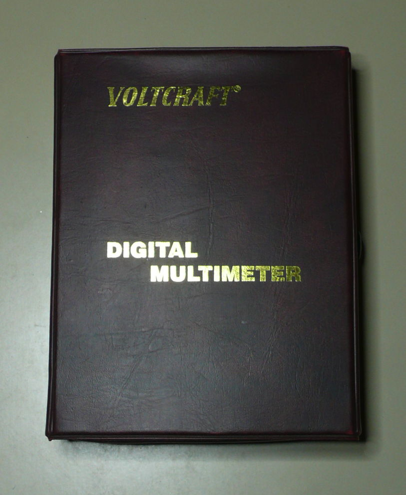
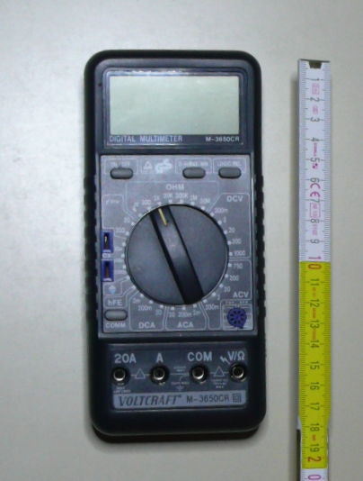

# Voltcraft M-3650CR

{ .infobox-image }

### Voltcraft M-3650CR

| | |
|---|---|
| **Status** | supported |
| **Source code** | [serial-dmm](https://github.com/OpenTraceLab/OpenTraceCapture/tree/main/src/hardware/serial-dmm) |
| **Counts** | 2000 |
| **IEC 61010-1** | — |
| **Connectivity** | [RS232](https://sigrok.org/wiki/Device_cables#Metex_5-pin_RS232_cable) |
| **Measurements** | voltage, current, resistance, capacitance, hFE, diode, continuity, frequency, logic |
| **Features** | data hold, bargraph, difference |

The **Voltcraft M-3650CR** is a 2000 counts handheld digital multimeter with RS232 connectivity.

It came into the market 1991 and is a rebadged Metex M-3650CR.

## Hardware

**Multimeter**:

- **Fuse**: 2A/250V (5x20mm) (for the A jack; the 20A jack is unfused!)
- TODO.

**RS232 cable**:

- See [Device_cables#Metex_5-pin_RS232_cable](https://sigrok.org/wiki/Device_cables#Metex_5-pin_RS232_cable).

## Photos

{ .glightbox data-gallery="voltcraft-m-3650cr" }
Metex Voltcraft M 3650cr 9

{ .glightbox data-gallery="voltcraft-m-3650cr" }
Metex Voltcraft M 3650cr 5

{ .glightbox data-gallery="voltcraft-m-3650cr" }
Metex Voltcraft M 3650cr 6

{ .glightbox data-gallery="voltcraft-m-3650cr" }
Metex Voltcraft M 3650cr 3

{ .glightbox data-gallery="voltcraft-m-3650cr" }
Metex Voltcraft M 3650cr 2

{ .glightbox data-gallery="voltcraft-m-3650cr" }
Metex Voltcraft M 3650cr 7

{ .glightbox data-gallery="voltcraft-m-3650cr" }
Metex Voltcraft M 3650cr 8

{ .glightbox data-gallery="voltcraft-m-3650cr" }
Voltcraft M 3650cr

{ .glightbox data-gallery="voltcraft-m-3650cr" }
Metex Voltcraft M 3650cr 1

{ .glightbox data-gallery="voltcraft-m-3650cr" }
Metex Voltcraft M 3650cr 10

{ .glightbox data-gallery="voltcraft-m-3650cr" }
Metex Voltcraft M 3650cr 4

## Protocol

The protocol is (partially) documented in the manual of the *Voltcraft M-3650CR* and was determined completely by testing. See [Multimeter ICs#Alternative Protocol](https://sigrok.org/wiki/Multimeter_ICs#Alternative_Protocol).

## Resources
- 
## Measurement functions and ranges
| Measurement function | Range | Resolution | Accuracy | sigrok result | Remarks |
|---|---|---|---|---|---|
| V= | 200.0 mV | 100 μV | ±(0.3% + 1) | mq V, unit V, mqflags DC |  |
| 2.000 V | 1 mV | " |  |
| 20.00 V | 10 mV | " |  |
| 200.0 V | 100 mV | " |  |
| 1000 V | 1 V | " |  |
| V≈ | 200.0 mV | 100 μV | ±(0.8% + 3) | mq V, unit V, mqflags AC |  |
| 2.000 V | 1 mV | " |  |
| 20.00 V | 10 mV | " |  |
| 200.0 V | 100 mV | " |  |
| 750 V | 1 V | ±(1.2% + 3) | " |  |
| A= | 2.000 mA | 1 µA | ±(0.5% + 1) | mq Curr., unit A, mqflags DC |  |
| 200.0 mA | 100 µA | ±(1,2% + 1) | " |  |
| 20.00 A | 10 mA | ±(2,0% + 5) | " | Max. 20 min.; unfused! |
| A≈ | 2.000 mA | 10 µA | ±(1,0% + 5) | mq Curr., unit A, mqflags AC |  |
| 200.0 mA | 100 µA | ±(1,8% + 5) | " |  |
| 20.00 A | 10 mA | ±(3.0% + 7) | " | Max. 20 min.; unfused! |
| Ω | 200.0 Ω | 100 mΩ |  | mq Res., unit Ω, mqflags - |  |
| 2.000 kΩ | 1 Ω |  | " |  |
| 20.00 kΩ | 10 Ω |  | " |  |
| 200.0 kΩ | 100 Ω |  | " |  |
| 2.000 MΩ | 1 kΩ |  | " |  |
| 20.00 MΩ | 10 kΩ |  | " |  |
| Cap. F | 2000 pF | 1 pF | ±(2.0% + 3) | mq Cap., unit F, mqflags - |  |
| 200.0 nF | 100 pF | " |  |
| 20.00 µF | 10 nF | ±(3.0% + 5) | " |  |
| Hz= | 20.00 kHz | 1 Hz | ±(2% + 3) | mq Freq., unit Hz, mqflags DC |  |
| 200.00 kHz | 10 Hz | " |  |
| Logic |  |  |  | - |  |
| hFE |  |  |  | ? | IB=10 µA, UCE=2,8 V |
| Diode |  |  |  | mq V, unit V, mqflags DC,DIODE |  |
| Data Hold |  |  |  | - | Not supported by protocol. |

The column "sigrok result" contains in short form what the driver generates for the resp. data type.

