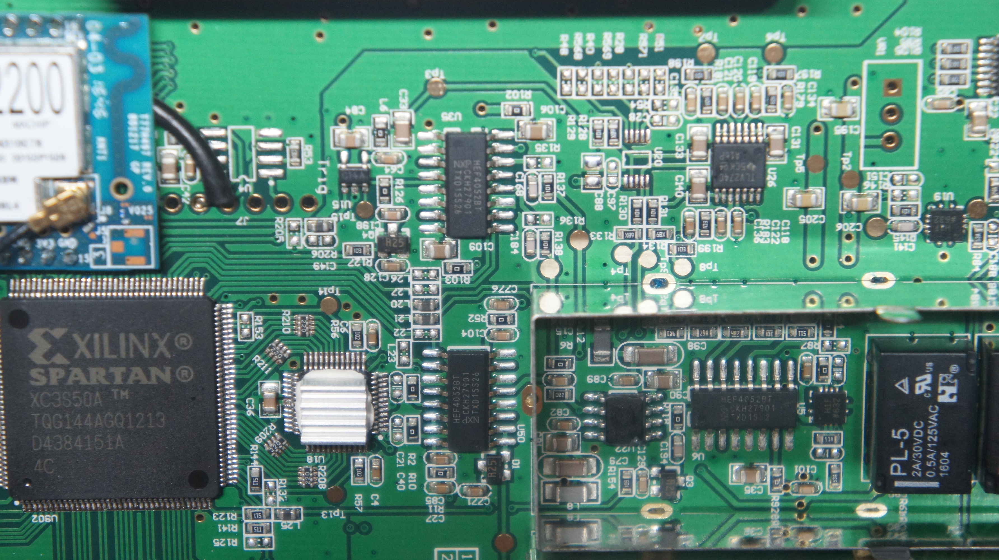
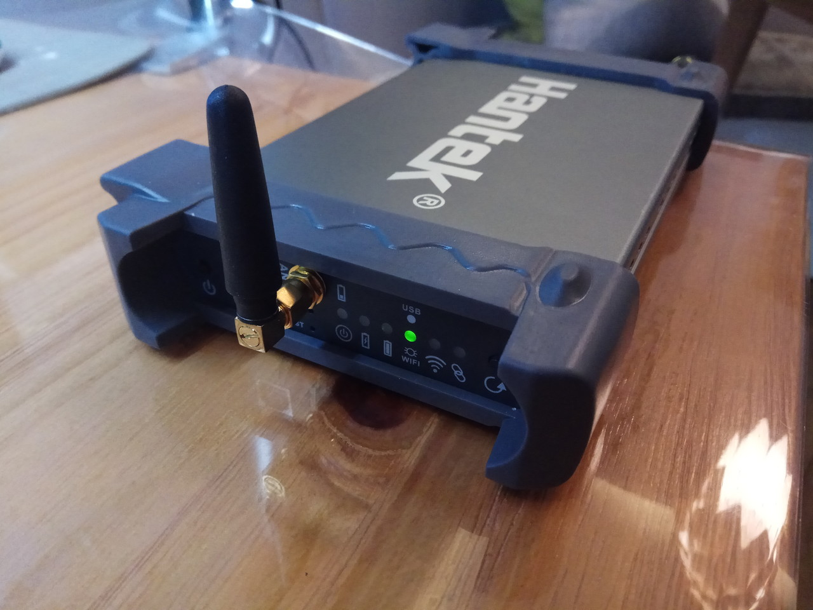

# Hantek iDSO1070

{ .infobox-image }

### Hantek iDSO1070

| | |
|---|---|
| **Status** | planned |
| **Source code** | [[1]](http://sigrok.org/gitweb/?p=libsigrok.git;a=tree;f=src/hardware/) |
| **Channels** | 2 |
| **Samplerate** | 250MSa/s |
| **Analog bandwidth** | 70MHz |
| **Vertical resolution** | 8bit |
| **Triggers** | none (SW-only) |
| **Input impedance** | 1MΩ‖25pF |
| **Memory** | none |
| **Display** | none |
| **Connectivity** | USB / Wifi |
| **Website** | [hantek.com](http://www.hantek.com/en/productdetail_2_10165.html) |

The **Hantek iDSO1070** is a self powered, 2-channel oscilloscope with an analog bandwidth of 70MHz with 250MSa/s sampling rate (125MSa/s each channel). The internal battery let the device to run up to 3-4 hours.

See [Hantek iDSO1070/Info](/w/index.php?title=Hantek_iDSO1070/Info&action=edit&redlink=1) for more details (such as **lsusb -v** output) about the device.

## Hardware
- **Main chip**: [Xilinx Spartan XC3S50A](http://www.xilinx.com/support/documentation/spartan-3an_data_sheets.htm) ([datasheet](http://www.xilinx.com/support/documentation/data_sheets/ds557.pdf))
- **Main oscillator**: 50MHz 50.000 YX FH

## Photos

{ .glightbox data-gallery="hantek-idso1070" }
Hantek Idso1070a Inside1 Back

{ .glightbox data-gallery="hantek-idso1070" }
Hantek Idso1070a Detail 1

{ .glightbox data-gallery="hantek-idso1070" }
Hantek Idso1070a Inside1 Front

{ .glightbox data-gallery="hantek-idso1070" }
Hantek Idso1070a

{ .glightbox data-gallery="hantek-idso1070" }
Hantek Idso1070a Channel Module

{ .glightbox data-gallery="hantek-idso1070" }
Hantek Idso1070a Wifi Module

## Protocol

See [Reverse Engineered Protocol](https://github.com/hhornbacher/idso1070-protocol/blob/master/lib/README.md).

When the "Refresh" button is **not** pressed, the device run in Wifi mode, when "Refresh" button is kept pressed at boot it run in USB mode (USB vendor_id and device_id will change).

## Resources
- [Linux Driver and Software on GitHub](https://github.com/hhornbacher/idso1070-protocol)

