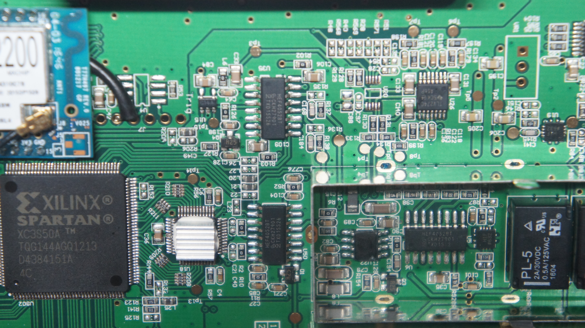
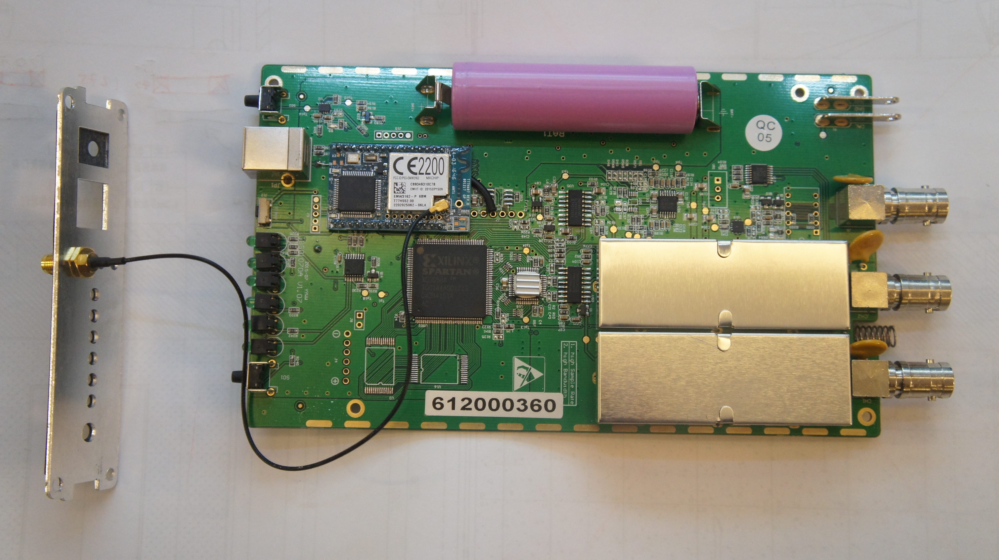
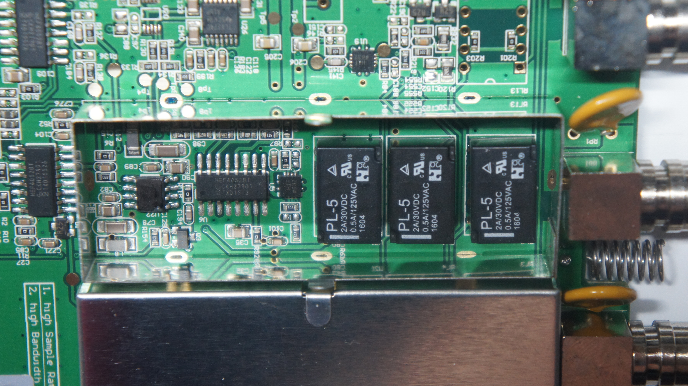
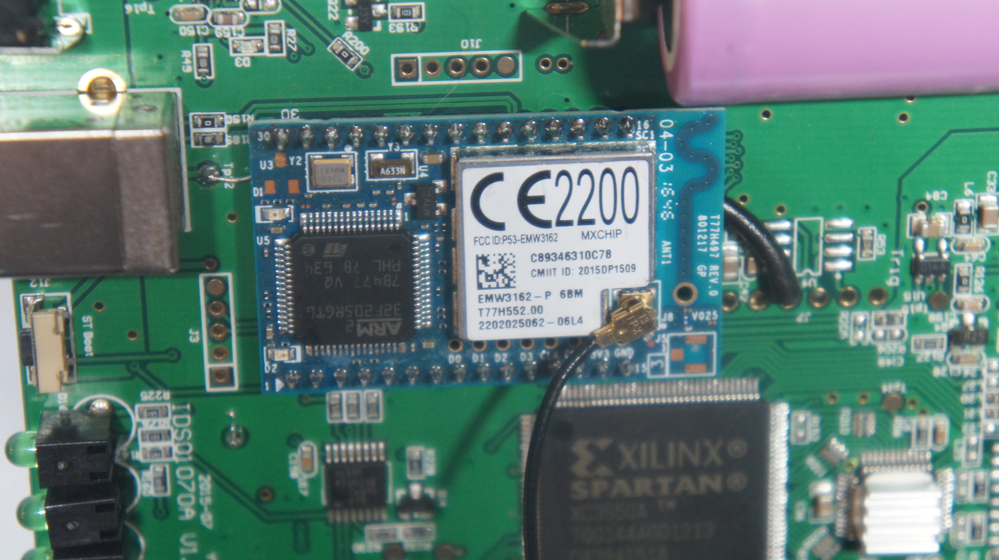

# Hantek iDSO1070A

{ .infobox-image }

### Hantek iDSO1070A

| | |
|---|---|
| **Status** | planned |
| **Channels** | 2 |
| **Samplerate** | 250MS/s (125 for 2 channels) |
| **Analog bandwidth** | 70MHz |
| **Vertical resolution** | 8bit |
| **Triggers** | CH1, CH2, EXT (all hardware) |
| **Input impedance** | 1MΩ‖25pF |
| **Memory** | ? |
| **Display** | none |
| **Connectivity** | USB / WiFi |
| **Website** | [hantek.com](http://www.hantek.com/en/ProductDetail_2_31.html) |

The **Hantek iDSO1070A** is a USB/WiFi-based, 2-channel oscilloscope with an analog bandwidth of 70MHz and 250MS/s sampling rate.

## Hardware
- **Main chip**: [Xilinx Spartan XC3S50A](http://www.xilinx.com/support/documentation/spartan-3an_data_sheets.htm) ([datasheet](http://www.xilinx.com/support/documentation/data_sheets/ds557.pdf))
- **Wifi module**: [MxChip EMW3162](http://en.mxchip.com/product/wifi_product/39) ([datasheet](http://en.mxchip.com/download/getFiles/57391c8444837.pdf/Datasheet.pdf))
- **Main oscillator**: 50MHz 50.000 YX FH

## Photos

{ .glightbox data-gallery="hantek-idso1070a" }
Hantek Idso1070a Inside1 Back

{ .glightbox data-gallery="hantek-idso1070a" }
Hantek Idso1070a Detail 1

{ .glightbox data-gallery="hantek-idso1070a" }
Hantek Idso1070a Inside1 Front

{ .glightbox data-gallery="hantek-idso1070a" }
Hantek Idso1070a Channel Module

{ .glightbox data-gallery="hantek-idso1070a" }
Hantek Idso1070a Wifi Module

## Notes
- Has been found cross channel interference. To observe this just connect Channel 1 to 5V DC and it is possible to see the shift of Channel 2 zero offset.
## Protocol

[Reverse engineered implementation of the protocol](https://github.com/hhornbacher/idso1070-protocol) 

## Resources

