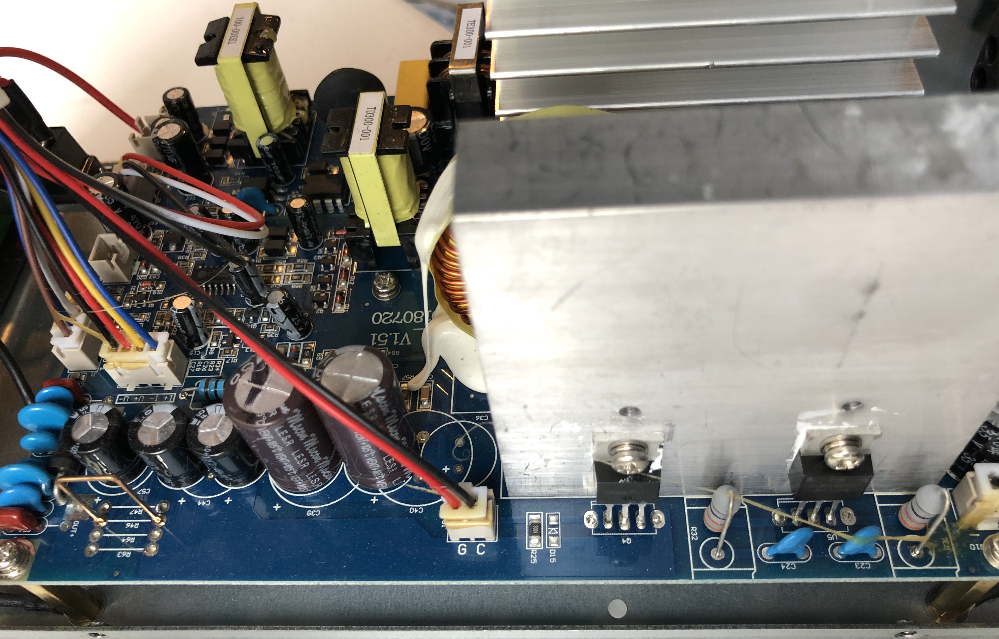
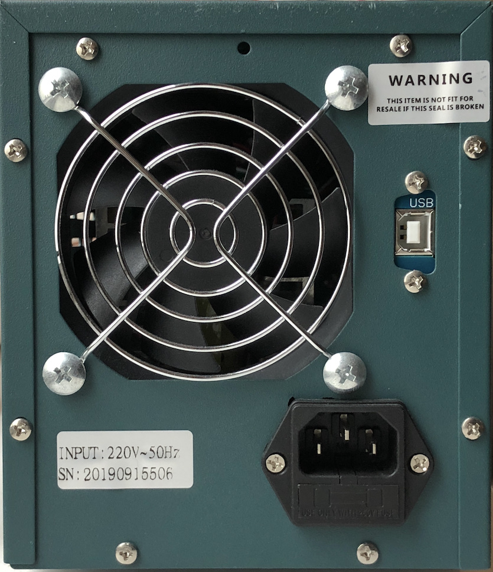
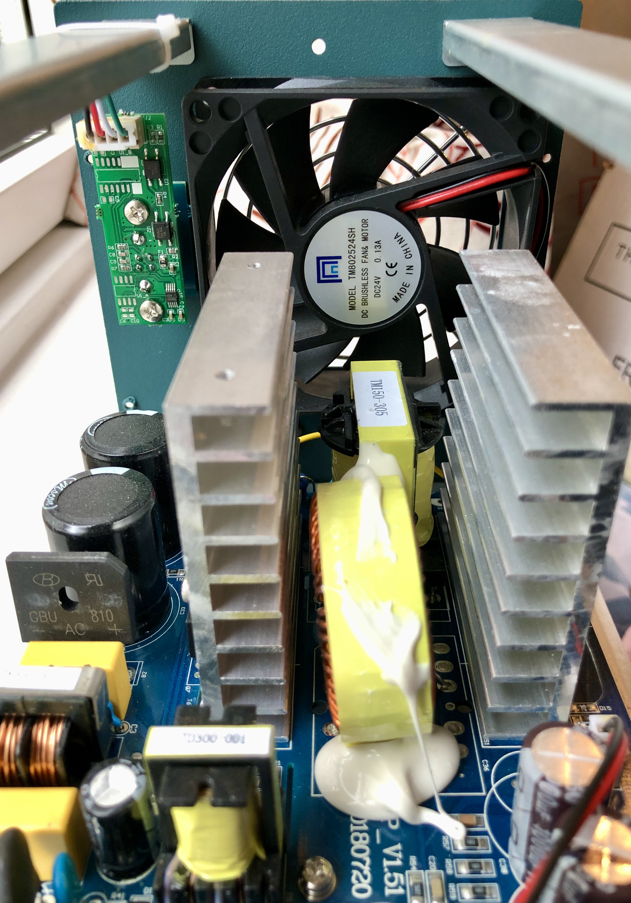
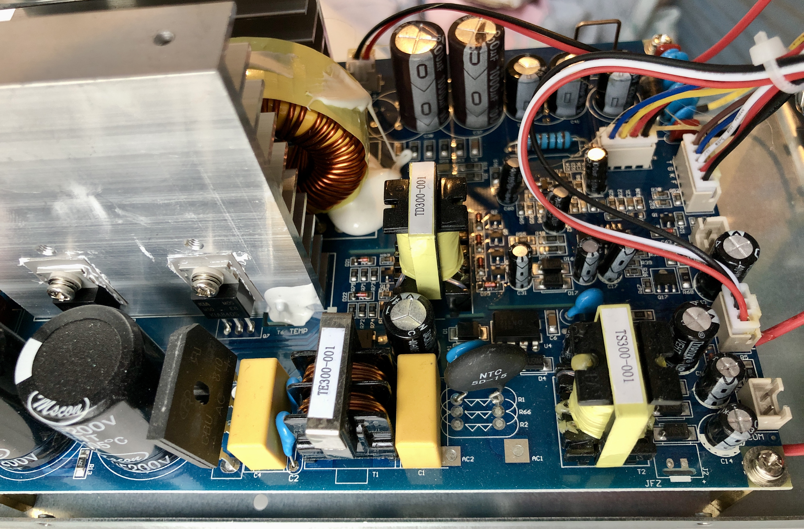
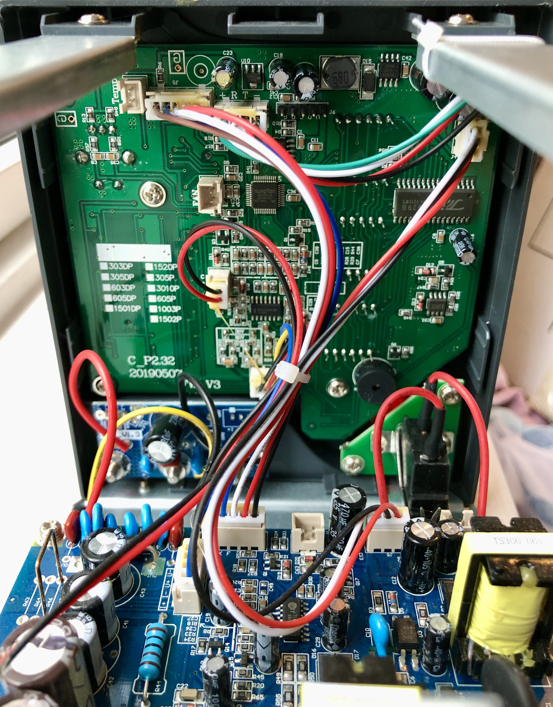
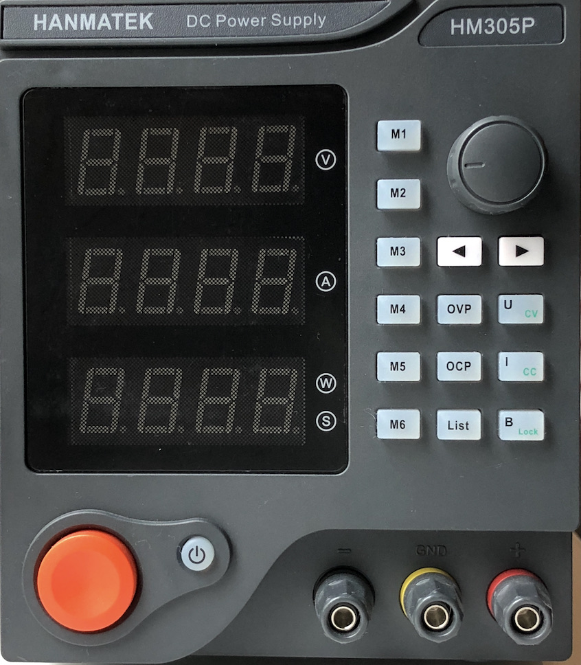

# Hanmatek HM305P

{ .infobox-image }

### Hanmatek HM305P

| | |
|---|---|
| **Status** | in progress |
| **Source code** | [etommens-etm-xxxxp](https://github.com/OpenTraceLab/OpenTraceCapture/tree/main/src/hardware/etommens-etm-xxxxp) |
| **Channels** | 1 |
| **Voltage/current (CH1)** | 0-30V / 0-5A |
| **Connectivity** | USB/serial |
| **Features** | programmable presets, over voltage protection, over current protection, output on/off |

The **Hanmatek HM305P** is a 1-channel programmable DC switched power supply (0-30V/0-5A) with USB/serial connectivity.

See [ETommens eTM-xxxxP Series](https://sigrok.org/wiki/ETommens_eTM-xxxxP_Series) for information common to all devices in this series. 

## Hardware
- MCU&#160;: [Nuvoton NUC029LAN Arm® Cortex®-M0](https://www.nuvoton.com/products/microcontrollers/arm-cortex-m0-mcus/nuc029-series/nuc029lan/?__locale=en).
- EEPROM&#160;: [Belling - BL24C08A - 8K bits I2C EEPROM](https://pdf1.alldatasheet.com/datasheet-pdf/view/887707/BELLING/BL24C08A.html).

## Photos

{ .glightbox data-gallery="hanmatek-hm305p" }
Hanmatek Hm305p Inside Power Front Left

{ .glightbox data-gallery="hanmatek-hm305p" }
Hanmatek Hm305p Rear

{ .glightbox data-gallery="hanmatek-hm305p" }
Hanmatek Hm305p Inside Rear

{ .glightbox data-gallery="hanmatek-hm305p" }
Hanmatek Hm305p Inside Power Front Right

{ .glightbox data-gallery="hanmatek-hm305p" }
Hanmatek Hm305p Inside Front

{ .glightbox data-gallery="hanmatek-hm305p" }
Hanmatek Hm305p Front

## Protocol

See [ETommens eTM-xxxxP Series#Protocol](https://sigrok.org/wiki/ETommens_eTM-xxxxP_Series#Protocol) for the protocol details.

## Resources
- [Product Overview Video](https://www.youtube.com/watch?v=prZja_XnRtw)
- [Manual (English)](https://img1.wsimg.com/blobby/go/7618ff31-9f39-4393-a27c-4edd68374a29/HM305P-HM310P%20Product%20Manual%20English.pdf)
- [HM305P/HM310P Software](http://s000.tinyupload.com/index.php?file_id=96163148851483775673)

