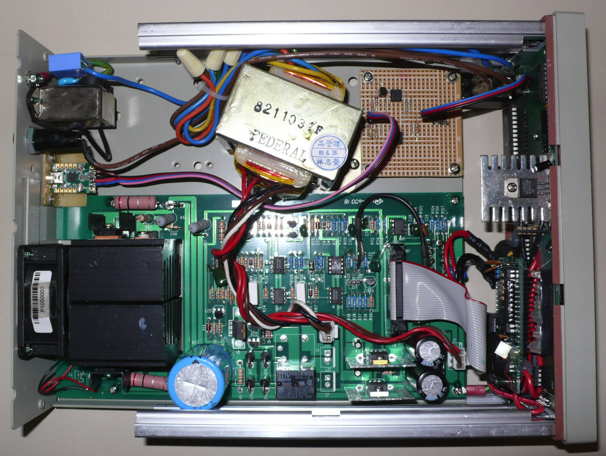
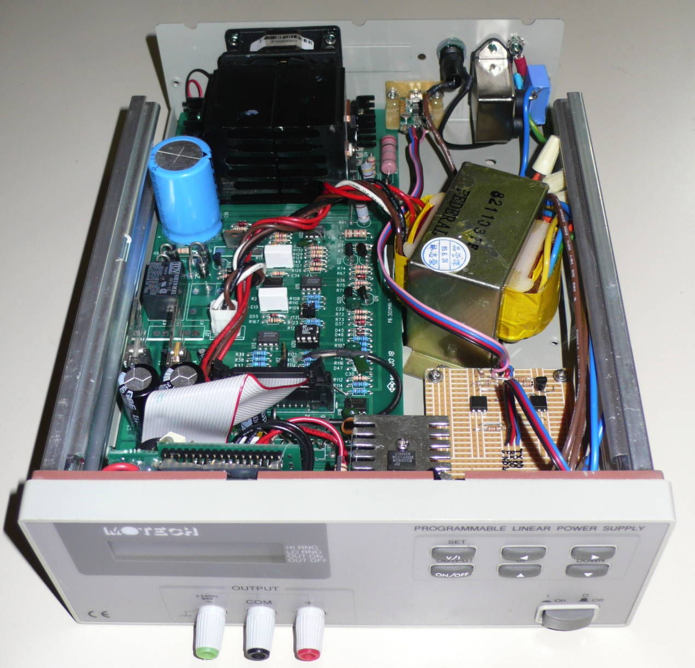

# Motech LPS-301

{ .infobox-image }

### Motech LPS-301

| | |
|---|---|
| **Status** | supported |
| **Source code** | [motech-lps-30x](https://github.com/OpenTraceLab/OpenTraceCapture/tree/main/src/hardware/motech-lps-30x) |
| **Channels** | 1 |
| **Voltage/current (CH1)** | 0-30 V, 0-1 or 2A |
| **Connectivity** | RS232 |
| **Features** | output on/off |
| **Website** | [power.motech.com.tw](http://power.motech.com.tw/) |

The **Motech LPS-301** is a 1-channel programmable linear power supply with optional RS232 connectivity.

It is the smallest member of the [Motech LPS-300 series](https://sigrok.org/wiki/Motech_LPS-300_series).

This device was also sold as the **Amrel LPS-301** by **American Reliance**.

It was sold from 1993-????.

## Hardware
- TODO.

## Photos

{ .glightbox data-gallery="motech-lps-301" }
Motech Lps 301 1

{ .glightbox data-gallery="motech-lps-301" }
Motech Lps 301 3

{ .glightbox data-gallery="motech-lps-301" }
Motech Lps 301 5

{ .glightbox data-gallery="motech-lps-301" }
Motech Lps 301 2

{ .glightbox data-gallery="motech-lps-301" }
Motech Lps 301 6

{ .glightbox data-gallery="motech-lps-301" }
Motech Lps 301 7

{ .glightbox data-gallery="motech-lps-301" }
Motech Lps 301 Logo

{ .glightbox data-gallery="motech-lps-301" }
Motech Lps 301 4

## Protocol

See [Motech LPS-300 series#Protocol](https://sigrok.org/wiki/Motech_LPS-300_series#Protocol).

## Resources
- [Vendor website](http://power.motech.com.tw/)

