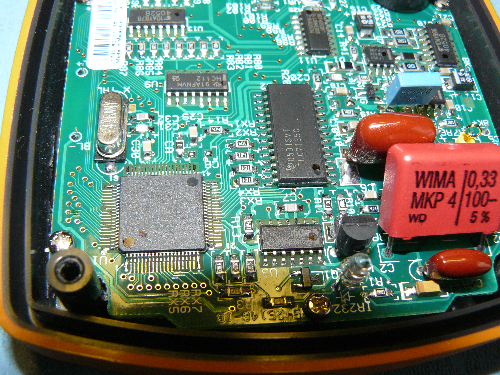
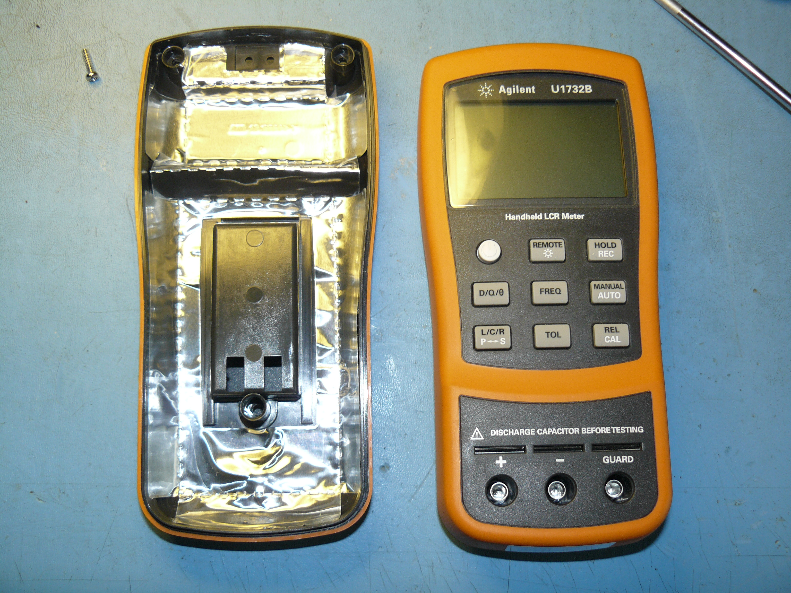
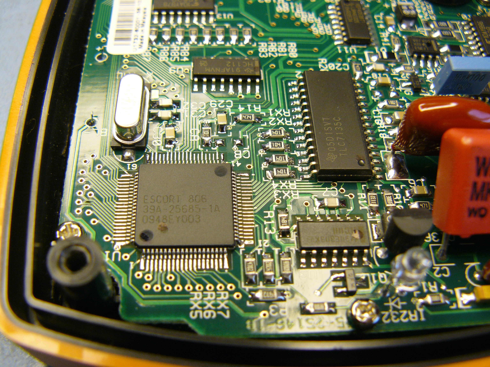
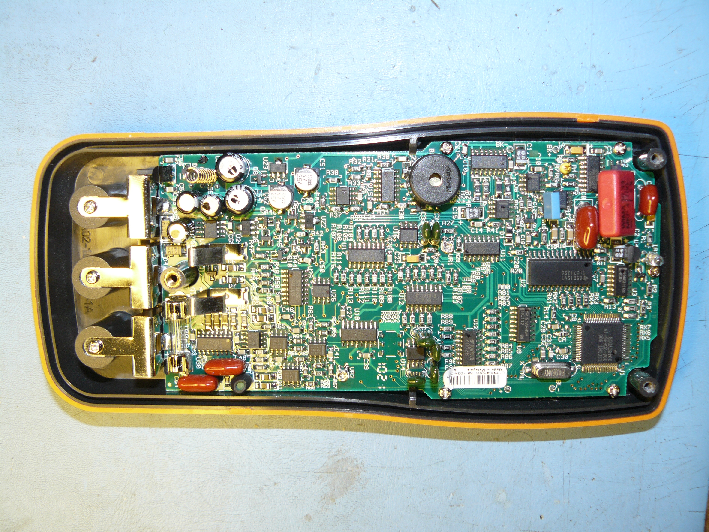

# Agilent U1732B

{ .infobox-image }

### Agilent U1732B

| | |
|---|---|
| **Status** | planned |
| **Counts** | 6000 |
| **IEC 61010-1** | CAT III (600V) |
| **Connectivity** | [USB](https://sigrok.org/wiki/Device_cables#Agilent_U5481A) |
| **Measurements** | inductance, capacitance, resistance, |
| **Features** | phase angle, dissipation factor, quality factor |
| **Website** | [keysight.com](http://www.keysight.com/en/pd-1764079-pn-U1732B/handheld-lcr-meters) |

The **Agilent U1732B** is a handheld LCR meter with USB connectivity.

## Photos

{ .glightbox data-gallery="agilent-u1732b" }
U1732b Adc

{ .glightbox data-gallery="agilent-u1732b" }
U1732b Case

{ .glightbox data-gallery="agilent-u1732b" }
U1732b Cpu

{ .glightbox data-gallery="agilent-u1732b" }
U1732b Pcb

{ .glightbox data-gallery="agilent-u1732b" }
Agilent U1732b

## Resources
- [U1700 series datasheet](http://literature.cdn.keysight.com/litweb/pdf/5990-3458EN.pdf)

