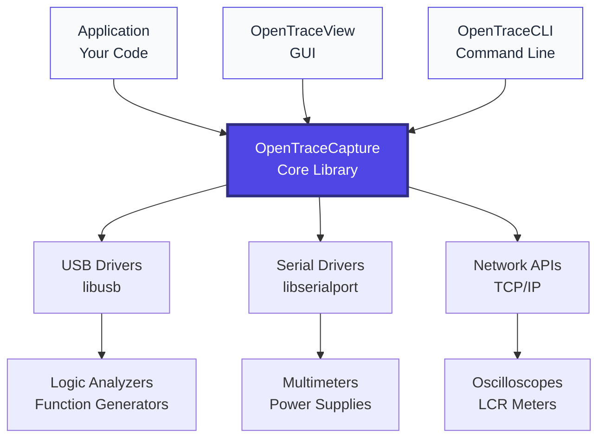

# OpenTraceCapture

OpenTraceCapture is the core library that provides hardware abstraction and signal acquisition capabilities for the OpenTraceLab ecosystem.

## Overview

OpenTraceCapture handles communication with measurement hardware including:

- **Logic analyzers** - Digital signal capture
- **Oscilloscopes** - Analog waveform acquisition  
- **Multimeters** - Voltage, current, resistance measurements
- **Function generators** - Signal generation
- **Power supplies** - Programmable power sources
- **LCR meters** - Inductance, capacitance, resistance
- **And many more device types**

## Key Features

### Hardware Abstraction
- Unified API across different device types
- Automatic device detection and configuration
- Hot-plug support for USB devices
- Cross-platform compatibility (Linux, Windows, macOS)

### Signal Acquisition
- High-speed streaming capture
- Configurable sample rates and buffer sizes
- Trigger support (edge, pattern, protocol)
- Real-time data processing

### Device Support
OpenTraceCapture supports 200+ devices including:

- **FX2-based logic analyzers** (fx2lafw firmware)
- **Saleae Logic** series
- **Rigol oscilloscopes** (DS1000, DS2000, DS4000 series)
- **Hantek oscilloscopes** 
- **UNI-T multimeters**
- **Korad power supplies**
- **And many more**

## Architecture



## Language Bindings

OpenTraceCapture provides bindings for multiple languages:

### C++ Bindings
```cpp
#include <libsigrokcxx/libsigrokcxx.hpp>

auto context = sigrok::Context::create();
auto devices = context->drivers()["fx2lafw"]->scan();
auto device = devices[0];
device->open();
```

### Python Bindings
```python
import sigrok

context = sigrok.Context.create()
devices = context.drivers()["fx2lafw"].scan()
device = devices[0]
device.open()
```

### Java Bindings
```java
import org.sigrok.core.classes.*;

Context context = Context.create();
Driver driver = context.getDrivers().get("fx2lafw");
List<HardwareDevice> devices = driver.scan();
```

## Supported Hardware

### Logic Analyzers
- **FX2-based devices** - 8/16 channels, up to 24MHz
- **Saleae Logic** - High-speed USB logic analyzers
- **OpenBench LogicSniffer** - Open hardware logic analyzer
- **IKALOGIC** - ScanaPLUS, ScanaQuad series
- **Zeroplus** - LAP-C series

### Oscilloscopes  
- **Rigol** - DS1000Z, DS2000, DS4000 series
- **Hantek** - DSO-2xxx, DSO-5xxx series
- **Siglent** - SDS1000 series
- **Tektronix** - TDS2000 series (via USBTMC)

### Multimeters
- **UNI-T** - UT61x, UT32x series  
- **Voltcraft** - VC-820, VC-840 series
- **Brymen** - BM25x series
- **Fluke** - 287, 289 (via serial)

## Building from Source

```bash
# Install dependencies
sudo apt install libglib2.0-dev libzip-dev libusb-1.0-0-dev \
  libftdi1-dev libserialport-dev

# Build
git clone https://github.com/OpenTraceLab/opentracecapture
cd opentracecapture
./autogen.sh
./configure
make
sudo make install
```

## Configuration

### Device Permissions (Linux)
```bash
# Install udev rules
sudo cp contrib/60-opentracelab.rules /etc/udev/rules.d/
sudo udevadm control --reload-rules

# Add user to plugdev group
sudo usermod -a -G plugdev $USER
```

### Firmware Installation
Some devices require firmware upload:
```bash
# FX2-based devices need fx2lafw firmware
mkdir -p ~/.local/share/sigrok-firmware
cp fx2lafw-*.fw ~/.local/share/sigrok-firmware/
```

## API Documentation

- **[C API Reference](https://opentracelab.org/api/opentracecapture/)**
- **[C++ Bindings](https://opentracelab.org/api/opentracecapture/bindings/cxx/)**
- **[Python Bindings](https://opentracelab.org/api/opentracecapture/bindings/python/)**

## Integration Examples

### collectd Plugin
Monitor devices with collectd:
```
LoadPlugin "opentracecapture"
<Plugin "opentracecapture">
   <Device "Temperature">
       Driver "uni-t-ut32x"
       conn "1a86.e008"
       MinimumInterval 1
   </Device>
</Plugin>
```

### Custom Applications
```c
#include <libsigrok/libsigrok.h>

struct sr_context *ctx;
struct sr_dev_inst *sdi;

sr_init(&ctx);
sr_driver_scan(driver, NULL);
sr_dev_open(sdi);
sr_session_start(session);
```

## Contributing

- **Device drivers** - Add support for new hardware
- **Protocol support** - Extend communication protocols  
- **Bug fixes** - Improve stability and compatibility
- **Documentation** - Help others use the library

See our [contributing guide](../community/contributing.md) for details.
