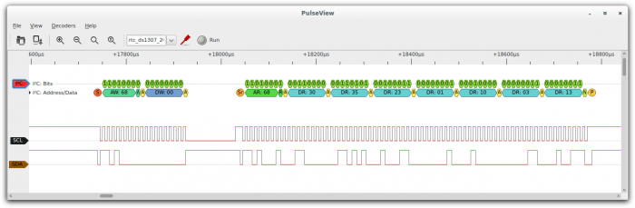

# OpenTraceDecode
OpenTraceDecode provides protocol decoding capabilities for the OpenTraceLab ecosystem, enabling automatic interpretation of captured digital signals.
## Overview
OpenTraceDecode transforms raw digital signals into human-readable protocol information using Python-based decoders. It supports **131 protocol decoders** covering everything from basic serial protocols to complex automotive and wireless communications.

## Supported Protocols
### Serial Communications
- **I²C** - Inter-Integrated Circuit (two-wire bus)
- **SPI** - Serial Peripheral Interface
- **UART** - Universal Asynchronous Receiver-Transmitter
- **Microwire** - 3-wire synchronous serial bus
- **1-Wire** - Single-wire communication protocol
### Automotive Protocols
- **CAN** - Controller Area Network
- **LIN** - Local Interconnect Network
- **FlexRay** - High-speed automotive network
- **K-Line** - Diagnostic communication
### Embedded & Industrial
- **Modbus** - Industrial automation protocol
- **DALI** - Digital Addressable Lighting Interface
- **DMX512** - Digital lighting control
- **IEEE-488** - GPIB/HPIB instrumentation bus
### Audio & Video
- **I²S** - Integrated Interchip Sound
- **AC'97** - Audio Codec '97
- **HDMI-CEC** - Consumer Electronics Control
- **MIDI** - Musical Instrument Digital Interface
### Wireless & RF
- **nRF24L01** - 2.4GHz RF transceiver
- **CC1101** - Sub-1GHz RF transceiver
- **Bluetooth** - Short-range wireless
- **IEEE 802.15.4** - Low-power wireless
### Debug & Trace
- **JTAG** - Joint Test Action Group
- **ARM ITM** - Instrumentation Trace Macroblock
- **ARM ETM** - Embedded Trace Macroblock
- **SWD** - Serial Wire Debug
### Memory & Storage
- **24xx EEPROM** - I²C EEPROM protocols
- **93xx EEPROM** - Microwire EEPROM
- **SPI Flash** - Serial flash memory
- **SD Card** - Secure Digital card protocol
## Decoder Architecture
### Stacked Decoders
Decoders can be chained for complex analysis:
```
Raw Logic → I²C Decoder → DS1307 RTC Decoder → Human-readable timestamps
```
### Python-based Implementation
```python
import sigrokdecode as srd
class Decoder(srd.Decoder):
    api_version = 3
    id = 'my_protocol'
    name = 'My Protocol'
    longname = 'My Custom Protocol'
    desc = 'Custom protocol decoder'
    license = 'gplv2+'
    inputs = ['logic']
    outputs = ['my_protocol']
    def __init__(self):
        self.reset()
    def reset(self):
        self.samplerate = None
    def start(self):
        self.out_ann = self.register(srd.OUTPUT_ANN, id='ann')
    def decode(self, ss, es, data):
        # Decoder logic here
        pass
```
## Key Features
### Real-time Decoding
- Live protocol analysis during capture
- Streaming decoder support
- Low-latency processing
### Flexible Output
- **Annotations** - Visual overlay on signals
- **Binary data** - Structured protocol data
- **Python objects** - Programmatic access
- **Export formats** - CSV, JSON, XML
### Extensible Framework
- Easy decoder development
- Protocol stacking support
- Custom annotation types
- Configurable parameters
## Using Decoders
### In OpenTraceView
1. **Add decoder** - Select from Decoders menu
2. **Configure channels** - Map logic channels to decoder inputs
3. **Set parameters** - Configure baud rates, addresses, etc.
4. **View results** - See decoded data overlaid on signals
### With OpenTraceCLI
```bash
# Basic I²C decoding
opentracelab-cli -i capture.sr -P i2c:scl=0:sda=1
# Stacked decoding (I²C + DS1307)
opentracelab-cli -i capture.sr -P i2c:scl=0:sda=1 -P ds1307:i2c=i2c
# Export decoded data
opentracelab-cli -i capture.sr -P uart:rx=0:baudrate=9600 -A uart=rx_data > output.txt
```
### Programmatic Access
```python
import sigrok
# Create session and add decoder
session = sigrok.Session()
decoder = session.add_decoder('i2c', channels={'scl': 0, 'sda': 1})
# Configure parameters
decoder.options = {'address_format': 'shifted'}
# Process data
session.start()
session.run()
```
## Writing Custom Decoders
### Basic Structure
```python
class Decoder(srd.Decoder):
    api_version = 3
    id = 'myprotocol'
    name = 'MyProtocol'
    # Protocol definition
    inputs = ['spi']  # Input from SPI decoder
    outputs = ['myprotocol']
    # Annotations
    annotations = (
        ('cmd', 'Command'),
        ('data', 'Data'),
        ('error', 'Error'),
    )
    def decode(self, ss, es, data):
        ptype, mosi, miso = data
        if ptype == 'DATA':
            # Decode protocol-specific data
            self.put(ss, es, self.out_ann, [0, ['CMD: 0x%02X' % mosi]])
```
### Advanced Features
- **State machines** - Track protocol state
- **Timing analysis** - Measure protocol timing
- **Error detection** - Identify protocol violations
- **Multi-channel** - Handle complex protocols
## Installation
### From Package
```bash
# Ubuntu/Debian
sudo apt install libsigrokdecode-dev
# Fedora
sudo dnf install libsigrokdecode-devel
```
### From Source
```bash
git clone https://github.com/OpenTraceLab/opentracedecode
cd opentracedecode
./autogen.sh
./configure
make
sudo make install
```
## API Documentation
- **[C API Reference](https://opentracelab.org/api/opentracedecode/)**
- **[Python Decoder API](https://opentracelab.org/api/opentracedecode/python/)**
- **[Decoder Development Guide](decoder-howto.md)**
## Contributing Decoders
We welcome new protocol decoders! See our guides:
- **[Protocol Decoder HOWTO](decoder-howto.md)** - Step-by-step decoder development
- **[Decoder API](decoder-api.md)** - Complete API reference
- **[Contributing Guide](../community/contributing.md)** - Submission process
Popular decoder requests:
- USB protocols (HID, CDC, etc.)
- Ethernet protocols
- Automotive diagnostics (OBD-II, UDS)
- IoT protocols (LoRaWAN, Zigbee)
- Industrial protocols (Profibus, EtherCAT)
