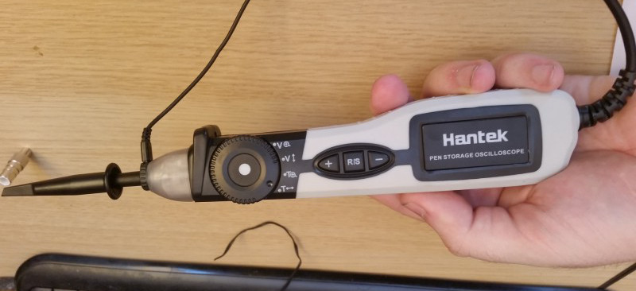

# Hardware support

{ .infobox-image }

### Hardware support

| | |
|---|---|

sigrok is intended as a flexible, cross-platform, and **hardware-independent** software suite, i.e., it supports various devices from many different vendors.

Here is a list of currently supported devices (various stages of completeness) in the [latest git version of libsigrok](http://sigrok.org/gitweb/?p=libsigrok.git;a=summary) (fewer devices might be supported in tarball releases) and devices we plan to support in the future. The [README.devices](http://sigrok.org/gitweb/?p=libsigrok.git;a=blob_plain;f=README.devices) document discusses more device or platform specific details, physical transports, dependencies on firmware and external tools, how to enable communication modes, etc.

The lists are sorted by category ( supported: [258](/wiki/Category:Supported),  in progress: [27](/wiki/Category:In_progress),  planned: [144](/wiki/Category:Planned)), and alphabetically within those categories.

## Logic analyzers

		- 
			

 [128axc-based USBee AX-Pro clone ](/wiki/128axc-based_USBee_AX-Pro_clone) (8ch, 24MHz)

		- 
			

 [ARMFLY Mini-Logic](/wiki/ARMFLY_Mini-Logic) (8ch, 24MHz)

		- 
			

 [ASIX OMEGA](/wiki/ASIX_OMEGA) (16ch, 400MHz)

		- 
			

 [ASIX SIGMA](/wiki/ASIX_SIGMA) (16ch, 200MHz)

		- 
			

 [ AZ-Delivery Logic Analyzer](/wiki/AZDelivery_Logic_Analyzer)] (8ch, 24MHz)

		- 
			

 [BeagleLogic](/wiki/BeagleLogic) (12(max 14)ch, 100MHz)

		- 
			

 [Braintechnology USB Interface V2.x](/wiki/Braintechnology_USB_Interface_V2.x) (8/16ch, 24/12MHz)

		- 
			

 [Braintechnology USB-LPS](/wiki/Braintechnology_USB-LPS) (8/16ch, 24/12MHz)

		- 
			

 [ChronoVu LA8](/wiki/ChronoVu_LA8) (8ch, 100MHz)

		- 
			

 [ChronoVu LA16](/wiki/ChronoVu_LA16) (16ch, 200MHz)

		- 
			

 [CWAV USBee SX](/wiki/CWAV_USBee_SX) (8ch, 24MHz)

		- 
			

 [Dangerous Prototypes Buspirate](/wiki/Dangerous_Prototypes_Buspirate) (5ch, 1MHz)

		- 
			

 [Dangerous Prototypes USB IR Toy](/wiki/Dangerous_Prototypes_USB_IR_Toy) (1ch, 10kHz)

		- 
			

 [DreamSourceLab DSLogic](/wiki/DreamSourceLab_DSLogic) (16ch, 400MHz)

		- 
			

 [DreamSourceLab DSLogic Basic](/wiki/DreamSourceLab_DSLogic_Basic) (16ch, 100MHz)

		- 
			

 [DreamSourceLab DSLogic Plus](/wiki/DreamSourceLab_DSLogic_Plus) (16ch, 400MHz)

		- 
			

 [DreamSourceLab DSLogic Pro](/wiki/DreamSourceLab_DSLogic_Pro) (16ch, 400MHz)

		- 
			

 [EE Electronics ESLA100](/wiki/EE_Electronics_ESLA100) (8ch, 24MHz)

		- 
			

 [FTDI-LA](/wiki/FTDI-LA) (8ch, ~10MHz)

		- 
			

[ Grand Idea Studio JTAGulator](/wiki/JTAGulator) (24ch, 1.2MHz)

		- 
			

 [GreatFET One](/wiki/GreatFET_One) (8/4/2/1ch, 40.8/68/102/204MHz)

		- 
			

 [Hantek 4032L](/wiki/Hantek_4032L) (32ch, 400MHz)

		- 
			

 [Hantek 6022BL](/wiki/Hantek_6022BL) (8ch, 24MHz)

		- 
			

 [Hobby Components HCTEST0006](/wiki/Hobby_Components_HCTEST0006) (8ch, 24MHz)

		- 
			

 [IKALOGIC Scanalogic-2](/wiki/IKALOGIC_Scanalogic-2) (4ch, 20MHz)

		- 
			

 [IKALOGIC ScanaPLUS](/wiki/IKALOGIC_ScanaPLUS) (9ch, 100MHz)

		- 
			

 [Kingst LA2016](/wiki/Kingst_LA2016) (16ch, 200MHz)

		- 
			

 [Kingst LA5016](/wiki/Kingst_LA5016) (16ch, 500MHz)

		- 
			

 [Kingst LA5032](/wiki/Kingst_LA5032) (32ch, 500MHz)

		- 
			

 [KingST KQS3506-LA16100](/wiki/KingST_KQS3506-LA16100) (16ch, 100/50/32/16MHz @ 3/6/9/16ch)

		- 
			

 [Lcsoft Mini Board](/wiki/Lcsoft_Mini_Board) (8/16ch, 24/12MHz)

		- 
			

 [LeCroy LogicStudio](/wiki/LeCroy_LogicStudio) (8/16ch, 1GHz/500MHz)

		- 
			

 [Logic Shrimp](/wiki/Logic_Shrimp) (4ch, 20MHz)

		- 
			

 [MCU123 Saleae Logic clone](/wiki/MCU123_Saleae_Logic_clone) (8ch, 24MHz)

		- 
			

 [Meilhaus Logian-16L](/wiki/Meilhaus_Logian-16L) (16ch, 200MHz)

		- 
			

 [Microchip PICkit2](/wiki/Microchip_PICkit2) (3ch, 1MHz)

		- 
			

 [MCU123 USBee AX Pro clone](/wiki/MCU123_USBee_AX_Pro_clone) (8ch, 24MHz)

		- 
			

 [mcupro Logic16 clone](/wiki/Mcupro_Logic16_clone) (16ch, 100MHz)

		- 
			

 [Noname Saleae Logic clone](/wiki/Noname_Saleae_Logic_clone) (8ch, 24MHz)

		- 
			

 [Openbench Logic Sniffer](/wiki/Openbench_Logic_Sniffer) (32ch, 100MHz)

		- 
			

 [Prist AKIP-9101](/wiki/Prist_AKIP-9101) (16ch, 200MHz)

		- 
			

 [Robomotic BugLogic 3](/wiki/Robomotic_BugLogic_3) (8ch, 24MHz)

		- 
			

 [Robomotic MiniLogic](/wiki/Robomotic_MiniLogic) (8ch, 24MHz)

		- 
			

 [Saleae Logic](/wiki/Saleae_Logic) (8ch, 24MHz)

		- 
			

 [Saleae Logic16](/wiki/Saleae_Logic16) (16ch, 100/50/32/16MHz @ 3/6/9/16ch)

		- 
			

 [Saanlima Pipistrello OLS](/wiki/Saanlima_Pipistrello_OLS) (32ch, 100MHz)

		- 
			

 [SUMP compatibles](/wiki/SUMP_compatibles)

		- 
			

 [Sysclk LWLA1016](/wiki/Sysclk_LWLA1016) (16ch, 100MHz)

		- 
			

 [Sysclk LWLA1034](/wiki/Sysclk_LWLA1034) (34ch, 125MHz)

		- 
			

 [Sysclk SLA5032](/wiki/Sysclk_SLA5032) (32ch, 500MHz)

		- 
			

 [VKTECH saleae clone](/wiki/VKTECH_saleae_clone) (8ch, 24MHz)

		- 
			

 [WayEngineer Saleae16](/wiki/WayEngineer_Saleae16) (16ch, 100/50/32/16MHz @ 3/6/9/16ch)

		- 
			)

 [ZEROPLUS Logic Cube LAP-C(16032)](/wiki/ZEROPLUS_Logic_Cube_LAP-C(16032)) (16ch, 100MHz)

		- 
			)

 [ZEROPLUS Logic Cube LAP-C(322000)](/wiki/ZEROPLUS_Logic_Cube_LAP-C(322000)) (32ch, 200MHz)

		- 
			

 [ZEROPLUS LAP-16128U](/wiki/ZEROPLUS_LAP-16128U) (16ch, 200MHz)

**Work in progress  / planned :**

		- 
			

 [Acute PKLA-1216](/wiki/Acute_PKLA-1216) (16ch, 200MHz)

		- 
			

 [Arduino](/wiki/Arduino) (6ch, 4MHz)

		- 
			

 [Codethink Interrogizer](/wiki/Codethink_Interrogizer) (16ch, 200kHz)

		- 
			

 [CoLA](/wiki/CoLA) (96/48/24ch, 25/50/100MHz)

		- 
			

 [DreamSourceLab DSLogic U3Pro16](/wiki/DreamSourceLab_DSLogic_U3Pro16) (16ch, 1GHz)

		- 
			

 [HSA Logic](/wiki/HSA_Logic) (8ch, 6.25MHz)

		- 
			

 [Ideofy LA-08](/wiki/Ideofy_LA-08) (8ch, 96/60/30MHz @ 2/4/8ch)

		- 
			

 [Intronix Logicport LA1034](/wiki/Intronix_Logicport_LA1034) (34ch, 500MHz)

		- 
			

 [Link Instruments LA-5580](/wiki/Link_Instruments_LA-5580) (80ch, 500MHz)

		- 
			

 [MiniLA](/wiki/MiniLA) (32ch, 100MHz)

		- 
			

 [MiniLA Mockup](/wiki/MiniLA_Mockup) (32ch, 100MHz)

		- 
			

 [Noname LA16](/wiki/Noname_LA16) (16ch, 100MHz)

		- 
			

 [Noname XL-LOGIC16-100M](/wiki/Noname_XL-LOGIC16-100M) (16ch, 100/50/32/16MHz @ 3/6/9/16ch)

		- 
			

 [RockyLogic Ant8](/wiki/RockyLogic_Ant8) (8ch, 500MHz)

		- 
			

 [RockyLogic Ant18e](/wiki/RockyLogic_Ant18e) (8ch, 1GHz)

		- 
			

 [Sysclk LWLA2034](/wiki/Sysclk_LWLA2034) (34ch, 200MHz)

		- 
			

 [TechTools DigiView DV1-100](/wiki/TechTools_DigiView_DV1-100) (18ch, 100MHz)

		- 
			

 [Tektronix TLA520X](/wiki/Tektronix_TLA520X) (128ch, 2Ghz)

		- 
			

 [XMOS XTAG-2](/wiki/XMOS_XTAG-2) (?ch, 50MHz)

		- 
			

 [ZLG LA1032](/wiki/ZLG_LA1032) (32ch, 100MHz)

## Mixed-signal devices

		- 
			

 [ARMFLY AX-Pro](/wiki/ARMFLY_AX-Pro) (8ch, 24MHz; 1ch analog, 3MHz BW)

		- 
			

 [Sysclk AX-Pro](/wiki/Sysclk_AX-Pro) (8ch, 24MHz; 1ch analog, 3MHz BW)

		- 
			

 [EE Electronics ESLA201A](/wiki/EE_Electronics_ESLA201A) (8ch, 24MHz; 1ch analog, 3MHz BW)

		- 
			

 [HT USBee-AxPro](/wiki/HT_USBee-AxPro) (8ch, 24MHz; 1ch analog, 3MHz BW)

		- 
			

 [LeCroy oscilloscope series](/wiki/LeCroy_oscilloscope_series) (various)

		- 
			

 [Noname LHT00SU1](/wiki/Noname_LHT00SU1) (8ch, 24MHz; 1ch analog, 3MHz BW)

		- 
			

 [Rigol DS1000D series](/wiki/Rigol_DS1000_series) (16ch, 2ch analog, 50-150MHz BW)

		- 
			

 [Rigol DS4000 series](/wiki/Rigol_DS4000_series) (0/16ch , 2-4ch analog, 2-4GS/s, 100MHz/200MHz/350MHz/500MHz BW)

		- 
			

 [Rigol VS5000D series](/wiki/Rigol_VS5000_series) (16ch, 2ch analog, 20-200MHz BW)

		- 
			

 [Rohde&Schwarz HMO1002 series](/w/index.php?title=Rohde%26Schwarz_HMO1002_series&action=edit&redlink=1) (2ch, 1GS/s, 50-100MHz BW)

		- 
			HMO3000.jpg

 [Rohde&Schwarz HMO 3000 series](/wiki/Rohde%26Schwarz_HMO_3000_series) (16ch, 2/4ch analog, 4GS/s, 300-500MHz BW)

		- 
			RTA4000.jpg

 [Rohde&Schwarz RT series](/wiki/Rohde%26Schwarz_RT_series) (8/16ch, 2/4ch analog, 2-5GS/s, 50MHz-1GHz BW)

		- 
			

 [Saleae Logic Pro 16](/wiki/Saleae_Logic_Pro_16) (4/16ch, 500/100MHz; 16ch analog, 50MSa/s, 5MHz BW)

		- 
			

 [Siglent SDS1000X series](/wiki/Siglent_SDS1000X_series) (16ch, 2ch analog, 1GSa/s, 200/100MHz BW)

		- 
			

 [Siglent SDS2000X series](/wiki/Siglent_SDS2000X_series) (16ch, 2/4ch analog, 2GSa/s, 300/200/150/100/70MHz BW)

		- 
			

 [Yokogawa DLM2000 series](/wiki/Yokogawa_DLM2000_series) (8ch, 2/4ch analog, 2.5GSa/s, 200/350/500MHz BW)

		- 
			

 [XZL_Studio AX](/wiki/XZL_Studio_AX) (8ch, 24MHz; 1ch analog, 3MHz BW)

		- 
			

 [XZL_Studio DX](/wiki/XZL_Studio_DX)
 (16ch, 24MHz; 2ch analog),
Analog not supported

**Work in progress  / planned :**

		- 
			

 [Agilent MSO7104A](/wiki/Agilent_MSO7104A) (16ch,&#160;?; 4ch analog, 2GSa/s, 1GHz BW)

		- 
			

 [BitScope BS10](/wiki/BitScope_BS10) (8ch, 40MHz; 2ch analog, 20MSa/s,&#160;? BW)

		- 
			

 [Digilent Analog Discovery](/wiki/Digilent_Analog_Discovery) (16ch, 100MHz; 2ch analog, 100MSa/s, 5MHz BW)

		- 
			

 [Hantek 1008C](/wiki/Hantek_1008C) (8ch)

		- 
			

 [HT USBee-DxPro](/wiki/HT_USBee-DxPro) (16ch, 24MHz; 2ch analog)

		- 
			

 [LabNation SmartScope](/wiki/LabNation_SmartScope) (8ch, 100MHz; 2ch analog, 100MSa/s, 45MHz BW)

		- 
			

 [Link Instruments MSO-19](/wiki/Link_Instruments_MSO-19) (8ch, 200MHz; 1ch analog, 200MSa/s, 60MHz BW)

		- 
			

 [Meilhaus MEphisto Scope1](/wiki/Meilhaus_MEphisto_Scope1) (16ch, 100kHz; 2ch analog, 1MSa/s, 500kHz BW)

		- 
			

 [PoLabs PoScope Basic2](/wiki/PoLabs_PoScope_Basic2) (16ch, 8MHz; 2ch analog, 200kSa/s,&#160;? BW)

		- 
			

 [QuantAsylum QA100](/wiki/QuantAsylum_QA100) (12ch; 2ch analog)

		- 
			

 [Rigol MSO5000 Series](/wiki/Rigol_MSO5000_Series) (16ch, 2-4ch analog, 70-350MHz BW)

		- 
			

 [Saleae Logic8](/wiki/Saleae_Logic8) (3/6/7/8ch, 100/50/40/25MHz; 8ch analog, 10MSa/s, 1MHz BW)

		- 
			

 [Saleae Logic Pro 8](/wiki/Saleae_Logic_Pro_8) (4/8ch, 500/100MHz; 8ch analog, 50MSa/s, 5MHz BW)

		- 
			

 [Pico Technology PicoScope 3205D MSO](/wiki/Pico_Technology_PicoScope_3205D_MSO) (16ch, 100MHz; 2ch analog, 1/0.5GS/s, 100MHz BW)

		- 
			

 [Hantek DSO3254A](/wiki/Hantek_DSO3254A) (16ch, 250MHz; 4ch analog, 1GS/s, 250MHz BW; 1 ch func/arb generator, 200MHz)

## Oscilloscopes

		- 
			

 [Agilent DSO1000 series](/wiki/Agilent_DSO1000_series) (2-4ch, 2GS/s, 60-200MHz BW)

		- 
			

 [Fluke ScopeMeter 199B](/wiki/Fluke_ScopeMeter_199B) (2ch, 2.5GS/s, 200MHz BW)

		- 
			

 [GW Instek GDS-800 series](/wiki/GW_Instek_GDS-800_series) (2ch, 25GS/s, 60-250MHz BW)

		- 
			

 [Hameg HMO compact series](/wiki/Hameg_HMO_compact_series) (2-4ch, 2GS/s, 70-200MHz BW)

		- 
			

 [Hantek 6022BE](/wiki/Hantek_6022BE) (2ch, 48MS/s, 20MHz BW)

		- 
			

 [Hantek DSO-2090](/wiki/Hantek_DSO-2090) (2ch, 100MS/s, 40MHz)

		- 
			

 [Hung-Chang DSO-2100](/wiki/Hung-Chang_DSO-2100) (2ch, 100MS/s, 30MHz BW)

		- 
			

 [Rigol DS1000E series](/wiki/Rigol_DS1000_series) (2ch, 1GS/s, 50-150MHz BW)

		- 
			

 [Rigol DS1000Z series](/wiki/Rigol_DS1000Z_series) (4ch, 1GS/s, 50-100MHz BW)

		- 
			

 [Rigol DS2000 series](/wiki/Rigol_DS2000_series) (2ch, 2GS/s, 70-200MHz BW)

		- 
			

 [Rigol VS5000 series](/wiki/Rigol_VS5000_series) (2ch, 20-200MHz BW)

		- 
			

 [Rocktech BM102](/wiki/Rocktech_BM102) (2ch, 50MS/s, 20MHz BW)

		- 
			

 [SainSmart DDS120](/wiki/SainSmart_DDS120) (2ch, 50MS/s, 20MHz BW)

		- 
			

 [YiXingDianZi MDSO](/wiki/YiXingDianZi_MDSO) (2ch, 48MS/s, 20MHz BW)

**Work in progress  / planned :**

		- 
			

 [DreamSourceLab DScope C20P](/wiki/DreamSourceLab_DScope_C20P) (2ch, 200MS/s, 50MHz BW)

		- 
			

 [Fluke ScopeMeter 123](/wiki/Fluke_ScopeMeter_123) (2ch, 25MS/s, 20MHz BW)

		- 
			

 [Focussz Fosc21](/wiki/Focussz_Fosc21) (2ch, 8kS/s, 3kHz BW)

		- 
			

 [GW Instek GDS-2000 series](/wiki/GW_Instek_GDS-2000_series) (2ch, 1GS/s, 60MHz/100MHz/200MHz BW)

		- 
			

 [Hantek 6052BE](/wiki/Hantek_6052BE) (2ch, 150MS/s, 50MHz BW)

		- 
			

 [Hantek 6254BD](/wiki/Hantek_6254BD) (4ch, 1GS/s, 250MHz BW)

		- 
			

 [Hantek DSO-1200](/wiki/Hantek_DSO-1200) (2ch, 500MS/s, 200MHz BW)

		- 
			

 [Hantek DSO-2100](/wiki/Hantek_DSO-2100) (2ch, 100M/s, 30MHz BW)

		- 
			

 [Hantek DSO-220](/wiki/Hantek_DSO-220) (2ch, 60MS/s, 20MHz BW)

		- 
			

 [Hantek PSO2020](/wiki/Hantek_PSO2020) (1ch, 96MS/s, 20MHz BW)

		- 
			

 [Hantek DSO-2250](/wiki/Hantek_DSO-2250) (2ch, 250MS/s, 100MHz BW)

		- 
			

 [Hantek DSO-5200A](/wiki/Hantek_DSO-5200A) (2ch, 250MS/s, 200MHz BW)

		- 
			

 [Hantek iDSO1070](/wiki/Hantek_iDSO1070) (2ch, 250MS/s, 70MHz BW)

		- 
			

 [Hantek iDSO1070A](/wiki/Hantek_iDSO1070A) (2ch, 125MS/s, 70MHz BW)

		- 
			

 [Incite Technology USB-DUXfast](/wiki/Incite_Technology_USB-DUXfast) (16ch, 3MHz,&#160;? BW)

		- 
			

 [Instrustar_ISDS205A](/wiki/Instrustar_ISDS205A) (2ch, 48MS/s, 20MHz BW)

		- 
			

 [Loto OSC802](/wiki/Loto_OSC802) (2ch, 80MS/s, 20MHz BW)

		- 
			

 [Nexus-Computing OsciPrime](/wiki/Nexus-Computing_OsciPrime) (2ch, ?MS/s, 3.3MHz-8MHz BW)

		- 
			

 [Owon SDS series](/wiki/Owon_SDS_series) (2ch, 0.5-3.2GS/s, 60-300MHz BW)

		- 
			

 [Pico Technology PicoScope 2203](/wiki/Pico_Technology_PicoScope_2203) (40/20MS/s, 5MHz BW)

		- 
			

 [Pico Technology PicoScope 2204A](/wiki/Pico_Technology_PicoScope_2204A) (100MS/s, 10MHz BW)

		- 
			

 [Pico Technology PicoScope 2205](/wiki/Pico_Technology_PicoScope_2205) (200/100MS/s, 25MHz BW)

		- 
			

 [Pico Technology PicoScope 3206](/wiki/Pico_Technology_PicoScope_3206) (200/100MS/s, 200MHz BW)

		- 
			

 [Pico Technology PicoScope 5203](/wiki/Pico_Technology_PicoScope_5203) (1/0.5GS/s, 250MHz BW)

		- 
			

 [SainSmart DDS140](/wiki/SainSmart_DDS140) (2ch, 200MS/s, 40MHz BW)

		- 
			

 [Soundcard](/wiki/Soundcard) (7.1ch, 192kS/s, 22kHz BW)

		- 
			

 [Tektronix TDS2000B series](/wiki/Tektronix_TDS2000B_series) (2-4ch, 1-2GS/s, 60-200MHz BW)

		- 
			

 [UNI-T UTD2042C](/wiki/UNI-T_UTD2042C) (2ch, 500MS/s, 40MHz BW)

		- 
			

 [Velleman PCSU1000](/wiki/Velleman_PCSU1000) (2ch, 1GS/s, 50MHz BW)

		- 
			

 [Velleman WFS210](/wiki/Velleman_WFS210) (2ch, 10MS/s,&#160;?? MHz BW)

		- 
			

 [Voltcraft DSO-220](/wiki/Voltcraft_DSO-220) (2ch, 60MS/s, 20MHz BW)

		- 
			

 [Voltcraft DSO-3062C](/wiki/Voltcraft_DSO-3062C) (2ch, 1GS/s, 60MHz BW)

## Multimeters

		- 
			

 [Agilent 34401A](/wiki/Agilent_34401A) (6.5 digits, GPIB, RS232)

		- 
			

 [Agilent 34405A](/wiki/Agilent_34405A) (120000 counts, USB TMC)

		- 
			

 [Agilent U12xxx series](/wiki/Agilent_U12xxx_series) (USB/Bluetooth)

		- 
			

 [BBC Goertz Metrawatt M2110](/wiki/BBC_Goertz_Metrawatt_M2110) (30000 counts, RS232)

		- 
			

 [Brymen BM257](/wiki/Brymen_BM257) (6000 counts, RS232/USB)

		- 
			

 [Brymen BM257s](/wiki/Brymen_BM257s) (6000 counts, RS232/USB)

		- 
			

 [Brymen BM525s](/wiki/Brymen_BM525s) (10000 counts, USB)

		- 
			

 [Brymen BM829s](/wiki/Brymen_BM829s) (10000 counts, USB)

		- 
			

 [Brymen BM857](/wiki/Brymen_BM857) (50000 counts, RS232)

		- 
			

 [Brymen BM859s](/wiki/Brymen_BM859s) (50000 counts, USB)

		- 
			

 [Brymen BM869](/wiki/Brymen_BM869) (50000 counts, USB)

		- 
			

 [Digitek DT4000ZC](/wiki/Digitek_DT4000ZC) (4000 counts, RS232)

		- 
			

 [EEVBlog 121GW](/wiki/EEVBlog_121GW) (50000 counts, BLE, SD)

		- 
			

 [Fluke 187/189](/wiki/Fluke_187/189) (50000 counts, RS232)

		- 
			

 [Fluke 287/289](/wiki/Fluke_287/289) (50000 counts, RS232)

		- 
			

 [Fluke 45](/wiki/Fluke_45) (100000 counts, GPIB/RS232)

		- 
			

 [Gossen Metrawatt Metrahit 14A](/wiki/Gossen_Metrawatt_Metrahit_14A) (3100 counts, RS232)

		- 
			

 [Gossen Metrawatt Metrahit 16I](/wiki/Gossen_Metrawatt_Metrahit_16I) (3100 counts, RS232)

		- 
			

 [Gossen Metrawatt Metrahit 18S](/wiki/Gossen_Metrawatt_Metrahit_18S) (31000 counts, RS232)

		- 
			

 [Gossen Metrawatt Metrahit 25S](/wiki/Gossen_Metrawatt_Metrahit_25S) (31000 counts, RS232/USB)

		- 
			

 [Gossen Metrawatt Metrahit 29S](/wiki/Gossen_Metrawatt_Metrahit_29S) (310000 counts, RS232/USB)

		- 
			

 [Gossen Metrawatt T-Com KMM2002](/wiki/Gossen_Metrawatt_T-Com_KMM2002) (3100 counts, RS232)

		- 
			

 [GW Instek GDM-397](/wiki/GW_Instek_GDM-397) (4000 counts, RS232/USB)

		- 
			

 [GW Instek GDM-8251A](/wiki/GW_Instek_GDM-8251A) (120000 counts, RS232/USB/DigitalIO)

		- 
			

 [GW Instek GDM-8255A](/wiki/GW_Instek_GDM-8255A) (199999 counts, RS232/USB/DigitalIO)

		- 
			

 [GW Instek GDM-9060](/wiki/GW_Instek_GDM-9060) (1200000 counts, LAN/RS232/USB/DigitalIO/GPIB)

		- 
			

 [GW Instek GDM-9061](/wiki/GW_Instek_GDM-9061) (1200000 counts, LAN/RS232/USB/DigitalIO/GPIB)

		- 
			

 [HP 3457A](/wiki/HP_3457A) (7.5 digits, GPIB)

		- 
			

 [HP 3478A](/wiki/HP_3478A) (5.5 digits, GPIB)

		- 
			

 [HT Instruments HT410](/wiki/HT_Instruments_HT410) (3100 counts, RS232)

		- 
			

 [ISO-TECH IDM103N](/wiki/ISO-TECH_IDM103N) (4000 counts, RS232)

		- 
			

 [Keysight 34465A](/wiki/Keysight_34465A) (1200000 counts, LAN/USB/GPIB)

		- 
			

 [MASTECH MAS345](/wiki/MASTECH_MAS345) (4000 counts, RS232)

		- 
			

 [MASTECH MS2115B](/wiki/MASTECH_MS2115B) (6000 counts, USB)

		- 
			

 [MASTECH MS8250B](/wiki/MASTECH_MS8250B) (4000 counts, USB)

		- 
			

 [MASTECH MS8250D](/wiki/MASTECH_MS8250D) (6600 counts, USB)

		- 
			

 [Meterman 38XR](/wiki/Meterman_38XR) (10000 counts, RS232)

		- 
			

 [Metex M-3850M](/wiki/Metex_M-3850M) (4000 counts, RS232)

		- 
			

 [Metex M-4650CR](/wiki/Metex_M-4650CR) (20000 counts, RS232)

		- 
			

 [Metex ME-21](/wiki/Metex_ME-21) (2000 counts, RS232)

		- 
			

 [Metex ME-31](/wiki/Metex_ME-31) (4000 counts, RS232)

		- 
			

 [Metrix MX56C](/wiki/Metrix_MX56C) (50000 counts, RS232)

		- 
			

 [Mooshim Engineering Mooshimeter](/wiki/Mooshim_Engineering_Mooshimeter) (24bit, BLE)

		- 
			

 [Norma DM950](/wiki/Norma_DM950) (21000 counts, RS232)

		- 
			

 [PCE PCE-DM32](/wiki/PCE_PCE-DM32) (4000 counts, RS232)

		- 
			

 [PeakTech 3330](/wiki/PeakTech_3330) (4000 counts, RS232/USB)

		- 
			

 [PeakTech 3410](/wiki/PeakTech_3410) (4000 counts, RS232)

		- 
			

 [PeakTech 3415](/wiki/PeakTech_3415) (6000 counts, USB)

		- 
			

 [PeakTech 4370](/wiki/PeakTech_4370) (2000 counts, RS232)

		- 
			

 [PeakTech 4390A](/wiki/PeakTech_4390A) (4000 counts, RS232)

		- 
			

 [RadioShack 22-168](/wiki/RadioShack_22-168) (2000 counts, RS232)

		- 
			

 [RadioShack 22-805](/wiki/RadioShack_22-805) (4000 counts, RS232)

		- 
			

 [RadioShack 22-812](/wiki/RadioShack_22-812) (4000 counts, RS232)

		- 
			

 [Siemens B1026](/wiki/Siemens_B1026) (21000 counts, RS232)

		- 
			

 [Siemens B1105](/wiki/Siemens_B1105) (310000 counts, RS232/USB)

		- 
			

 [Siglent SDM3055](/wiki/Siglent_SDM3055) (5.5 digits, LAN/USB/GPIB)

		- 
			

 [SparkFun 70C](/wiki/SparkFun_70C) (6000 counts, USB)

		- 
			

 [Tecpel DMM-8061](/wiki/Tecpel_DMM-8061) (4000 counts, RS232/USB)

		- 
			

 [TekPower TP4000ZC](/wiki/TekPower_TP4000ZC) (4000 counts, RS232)

		- 
			

 [Tenma 72-7730](/wiki/Tenma_72-7730) (20000 counts, RS232/USB)

		- 
			

 [Tenma 72-7732](/wiki/Tenma_72-7732) (40000 counts, RS232/USB)

		- 
			

 [Tenma 72-7745](/wiki/Tenma_72-7745) (4000 counts, RS232/USB)

		- 
			

 [Tenma 72-7750](/wiki/Tenma_72-7750) (6000 counts, RS232/USB)

		- 
			

 [Tenma 72-9380A](/wiki/Tenma_72-9380A) (40000 counts, RS232/USB)

		- 
			

 [UNI-T UT60E](/wiki/UNI-T_UT60E) (4000 counts, RS232/USB)

		- 
			

 [UNI-T UT61B](/wiki/UNI-T_UT61B) (4000 counts, RS232/USB)

		- 
			

 [UNI-T UT61C](/wiki/UNI-T_UT61C) (6000 counts, RS232/USB)

		- 
			

 [UNI-T UT61D](/wiki/UNI-T_UT61D) (6000 counts, RS232/USB)

		- 
			

 [UNI-T UT61E](/wiki/UNI-T_UT61E) (22000 counts, RS232/USB)

		- 
			

 [UNI-T UT71C](/wiki/UNI-T_UT71C) (40000 counts, RS232/USB)

		- 
			

 [UNI-T UT181A](/wiki/UNI-T_UT181A) (60000 counts, USB)

		- 
			

 [V&A VA18B](/wiki/V%26A_VA18B) (6000 counts, USB)

		- 
			

 [V&A VA40B](/wiki/V%26A_VA40B) (6000 counts, USB)

		- 
			

 [Velleman DVM4100](/wiki/Velleman_DVM4100) (6000 counts, USB)

		- 
			

 [Victor 70C](/wiki/Victor_70C) (4000 counts, USB)

		- 
			

 [Victor 86C](/wiki/Victor_86C) (4000 counts, USB)

		- 
			

 [Voltcraft M-3650CR](/wiki/Voltcraft_M-3650CR) (2000 counts, RS232)

		- 
			

 [Voltcraft M-3650D](/wiki/Voltcraft_M-3650D) (2000 counts, RS232)

		- 
			

 [Voltcraft M-4650CR](/wiki/Voltcraft_M-4650CR) (20000 counts, RS232)

		- 
			

 [Voltcraft ME-42](/wiki/Voltcraft_ME-42) (4000 counts, RS232)

		- 
			

 [Voltcraft VC-820](/wiki/Voltcraft_VC-820) (4000 counts, RS232/USB)

		- 
			

 [Voltcraft VC-830](/wiki/Voltcraft_VC-830) (6000 counts, RS232/USB)

		- 
			

 [Voltcraft VC-840](/wiki/Voltcraft_VC-840) (4000 counts, RS232/USB)

		- 
			

 [Voltcraft VC-870](/wiki/Voltcraft_VC-870) (40000 counts, RS232/USB)

		- 
			

 [Voltcraft VC-920](/wiki/Voltcraft_VC-920) (40000/4000 counts, RS232/USB)

		- 
			

 [Voltcraft VC-940](/wiki/Voltcraft_VC-940) (40000/4000 counts, RS232/USB)

		- 
			

 [Voltcraft VC-96](/wiki/Voltcraft_VC-96) (4000 counts, RS232)

**Work in progress  / planned :**

		- 
			

 [APPA 107](/wiki/APPA_107) (4000 / 20000 counts, RS232)

		- 
			

 [APPA Multimeters](/wiki/APPA_Multimeters) (Most models, Optical RS232/USB, BLE)

		- 
			

 [BENNING MM 12](/wiki/BENNING_MM_12) (40000 counts, RS232/USB, BLE)

		- 
			

 [CEM DT-987BT](/wiki/CEM_DT-987BT) (50000 counts, BLE)

		- 
			

 [Digitek DT8000](/wiki/Digitek_DT8000) (8000 counts, RS232)

		- 
			

 [Digitek DT80000](/wiki/Digitek_DT80000) (80000 counts, RS232)

		- 
			

 [Escort 179](/wiki/Escort_179) (10000 counts, RS232)

		- 
			

 [Gossen Metrawatt Metrahit 28C](/wiki/Gossen_Metrawatt_Metrahit_28C) (310000 counts, RS232/USB)

		- 
			

 [Gossen Metrawatt Metrahit 28S](/wiki/Gossen_Metrawatt_Metrahit_28S) (310000 counts, RS232/USB)

		- 
			

 [Gossen-Metrawatt METRAHIT 30M](/wiki/Gossen-Metrawatt_METRAHIT_30M) (1200000 counts, RS232/USB)

		- 
			

 [Gossen Metrawatt Metrahit X-Tra](/wiki/Gossen_Metrawatt_Metrahit_X-Tra) (12000 counts, USB)

		- 
			

 [HYELEC MS8236](/wiki/HYELEC_MS8236) (6000 counts, USB)

		- 
			

 [MASTECH M9803R](/wiki/MASTECH_M9803R) (4000 counts, RS232)

		- 
			

 [Metrix MX53](/wiki/Metrix_MX53) (50000 counts, RS232)

		- 
			

 [Owon XDM2041](/wiki/Owon_XDM2041) (55000 counts, RS232)

		- 
			

 [PeakTech 3442](/wiki/PeakTech_3442) (50000 counts, BLE)

		- 
			

 [PeakTech 4380](/wiki/PeakTech_4380) (4000 counts, RS232)

		- 
			

 [PeakTech 4390](/wiki/PeakTech_4390) (6000 counts, USB)

		- 
			

 [Protek 6500](/wiki/Protek_6500) (50000 counts, RS232)

		- 
			

 [Rigol DM3068](/wiki/Rigol_DM3068) (2200000 counts, LAN/USB/GPIB/RS232)

		- 
			

 [RS PRO S2](/wiki/RS_PRO_S2) (6000 counts, BLE)

		- 
			

 [Tenma 72-1016](/wiki/Tenma_72-1016) (6000 counts, RS232/USB)

		- 
			

 [UNI-T UT81B](/wiki/UNI-T_UT81B) (6000 counts, USB)

		- 
			

 [Voltcraft M-3850D](/wiki/Voltcraft_M-3850D) (4000 counts, RS232)

		- 
			

 [Voltcraft M-3890DT](/wiki/Voltcraft_M-3890DT) (4000 counts, USB)

		- 
			

 [Voltcraft M-4660A](/wiki/Voltcraft_M-4660A) (20000 counts, RS232)

		- 
			

 [Voltcraft VC-890](/wiki/Voltcraft_VC-890) (60000 counts, USB/serial)

		- 
			

 [Voltcraft VC-950](/wiki/Voltcraft_VC-950) (100000/10000 counts, serial/USB)

## LCR meters

		- 
			

 [DER EE DE-5000](/wiki/DER_EE_DE-5000) (serial)

		- 
			

 [MASTECH MS5308](/wiki/MASTECH_MS5308) (serial)

		- 
			

 [Peaktech 2165](/wiki/Peaktech_2165) (serial)

		- 
			

 [PeakTech 2170](/wiki/PeakTech_2170) (serial)

		- 
			

 [UNI-T UT612](/wiki/UNI-T_UT612) (USB/HID)

		- 
			

 [Voltcraft 4080](/wiki/Voltcraft_4080) (serial)

**Work in progress  / planned :**

		- 
			

 [Agilent U1732B](/wiki/Agilent_U1732B) (IR)

		- 
			

 [BK Precision 879B](/wiki/BK_Precision_879B) (USB)

## Sound level meters

		- 
			

 [CEM DT-8852](/wiki/CEM_DT-8852) (USB)

		- 
			

 [Colead SL-5868P](/wiki/Colead_SL-5868P) (RS232)

		- 
			

 [Kecheng KC-330B](/wiki/Kecheng_KC-330B) (RS232)

		- 
			

 [PCE PCE-322A](/wiki/PCE_PCE-322A) (USB)

		- 
			

 [Tondaj SL-814](/wiki/Tondaj_SL-814) (USB)

**Work in progress  / planned :**

		- 
			

 [PCE PCE-222](/wiki/PCE_PCE-222) (also: light-/thermo-/hygrometer; RS232)

		- 
			

 [Voltcraft DL-160S](/wiki/Voltcraft_DL-160S) (USB)

		- 
			

 [Voltcraft DL-161S](/wiki/Voltcraft_DL-161S) (USB)

## Thermometers

		- 
			

 [APPA 55II](/wiki/APPA_55II) (2xtemp, RS232)

		- 
			

 [Lascar Electronics EL-USB-2](/wiki/Lascar_Electronics_EL-USB-2) (1xtemp, 1xhum, USB)

		- 
			

 [MASTECH MS6514](/wiki/MASTECH_MS6514) (2x temp, USB/serial)

		- 
			

 [MIC 98581](/wiki/MIC_98581) (1xtemp, USB)

		- 
			

 [MIC 98583](/wiki/MIC_98583) (1xtemp, 1xhum, USB)

		- 
			

 [UNI-T UT325](/wiki/UNI-T_UT325) (2xtemp, USB)

		- 
			

 [Voltcraft K204](/wiki/Voltcraft_K204) (4xtemp, RS232)

**Work in progress  / planned :**

		- 
			

 [Elitech RC-3](/wiki/Elitech_RC-3) (1xtemp, RS232)

		- 
			

 [Escort 19](/wiki/Escort_19) (1x temp, RS232)

		- 
			

 [Pax Instruments T400](/wiki/Pax_Instruments_T400) (4xtemp, USB)

		- 
			

 [PCE PCE-222](/wiki/PCE_PCE-222) (1xtemp, RS232)

		- 
			

 [RDing TEMPer](/wiki/RDing_TEMPer) (1xtemp, USB)

		- 
			

 [RDing TEMPer Gold](/wiki/RDing_TEMPer_Gold) (1xtemp, USB)

		- 
			

 [RDing TEMPer1](/wiki/RDing_TEMPer1) (1xtemp, USB)

		- 
			

 [RDing TEMPer1K2](/wiki/RDing_TEMPer1K2) (1xtemp, USB)

		- 
			

 [Voltcraft DL-120TH](/wiki/Voltcraft_DL-120TH) (1xtemp, USB)

		- 
			

 [Voltcraft DL-140TH](/wiki/Voltcraft_DL-140TH) (1xtemp, USB)

## Hygrometers

		- 
			

 [Lascar Electronics EL-USB-2](/wiki/Lascar_Electronics_EL-USB-2) (temp/humidity, USB)

		- 
			

 [MIC 98583](/wiki/MIC_98583) (temp/humidity, USB)

**Work in progress  / planned :**

		- 
			

 [PCE PCE-222](/wiki/PCE_PCE-222) (also: light-/soundlevelmeter; RS232)

		- 
			

 [SiLabs Si7005USB-Dongle](/wiki/SiLabs_Si7005USB-Dongle) (USB)

## Anemometers

**Work in progress  / planned :**

		- 
			

 [MASTECH MS6252B](/wiki/MASTECH_MS6252B) (USB)

## Light meters

**Work in progress  / planned :**

		- 
			

 [Lutron YK-2005LX](/wiki/Lutron_YK-2005LX) (RS232)

		- 
			

 [PCE PCE-222](/wiki/PCE_PCE-222) (RS232)

## Energy meters

		- 
			

 [ATORCH_J7-c](/wiki/ATORCH_J7-c) (USB tester)

		- 
			

 [BayLibre ACME](/wiki/BayLibre_ACME) (I2C)

		- 
			

 [EDF Teleinfo](/wiki/EDF_Teleinfo) (RS232)

		- 
			

 [RDTech TC66C](/wiki/RDTech_TC66C) (USB tester)

		- 
			

 [RDTech UM series](/wiki/RDTech_UM_series) (USB testers)

**Work in progress  / planned :**

## DAQs

**Work in progress  / planned :**

		- 
			

 [NI USB-6008](/wiki/NI_USB-6008) (8/2 analog inputs/outputs, 12 digital I/Os)

## Dataloggers

		- 
			

 [Lascar Electronics EL-USB-CO](/wiki/Lascar_Electronics_EL-USB-CO) (carbon monoxide (CO) logger, USB)

		- 
			

 [Testo 435-4](/wiki/Testo_435-4) (USB)

**Work in progress  / planned :**

		- 
			

 [GSG Indoor Air Monitor](/wiki/GSG_Indoor_Air_Monitor) (air quality monitor, USB)

		- 
			

 [MAUL studio i](/wiki/MAUL_studio_i) (weighing scale, RS232)

		- 
			

 [Voltcraft CO-20](/wiki/Voltcraft_CO-20) (air quality monitor, USB)

## Tachometers

		- 
			

 [UNI-T UT372](/wiki/UNI-T_UT372) (USB)

## Scales

		- 
			

 [KERN scale series](/wiki/KERN_scale_series) (RS232)

## Digital loads

		- 
			

 [Arachnid Labs Reload Pro](/wiki/Arachnid_Labs_Reload_Pro) (USB)

		- 
			

 [ATORCH DL24MP-150W Purple](/wiki/ATORCH_DL24MP-150W_Purple)

		- 
			

 [ITECH IT8500 series](/wiki/ITECH_IT8500_series)

		- 
			

 [Maynuo M9812](/wiki/Maynuo_M9812)

		- 
			

 [ZKETECH EBD-USB](/wiki/ZKETECH_EBD-USB)

**Work in progress  / planned :**

		- 
			

 [ATTEN ATZ9711](/wiki/ATTEN_ATZ9711)

		- 
			

 [SIGLENT SDL10X0](/wiki/SIGLENT_SDL10X0)

## Function generators

		- 
			

 [Joy-IT JDS6600](/wiki/Joy-IT_JDS6600) (60MHz, USB RS232)

		- 
			

 [Rohde&Schwarz SME series](/w/index.php?title=Rohde%26Schwarz_SME_series&action=edit&redlink=1) (1ch, various, GPIB&RS232)

		- 
			

 [Rigol DG800 Series](/wiki/Rigol_DG800_Series) (1-2ch, 10/25/35MHz, USB)

		- 
			

 [Rigol DG900 Series](/wiki/Rigol_DG900_Series) (2ch, 50/70/100MHz, USB)

		- 
			

 [Rigol DG1000z Series](/wiki/Rigol_DG1000z_Series) (2ch, 25/35/60MHz, USB, LAN)

**Work in progress  / planned :**

		- 
			

 [Agilent 33120A](/wiki/Agilent_33120A) (15MHz, GPIB/Serial)

		- 
			

 [BG7TBL](/wiki/BG7TBL) (138MHz-4.4GHz, PC-based, USB)

		- 
			

 [Hantek DDS-3X25](/wiki/Hantek_DDS-3X25) (25MHz, PC-based, USB)

		- 
			

 [HP 3325A](/wiki/HP_3325A) (20MHz, GPIB)

		- 
			

 [MHINSTEK UDB1xxxS](/wiki/MHINSTEK_UDB1xxxS) (2/5/8MHz, Serial)

		- 
			

 [MHINSTEK MHS-5200A](/wiki/MHINSTEK_MHS-5200A) (6/12/20/25MHz, USB)

		- 
			

 [Siglent SDG1010](/wiki/Siglent_SDG1010) (10MHz, USB)

		- 
			

 [Velleman PCG10](/wiki/Velleman_PCG10) (1MHz, PC-based, LPT)

## Frequency counters

**Work in progress  / planned :**

		- 
			

 [Hantek DDS-3X25](/wiki/Hantek_DDS-3X25) (50MHz, PC-based, USB)

		- 
			

 [HP 5350B](/wiki/HP_5350B) (10Hz-20GHz, GPIB)

## RF receivers

**Work in progress  / planned :**

		- 
			

 [Per Vices Noctar](/w/index.php?title=Per_Vices_Noctar&action=edit&redlink=1) (100kHz-4GHz, IQ modulator/demodulator, PCIe)

## Spectrum analyzers

**Work in progress  / planned :**

		- 
			

 [Siglent SSA3000X series](/wiki/Siglent_SSA3000X_series) (9kHz-2.1GHz, USB, Ethernet)

## Power supplies

		- 
			

 [Agilent N5700 series](/w/index.php?title=Agilent_N5700_series&action=edit&redlink=1)

		- 
			

 [Atten PPS3203T-3S](/wiki/Atten_PPS3203T-3S) (3ch, 2x 0-32V, 1x 0-6V at 0-3A, USB&RS232)

		- 
			

 [BK Precision 9310](/w/index.php?title=BK_Precision_9310&action=edit&redlink=1)

		- 
			

 [Chroma 61604](/wiki/Chroma_61604) (1ch, 0-300V, 0-16A, 2kVA)

		- 
			

 [Conrad DIGI 35 CPU](/wiki/Conrad_DIGI_35_CPU) (1ch, 0-35V / 0-2.55A, RS232)

		- 
			

 [Envox EEZ H24005](/wiki/Envox_EEZ_H24005) (2ch, USB&LAN)

		- 
			

 [Envox EEZ Bench Box 3](/wiki/Envox_EEZ_Bench_Box_3) (6ch, modular, USB&LAN)

		- 
			

 [GW Instek GPD series](/wiki/GW_Instek_GPD_series) (2/3/4ch, 0-30V / 0-3A, USB/serial)

		- 
			

 [HP 661xC series](/w/index.php?title=HP_661xC_series&action=edit&redlink=1)

		- 
			

 [HP 66312A](/wiki/HP_66312A) (1ch, 0-20V / 0-2A, GPIB&RS232)

		- 
			

 [HP 6632B](/wiki/HP_6632B) (1ch, 0-20V / 0-5A, GPIB&RS232)

		- 
			

 [Korad KAxxxxP series](/wiki/Korad_KAxxxxP_series) (1ch, 0-30V / 0-5A, USB&RS232)

		- 
			

 [Manson HCS-3xxx series](/wiki/Manson_HCS-3xxx_series) (1ch, 1-36V / 0-10A, USB)

		- 
			

 [Motech LPS-301](/wiki/Motech_LPS-301) (1ch, 1-32V / 0-2A, RS232)

		- 
			

 [Owon P4000 series](/wiki/Owon_P4000_series) (1ch, 30V/5A or 60V/3A, RS232)

		- 
			

 [Fluke/Philips PM2800 series](/wiki/Philips_PM2800_series)

		- 
			

 [RDTech DPS series](/wiki/RDTech_DPS_series) (1ch, various, USB/BT)

		- 
			

 [RDTech RD series](/wiki/RDTech_RD_series) (1ch, 0-60V, 0-6/12/18A, USB/Serial/WiFi)

		- 
			

 [Rigol DP700 series](/w/index.php?title=Rigol_DP700_series&action=edit&redlink=1)

		- 
			

 [Rigol DP800 series](/wiki/Rigol_DP800_series)

		- 
			

 [Rohde&Schwarz HMC 8043](/wiki/Rohde%26Schwarz_HMC_8043) (3ch, 0-32V / 0-3A, USB&LXI)

		- 
			

 [Rohde&Schwarz HMP 4000 series](/wiki/Rohde%26Schwarz_HMP_4000_series) (3/4ch, 0-32V / 0-10A, USB&LAN)

**Work in progress  / planned :**

		- 
			

 [Delta Elektronika SM3300 series](/wiki/Delta_Elektronika_SM3300_series) (1ch, 18V-660V/3.3kW, USB, RS232, RS485, RS422)

		- 
			

 [ETommens eTM-xxxxP Series](/wiki/ETommens_eTM-xxxxP_Series) (1ch, various, USB/Serial)

		- 
			

 [Hanmatek HM305P](/wiki/Hanmatek_HM305P) (1ch, 0-30V/0-5A, USB/Serial)

		- 
			

 [RockSeed RS310P](/wiki/RockSeed_RS310P) (1ch, 0-30V/0-10A, USB/Serial)

		- 
			

 [Siglent SPD3303 series](/wiki/Siglent_SPD3303_series) (3ch, 0-32V/0-3.2A, USB, LAN)

		- 
			

 [Voltcraft 18220](/wiki/Voltcraft_18220) (1ch, 0-40V/0-5A, RS232)

## Multiplexer / Relay actuators

		- 
			

 [dcttech usbrelay](/wiki/Dcttech_usbrelay) (1-8ch, 10A @ 250VAC, 10A @ 30VDC, USB HID)

		- 
			

 [Devantech ETH008](/wiki/Devantech_ETH008) (2-20ch, 250VAC, 16A, Ethernet/Wifi)

		- 
			

 [HP 59306A](/wiki/HP_59306A) (6ch, 0.5A @ 28VDC, 0.5A @ 115VAC, GPIB)

		- 
			

 [ICStation USBRelay](/wiki/ICStation_USBRelay) (2-8ch, 10A @ 30VDC, 10A @ 250VAC, USB/Serial)

**Work in progress  / planned :**

		- 
			

 [Gembird silvershield](/wiki/Gembird_silvershield) (1-4ch, 230V, 10A, USB HID)

## GPIB interfaces

**Work in progress  / planned :**

		- 
			

 [Agilent 82357A](/wiki/Agilent_82357A) (Hardware-based, USB)

		- 
			

 [AR488](/wiki/AR488) (Arduino based, USB/RS232)

		- 
			

 [Beiming S82357](/wiki/Beiming_S82357) (hardware-based, USB)

		- 
			

 [ICS 488-USB](/wiki/ICS_488-USB) (hardware-based, USB)

		- 
			

 [GPIB-USB 82357B clone](/wiki/GPIB-USB_82357B_clone) (hardware-based, USB)

		- 
			

 [National Instruments GPIB-ENET](/wiki/National_Instruments_GPIB-ENET) (hardware-based, Ethernet)

		- 
			

 [National Instruments GPIB-USB-HS](/wiki/National_Instruments_GPIB-USB-HS) (hardware-based, USB)

		- 
			

 [Prologix GPIB-USB](/wiki/Prologix_GPIB-USB) (firmware-based, USB)

		- 
			

 [Galvant GPIBUSB](/wiki/Galvant_GPIBUSB) (firmware-based, USB, OSHW)

## Potential other candidates

If you own any other logic analyzers, oscilloscopes, multimeters, dataloggers, ... and want to add support for them in sigrok (or donate/lend devices to developers), please let us know. We're always happy to add more hardware support! Join the [mailing list](https://lists.sourceforge.net/lists/listinfo/sigrok-devel) or ask on [#sigrok@libera.chat](https://web.libera.chat/#sigrok) if you want to help out.

## Photos

{ .glightbox data-gallery="hardware-support" }
Yokogawa Dlm2000 Front

{ .glightbox data-gallery="hardware-support" }
Ht Usbee Axpro V5 Mugshot

{ .glightbox data-gallery="hardware-support" }
Peaktech 4390a Metex M 3860m Mugshot

{ .glightbox data-gallery="hardware-support" }
Picoscope 3205d Mso Fp

{ .glightbox data-gallery="hardware-support" }
Sysclk Lwla2034 Mugshot

{ .glightbox data-gallery="hardware-support" }
Dvm4100

{ .glightbox data-gallery="hardware-support" }
Eevblog 121gw Mugshot

{ .glightbox data-gallery="hardware-support" }
Acute Pkla1216

{ .glightbox data-gallery="hardware-support" }
Tondaj Sl 814

{ .glightbox data-gallery="hardware-support" }
Lecroy Wavesurfer 24xs A Front

{ .glightbox data-gallery="hardware-support" }
Silabs Si7005usb Dgl Eb Top

{ .glightbox data-gallery="hardware-support" }
Voltcraft Me 42 Logo

{ .glightbox data-gallery="hardware-support" }
Arachnid Labs Reload Pro Mugshot

{ .glightbox data-gallery="hardware-support" }
Noname La16 Mugshot

{ .glightbox data-gallery="hardware-support" }
Voltcraft M4660a Device Front

{ .glightbox data-gallery="hardware-support" }
Usbee Ax Clone Front

{ .glightbox data-gallery="hardware-support" }
Tenma 72 9380a

{ .glightbox data-gallery="hardware-support" }
Logic Shrimp Front

{ .glightbox data-gallery="hardware-support" }
Lab Nation Smartscope Mugshot

{ .glightbox data-gallery="hardware-support" }
Minila Mockup

{ .glightbox data-gallery="hardware-support" }
Pax Instruments T400

{ .glightbox data-gallery="hardware-support" }
Rding Temper1 Device Front

{ .glightbox data-gallery="hardware-support" }
Bbc Gm M2110 Mugshot

{ .glightbox data-gallery="hardware-support" }
Asix Omega

{ .glightbox data-gallery="hardware-support" }
Rs Hmc8043 Mugshot

{ .glightbox data-gallery="hardware-support" }
Hantek Pso2020 0

{ .glightbox data-gallery="hardware-support" }
Hantek 6254bd Mugshot

{ .glightbox data-gallery="hardware-support" }
Peaktech3415 Top

{ .glightbox data-gallery="hardware-support" }
El Usb 2

{ .glightbox data-gallery="hardware-support" }
Cwav Usbee Sx

{ .glightbox data-gallery="hardware-support" }
Siglent Sdl1020x E Mugshot

{ .glightbox data-gallery="hardware-support" }
Zlg La1032

{ .glightbox data-gallery="hardware-support" }
Digitek Dt80000

{ .glightbox data-gallery="hardware-support" }
Xmos Xtag2

{ .glightbox data-gallery="hardware-support" }
Eeelec Xla Esla100

{ .glightbox data-gallery="hardware-support" }
Peaktech2165 Front

{ .glightbox data-gallery="hardware-support" }
Ztetech Ebd Usb 2b

{ .glightbox data-gallery="hardware-support" }
Sainsmart Dds140 Mugshot

{ .glightbox data-gallery="hardware-support" }
Atten Pps3203t 3s

{ .glightbox data-gallery="hardware-support" }
Velleman Ps3005d Mugshot

{ .glightbox data-gallery="hardware-support" }
Rding Temper Front

{ .glightbox data-gallery="hardware-support" }
Kingst La2016 Mugshot

{ .glightbox data-gallery="hardware-support" }
Bitscope Bs10

{ .glightbox data-gallery="hardware-support" }
Picoscope 5203

{ .glightbox data-gallery="hardware-support" }
Gpib Usb 82357b Clone

{ .glightbox data-gallery="hardware-support" }
Nuvola Ok

{ .glightbox data-gallery="hardware-support" }
Gmc Kmm2002 Logo

{ .glightbox data-gallery="hardware-support" }
Philips Pm2813

{ .glightbox data-gallery="hardware-support" }
Atorch J7 C

{ .glightbox data-gallery="hardware-support" }
Hung Chang Dso 2100 Mugshot

{ .glightbox data-gallery="hardware-support" }
Atten Atz9711

{ .glightbox data-gallery="hardware-support" }
Hp 3325a Front

{ .glightbox data-gallery="hardware-support" }
Sysclk Lwla1016

{ .glightbox data-gallery="hardware-support" }
Saanlima Pipistrello Ols

{ .glightbox data-gallery="hardware-support" }
Brymen Bm257

{ .glightbox data-gallery="hardware-support" }
Dso3254a

{ .glightbox data-gallery="hardware-support" }
Lcsoft Miniboard Front

{ .glightbox data-gallery="hardware-support" }
Victor 86c Device Front

{ .glightbox data-gallery="hardware-support" }
Gossen Metrawatt Metrahit 25s Logo

{ .glightbox data-gallery="hardware-support" }
Intronix Logicport

{ .glightbox data-gallery="hardware-support" }
Uni T Ut61d Device

{ .glightbox data-gallery="hardware-support" }
Hsa Logic

{ .glightbox data-gallery="hardware-support" }
Hantek 4032l Mugshot

{ .glightbox data-gallery="hardware-support" }
Ht410 Logo

{ .glightbox data-gallery="hardware-support" }
Voltcraft M 3650d Transparent

{ .glightbox data-gallery="hardware-support" }
Rockylogic Ant8

{ .glightbox data-gallery="hardware-support" }
Kingst Kqs3506 La16100

{ .glightbox data-gallery="hardware-support" }
Voltcraft4080 2

{ .glightbox data-gallery="hardware-support" }
Techtools Digiview Dv1 100

{ .glightbox data-gallery="hardware-support" }
Galvantgpibusbrev4

{ .glightbox data-gallery="hardware-support" }
Dg1000z Series

{ .glightbox data-gallery="hardware-support" }
Gossen Metrawatt Metrahit 18s Small

{ .glightbox data-gallery="hardware-support" }
Kecheng Kc 330b

{ .glightbox data-gallery="hardware-support" }
Uni T Ut325 Front

{ .glightbox data-gallery="hardware-support" }
Sds2304x Mugshot

{ .glightbox data-gallery="hardware-support" }
Kingst La5032 Mugshot

{ .glightbox data-gallery="hardware-support" }
Xzl Studio Dx Mugshot

{ .glightbox data-gallery="hardware-support" }
Uni T Utd2042c

{ .glightbox data-gallery="hardware-support" }
Dcttech Usbrelay Mugshot

{ .glightbox data-gallery="hardware-support" }
Hantek Dds 3x25 Top

{ .glightbox data-gallery="hardware-support" }
Voltcraft Vc940

{ .glightbox data-gallery="hardware-support" }
Robomotic Minilogic

{ .glightbox data-gallery="hardware-support" }
Mhinstek Mhs 5200a Persp

{ .glightbox data-gallery="hardware-support" }
Mastech Mas345 Device Front

{ .glightbox data-gallery="hardware-support" }
Keysight 34465a Mugshot

{ .glightbox data-gallery="hardware-support" }
Fluke 187

{ .glightbox data-gallery="hardware-support" }
Gdm 397 Front

{ .glightbox data-gallery="hardware-support" }
Dslogic

{ .glightbox data-gallery="hardware-support" }
Uni T Ut61c Mugshot

{ .glightbox data-gallery="hardware-support" }
Elitech Rc3

{ .glightbox data-gallery="hardware-support" }
Quantasylum Qa100

{ .glightbox data-gallery="hardware-support" }
Fluke 287

{ .glightbox data-gallery="hardware-support" }
Rocktech Bm102 Mugshot

{ .glightbox data-gallery="hardware-support" }
Sparkfun 70c Mugshot

{ .glightbox data-gallery="hardware-support" }
Agilent 34401a Front

{ .glightbox data-gallery="hardware-support" }
Wayengineer Saleae16

{ .glightbox data-gallery="hardware-support" }
Voltcraft Vc830

{ .glightbox data-gallery="hardware-support" }
Chronovu La8 Ftdi Ft245rl

{ .glightbox data-gallery="hardware-support" }
Acme

{ .glightbox data-gallery="hardware-support" }
Nuvola Red

{ .glightbox data-gallery="hardware-support" }
Meterman 38xr

{ .glightbox data-gallery="hardware-support" }
Chronovu La8 Front

{ .glightbox data-gallery="hardware-support" }
Mastech Ms6252b

{ .glightbox data-gallery="hardware-support" }
Hantek Dso 220 Back

{ .glightbox data-gallery="hardware-support" }
Saleae Logic Pro 8 Bottom

{ .glightbox data-gallery="hardware-support" }
Ar488 Artag Pcb Top

{ .glightbox data-gallery="hardware-support" }
Pce 322a

{ .glightbox data-gallery="hardware-support" }
Picoscope 2204a

{ .glightbox data-gallery="hardware-support" }
Sysclk Lwla1034 Mugshot

{ .glightbox data-gallery="hardware-support" }
Old Ver Front

{ .glightbox data-gallery="hardware-support" }
Cem Dt 8852

{ .glightbox data-gallery="hardware-support" }
Rockseed Rs310p

{ .glightbox data-gallery="hardware-support" }
Hp 3457a Sigrok Teaser

{ .glightbox data-gallery="hardware-support" }
Saleae Logic8 Case Bottom

{ .glightbox data-gallery="hardware-support" }
Ut71c Mugshot

{ .glightbox data-gallery="hardware-support" }
Lecroy Logicstudio16 Mugshot

{ .glightbox data-gallery="hardware-support" }
Voltcraft M3890dt Usb

{ .glightbox data-gallery="hardware-support" }
Radioshack 22 812 Front

{ .glightbox data-gallery="hardware-support" }
Va Va18b

{ .glightbox data-gallery="hardware-support" }
Uni T Ut181a Mugshot

{ .glightbox data-gallery="hardware-support" }
Voltcraft M4650cr

{ .glightbox data-gallery="hardware-support" }
Saleae Logic Pro 16 Bottom

{ .glightbox data-gallery="hardware-support" }
Microchip Pickit2

{ .glightbox data-gallery="hardware-support" }
Gdm 8251a Frontpanel

{ .glightbox data-gallery="hardware-support" }
Braintechnology Usb Lps

{ .glightbox data-gallery="hardware-support" }
Rdtech Dps

{ .glightbox data-gallery="hardware-support" }
Envox Eez H24005 Front Panel

{ .glightbox data-gallery="hardware-support" }
Hp 5350b

{ .glightbox data-gallery="hardware-support" }
Hantek Front

{ .glightbox data-gallery="hardware-support" }
Buspirate V3

{ .glightbox data-gallery="hardware-support" }
Hantek Dso 2100 Usb

{ .glightbox data-gallery="hardware-support" }
Siglent Sds1202x E Front

{ .glightbox data-gallery="hardware-support" }
Rigol Dg811 Frontpanel

{ .glightbox data-gallery="hardware-support" }
Voltcraft Vc920

{ .glightbox data-gallery="hardware-support" }
Appa 107

{ .glightbox data-gallery="hardware-support" }
Metex M3850m Mugshot

{ .glightbox data-gallery="hardware-support" }
Voltcraft Vc840 Device Front

{ .glightbox data-gallery="hardware-support" }
Owon Xdm2041

{ .glightbox data-gallery="hardware-support" }
Ni Gpib Usb Hs

{ .glightbox data-gallery="hardware-support" }
Agilent Mso7104a

{ .glightbox data-gallery="hardware-support" }
Gsg Indoor Air Monitor

{ .glightbox data-gallery="hardware-support" }
Noname Saleae Logic Clone Mugshot

{ .glightbox data-gallery="hardware-support" }
Braintechnology Usb Interface V26

{ .glightbox data-gallery="hardware-support" }
Vellemanwfs210

{ .glightbox data-gallery="hardware-support" }
Tenma 72 7750

{ .glightbox data-gallery="hardware-support" }
Hameg Hmo2024

{ .glightbox data-gallery="hardware-support" }
Rigol Ds1052e

{ .glightbox data-gallery="hardware-support" }
100px Idm103n

{ .glightbox data-gallery="hardware-support" }
Bm 857 Mugshot 500000

{ .glightbox data-gallery="hardware-support" }
Mooshimeter Mugshot

{ .glightbox data-gallery="hardware-support" }
Siemens B1026 Logo

{ .glightbox data-gallery="hardware-support" }
Atorch Dl24mp 150w Purple Picture

{ .glightbox data-gallery="hardware-support" }
Usbduxfast

{ .glightbox data-gallery="hardware-support" }
Digitek Dt8000

{ .glightbox data-gallery="hardware-support" }
Chronovu La16

{ .glightbox data-gallery="hardware-support" }
Nuvola Orange

{ .glightbox data-gallery="hardware-support" }
Metrix Mx53

{ .glightbox data-gallery="hardware-support" }
Esla201a

{ .glightbox data-gallery="hardware-support" }
Gossen Metrawatt Metrahit 16i Small

{ .glightbox data-gallery="hardware-support" }
Metex Me 31

{ .glightbox data-gallery="hardware-support" }
Rigol Ds2072 Mugshot

{ .glightbox data-gallery="hardware-support" }
Voltcraft Dso 220 Usb

{ .glightbox data-gallery="hardware-support" }
Peaktech 3442 Front

{ .glightbox data-gallery="hardware-support" }
Greatfet Mugshot

{ .glightbox data-gallery="hardware-support" }
Picoscope 2205

{ .glightbox data-gallery="hardware-support" }
Agilent Dso1014a

{ .glightbox data-gallery="hardware-support" }
Kern Ew 6200 2nm Mugshot

{ .glightbox data-gallery="hardware-support" }
Voltcraft Vc890 Mugshot

{ .glightbox data-gallery="hardware-support" }
Link Instruments Mso 19 Front

{ .glightbox data-gallery="hardware-support" }
Picoscope 2203

{ .glightbox data-gallery="hardware-support" }
Dangerous Prototypes Irtoy Mugshot

{ .glightbox data-gallery="hardware-support" }
Bm869 Mugshot

{ .glightbox data-gallery="hardware-support" }
Arduino Uno R3

{ .glightbox data-gallery="hardware-support" }
Voltcraft Dso 6060c Mugshot

{ .glightbox data-gallery="hardware-support" }
Kingst La5016 Mugshot

{ .glightbox data-gallery="hardware-support" }
Agilent 34405a

{ .glightbox data-gallery="hardware-support" }
Osciprime

{ .glightbox data-gallery="hardware-support" }
Tecpel Dmm8061

{ .glightbox data-gallery="hardware-support" }
Zeroplus Lap 16128u

{ .glightbox data-gallery="hardware-support" }
Voltcraft M 3650cr

{ .glightbox data-gallery="hardware-support" }
Gembird Silvershield Front

{ .glightbox data-gallery="hardware-support" }
Meilhaus Logian 16l Mugshot

{ .glightbox data-gallery="hardware-support" }
Lutron Yk 2005lx

{ .glightbox data-gallery="hardware-support" }
Voltcraft 3850d Front Transp

{ .glightbox data-gallery="hardware-support" }
Prist Akip 9101 Mugshot

{ .glightbox data-gallery="hardware-support" }
Loto Osc802

{ .glightbox data-gallery="hardware-support" }
Hobby Components Hctest0006 Mugshot

{ .glightbox data-gallery="hardware-support" }
Fluke Scopemeter 199b

{ .glightbox data-gallery="hardware-support" }
Rigol Ds1074z Front

{ .glightbox data-gallery="hardware-support" }
Robomotic Buglogic3

{ .glightbox data-gallery="hardware-support" }
Noname Xl Logic16 100m Mugshot

{ .glightbox data-gallery="hardware-support" }
Der Ee De 5000 Mugshot

{ .glightbox data-gallery="hardware-support" }
128axc Usbee Axpro Clone Overview

{ .glightbox data-gallery="hardware-support" }
Noname Lht00su1 Mugshot

{ .glightbox data-gallery="hardware-support" }
Sysclk Ax Pro Mugshot

{ .glightbox data-gallery="hardware-support" }
Jds6600 Mugshot

{ .glightbox data-gallery="hardware-support" }
Saleae Logic16 Bottom

{ .glightbox data-gallery="hardware-support" }
Rd6006 Frontpanel

{ .glightbox data-gallery="hardware-support" }
Motech Lps 301 Logo

{ .glightbox data-gallery="hardware-support" }
Uni T Ut612 1

{ .glightbox data-gallery="hardware-support" }
Tenma 72 1016

{ .glightbox data-gallery="hardware-support" }
Voltcraft Dl 120th

{ .glightbox data-gallery="hardware-support" }
Metex Me 21

{ .glightbox data-gallery="hardware-support" }
Siemens B1105 Small

{ .glightbox data-gallery="hardware-support" }
Ut60e Front Alpha

{ .glightbox data-gallery="hardware-support" }
Rockylogic Ant18e

{ .glightbox data-gallery="hardware-support" }
Maul Studio I

{ .glightbox data-gallery="hardware-support" }
Dslogic U3pro16

{ .glightbox data-gallery="hardware-support" }
Um24c Display

{ .glightbox data-gallery="hardware-support" }
Mastech Ms2115b Mugshot

{ .glightbox data-gallery="hardware-support" }
Ikalogic Scanaplus Mugshot

{ .glightbox data-gallery="hardware-support" }
Mhinstek Udb1305s Persp

{ .glightbox data-gallery="hardware-support" }
Voltcraft Co 20

{ .glightbox data-gallery="hardware-support" }
Benning Mm 12 01 Front Sleeve

{ .glightbox data-gallery="hardware-support" }
Saleae Logic

{ .glightbox data-gallery="hardware-support" }
Bg7tbl Small

{ .glightbox data-gallery="hardware-support" }
Az Delivery Logic Analyzer

{ .glightbox data-gallery="hardware-support" }
Brymen Bm257s Mugshot

{ .glightbox data-gallery="hardware-support" }
Hantek Dso 2090

{ .glightbox data-gallery="hardware-support" }
Uni T Ut61b Mugshot

{ .glightbox data-gallery="hardware-support" }
Voltcraft Dso 3062c

{ .glightbox data-gallery="hardware-support" }
Hp3478a Mugshot

{ .glightbox data-gallery="hardware-support" }
Pce Pce Dm32

{ .glightbox data-gallery="hardware-support" }
Rdtech Tc66c Mugshot

{ .glightbox data-gallery="hardware-support" }
Ht Usbee Dxpro Mugshot

{ .glightbox data-gallery="hardware-support" }
Peaktech 4390 Mugshot

{ .glightbox data-gallery="hardware-support" }
Rs Hmp4040 Mugshot

{ .glightbox data-gallery="hardware-support" }
Hantek Dso 5200a Device Front

{ .glightbox data-gallery="hardware-support" }
Conrad Digi 35 Cpu Logo

{ .glightbox data-gallery="hardware-support" }
Pce Pce 222 Front

{ .glightbox data-gallery="hardware-support" }
Hp 6632b Mugshot

{ .glightbox data-gallery="hardware-support" }
Rigol Dm3068 Front

{ .glightbox data-gallery="hardware-support" }
Gmc Metrahit 14a Logo

{ .glightbox data-gallery="hardware-support" }
Itech It8511plus Frontpanel

{ .glightbox data-gallery="hardware-support" }
Armfly Ax Pro

{ .glightbox data-gallery="hardware-support" }
Voltcraft Dl 161s

{ .glightbox data-gallery="hardware-support" }
Bm829s Mugshot

{ .glightbox data-gallery="hardware-support" }
Rs 22 805 Front

{ .glightbox data-gallery="hardware-support" }
Polabs Poscope Basic2

{ .glightbox data-gallery="hardware-support" }
Fluke 45 Mugshot

{ .glightbox data-gallery="hardware-support" }
Va Va40b Mugshot

{ .glightbox data-gallery="hardware-support" }
Sigrok Logo No Text Transparent 512

{ .glightbox data-gallery="hardware-support" }
Tenma 72 7745

{ .glightbox data-gallery="hardware-support" }
Zeroplus Logic Cube

{ .glightbox data-gallery="hardware-support" }
Rs 22 168 Mugshot

{ .glightbox data-gallery="hardware-support" }
Xzl Studio Ax Mugshot

{ .glightbox data-gallery="hardware-support" }
Instrustar Ids205a Casefront

{ .glightbox data-gallery="hardware-support" }
Siglent Sdg1010 Device Front 8116

{ .glightbox data-gallery="hardware-support" }
Hantek 1008c

{ .glightbox data-gallery="hardware-support" }
Hantek Dso2250 Mugshot

{ .glightbox data-gallery="hardware-support" }
Voltcraft Vc 950 01 Front

{ .glightbox data-gallery="hardware-support" }
Mic 98583

{ .glightbox data-gallery="hardware-support" }
Ikalogic Scanalogic2

{ .glightbox data-gallery="hardware-support" }
Gwinstek Gpd 3303s

{ .glightbox data-gallery="hardware-support" }
Digilent Analog Discovery

{ .glightbox data-gallery="hardware-support" }
Ideofy La 08

{ .glightbox data-gallery="hardware-support" }
Escort 179 Device Front

{ .glightbox data-gallery="hardware-support" }
Voltcraft Dl 160s

{ .glightbox data-gallery="hardware-support" }
Openbench Logic Sniffer Front

{ .glightbox data-gallery="hardware-support" }
Envox Eez Bb3 Enclosure Prototype

{ .glightbox data-gallery="hardware-support" }
Dreamsourcelab Dscope C20p Front

{ .glightbox data-gallery="hardware-support" }
Voltcraft Vc96 Mugshot

{ .glightbox data-gallery="hardware-support" }
Voltcraft Vc820 Device

{ .glightbox data-gallery="hardware-support" }
Agilent 33120a Front

{ .glightbox data-gallery="hardware-support" }
Mastech Ms8250d Mugshot

{ .glightbox data-gallery="hardware-support" }
Gossen Metrahit 30m

{ .glightbox data-gallery="hardware-support" }
Ni Gpib Enet

{ .glightbox data-gallery="hardware-support" }
Voltcraft Vc870 Mugshot

{ .glightbox data-gallery="hardware-support" }
Testo 435 4

{ .glightbox data-gallery="hardware-support" }
Peaktech 4380 Mugshot

{ .glightbox data-gallery="hardware-support" }
Prologix Usb

{ .glightbox data-gallery="hardware-support" }
Dds120 Mugshot

{ .glightbox data-gallery="hardware-support" }
Rigol Vs5202d

{ .glightbox data-gallery="hardware-support" }
Victor 70c

{ .glightbox data-gallery="hardware-support" }
Voltcraft K204

{ .glightbox data-gallery="hardware-support" }
Per Vices Noctar

{ .glightbox data-gallery="hardware-support" }
Gdm 9061 Frontpanel

{ .glightbox data-gallery="hardware-support" }
Hp 59306a Mugshot

{ .glightbox data-gallery="hardware-support" }
Escort 19

{ .glightbox data-gallery="hardware-support" }
Agilent U1732b

{ .glightbox data-gallery="hardware-support" }
Actaris A14c5 Teleinfo

{ .glightbox data-gallery="hardware-support" }
Armfly Mini Logic

{ .glightbox data-gallery="hardware-support" }
Mcupro Logic16 Overview

{ .glightbox data-gallery="hardware-support" }
Mic 98581

{ .glightbox data-gallery="hardware-support" }
Devantech Eth008b Mugshot

{ .glightbox data-gallery="hardware-support" }
Fluke Scopemeter123

{ .glightbox data-gallery="hardware-support" }
Peaktech 4370 Device Front

{ .glightbox data-gallery="hardware-support" }
Digitek Dt4000zc Device Front

{ .glightbox data-gallery="hardware-support" }
Agilent 82357a Top Cover Removed

{ .glightbox data-gallery="hardware-support" }
Rding Temper Gold Device Front

{ .glightbox data-gallery="hardware-support" }
Beiming S82357

{ .glightbox data-gallery="hardware-support" }
Owon P4603

{ .glightbox data-gallery="hardware-support" }
Hantek Idso1070a

{ .glightbox data-gallery="hardware-support" }
Peaktech 3330 Mugshot

{ .glightbox data-gallery="hardware-support" }
800px Mastech M9803r Device Front

{ .glightbox data-gallery="hardware-support" }
Velleman Pcsu1000

{ .glightbox data-gallery="hardware-support" }
Metrix Mx56c

{ .glightbox data-gallery="hardware-support" }
Tp4000zc Front

{ .glightbox data-gallery="hardware-support" }
Gmc Metrahit 29s Logo

{ .glightbox data-gallery="hardware-support" }
Bm859s Front Sleeve

{ .glightbox data-gallery="hardware-support" }
Beaglelogic

{ .glightbox data-gallery="hardware-support" }
Img 20191206 105430

{ .glightbox data-gallery="hardware-support" }
Voltcraft Dl 140th

{ .glightbox data-gallery="hardware-support" }
Meilhaus Mephisto Scope1

{ .glightbox data-gallery="hardware-support" }
Colead Sl 5868p

{ .glightbox data-gallery="hardware-support" }
Rs55ii

{ .glightbox data-gallery="hardware-support" }
Uni T Ut81b Mugshot

{ .glightbox data-gallery="hardware-support" }
Tenma 72 7730

{ .glightbox data-gallery="hardware-support" }
Ni Usb 6008

{ .glightbox data-gallery="hardware-support" }
Tektronix Tla5204 1000

{ .glightbox data-gallery="hardware-support" }
Chroma 61604 Front

{ .glightbox data-gallery="hardware-support" }
Pcsensor Temper1k2

{ .glightbox data-gallery="hardware-support" }
Rs Pro S2 01 Front

{ .glightbox data-gallery="hardware-support" }
Tektronix Tds2024b Mugshot

{ .glightbox data-gallery="hardware-support" }
Focussz Fosc21 Mugshot

{ .glightbox data-gallery="hardware-support" }
Metex M4650cr Mugshot

{ .glightbox data-gallery="hardware-support" }
Manson Hcs3202

{ .glightbox data-gallery="hardware-support" }
Tenma 72 7732

{ .glightbox data-gallery="hardware-support" }
Picoscope 3206

{ .glightbox data-gallery="hardware-support" }
Rigol Dp832

{ .glightbox data-gallery="hardware-support" }
Hanmatek Hm305p Front

{ .glightbox data-gallery="hardware-support" }
Ics 488 Usb

{ .glightbox data-gallery="hardware-support" }
Jtagulator Transparent

{ .glightbox data-gallery="hardware-support" }
Bm525s Mugshot

{ .glightbox data-gallery="hardware-support" }
Mastech Ms8250b Mugshot

{ .glightbox data-gallery="hardware-support" }
Minila Parport

{ .glightbox data-gallery="hardware-support" }
Peaktech 2170 Mugshot

{ .glightbox data-gallery="hardware-support" }
El Usb Co

{ .glightbox data-gallery="hardware-support" }
Icstation Icse012a Mugshot

{ .glightbox data-gallery="hardware-support" }
Maynuo M9812 Mugshot

{ .glightbox data-gallery="hardware-support" }
Hantek 6022be Mugshot

{ .glightbox data-gallery="hardware-support" }
Rs Hmo1002

{ .glightbox data-gallery="hardware-support" }
Asix Sigma 2

{ .glightbox data-gallery="hardware-support" }
Sysclk Sla5032 Mugshot

{ .glightbox data-gallery="hardware-support" }
Mcu123 Saleae Logic Clone

{ .glightbox data-gallery="hardware-support" }
Yixingdianzi Mdso

{ .glightbox data-gallery="hardware-support" }
Agilent U1232a

{ .glightbox data-gallery="hardware-support" }
Agilent 66312a Mugshot

{ .glightbox data-gallery="hardware-support" }
Norma Dm950

{ .glightbox data-gallery="hardware-support" }
Uni T Ut372 Mugshot

{ .glightbox data-gallery="hardware-support" }
Mastech Ms6514 Mugshot

{ .glightbox data-gallery="hardware-support" }
Vktech Thumb

